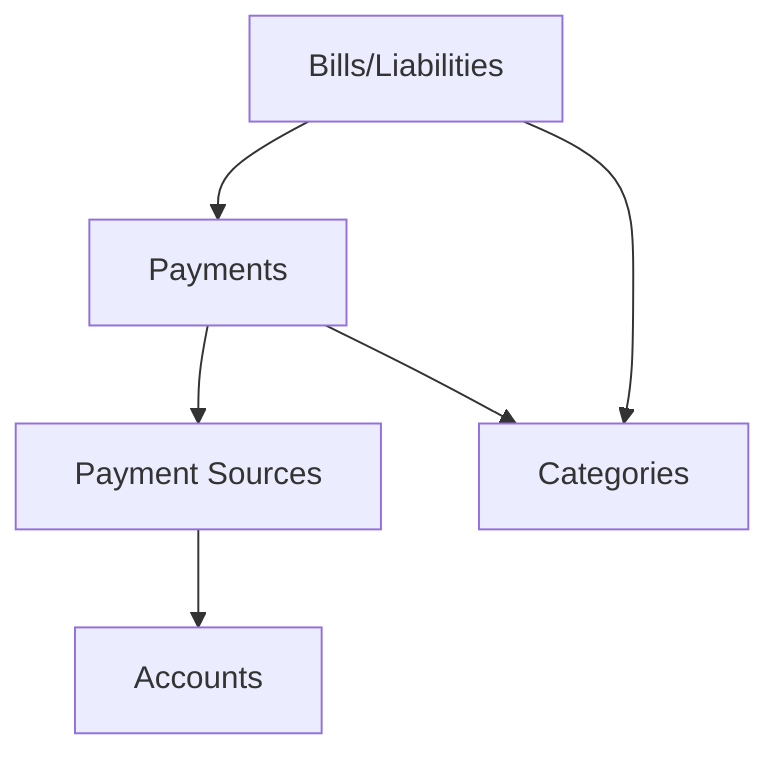

# ADR-009: Bills and Payments Separation

## Status

Accepted

## Executive Summary

Separates bills and payments into distinct entities to enable more flexible payment tracking and better represent one-to-many relationships between bills and payments. This architectural change supports split payments across time periods, different payment sources for the same bill, non-scheduled transactions, and historical payment tracking. The implementation creates a modified double-entry accounting approach with three core entities (bills, payments, payment sources) while maintaining backward compatibility through a phased implementation strategy across all application layers.

## Context

The current implementation tightly couples bills with their payment methods, creating several limitations in our financial management platform:

- **Limited Payment Flexibility**: Cannot easily handle split payments across multiple time periods
- **Source Constraints**: Difficult to track payments from different sources for the same bill
- **Transaction Limitations**: No support for non-scheduled transactions like groceries or impulse purchases
- **Historical Tracking Gaps**: Difficult to maintain comprehensive payment history
- **Expansion Limitations**: Prevents future expansion to general financial transaction tracking
- **Reconciliation Challenges**: No clear way to reconcile actual payments with scheduled bills

These limitations directly impact our ability to provide users with an accurate financial picture and restrict the platform's ability to grow with more advanced financial management features.

## Decision

Implement a modified double-entry accounting approach with three core entities that separate the concepts of what is owed from what is paid:

1. **Bills (Liabilities)**
   - Represent what is owed
   - Track due dates and amounts
   - Support recurring patterns
   - Enable categorization

2. **Payments (Transactions)**
   - Record actual payments made
   - Link to bills (optional)
   - Support non-bill expenses
   - Track payment dates

3. **Payment Sources (Entries)**
   - Track which accounts funded payments
   - Support split payments across multiple accounts
   - Maintain account balance accuracy
   - Enable comprehensive transaction tracking

This approach will enable more flexible payment tracking, better support for diverse payment scenarios, and create a foundation for future financial management features.

## Technical Details

### Architecture Overview

The new architecture separates the concept of bills (what is owed) from payments (what is paid) with payment sources tracking where money comes from:



This creates a more flexible financial management framework that:

- Enables one-to-many relationships between bills and payments
- Supports many-to-many relationships between payments and accounts through payment sources
- Maintains categorization consistency across financial entities
- Creates a foundation for comprehensive transaction tracking and reconciliation

### Data Layer

#### Models

**Bills Table**:

```sql
CREATE TABLE bills (
    id INTEGER PRIMARY KEY,
    name VARCHAR(255),
    amount DECIMAL(10,2),
    due_date DATE,
    description TEXT,
    recurring BOOLEAN,
    recurrence_pattern JSON,
    category_id INTEGER,
    created_at TIMESTAMP,
    updated_at TIMESTAMP,
    FOREIGN KEY (category_id) REFERENCES categories(id)
);
```

**Payments Table**:

```sql
CREATE TABLE payments (
    id INTEGER PRIMARY KEY,
    bill_id INTEGER NULL,
    amount DECIMAL(10,2),
    payment_date DATE,
    description TEXT,
    category_id INTEGER,
    created_at TIMESTAMP,
    updated_at TIMESTAMP,
    FOREIGN KEY (bill_id) REFERENCES bills(id),
    FOREIGN KEY (category_id) REFERENCES categories(id)
);
```

**Payment Sources Table**:

```sql
CREATE TABLE payment_sources (
    id INTEGER PRIMARY KEY,
    payment_id INTEGER,
    account_id INTEGER,
    amount DECIMAL(10,2),
    created_at TIMESTAMP,
    updated_at TIMESTAMP,
    FOREIGN KEY (payment_id) REFERENCES payments(id),
    FOREIGN KEY (account_id) REFERENCES accounts(id)
);
```

Key model changes:

- The `bills` table focuses on tracking what is owed with optional recurrence
- The `payments` table tracks actual payment transactions with optional link to a bill
- The `payment_sources` table tracks where money comes from with account relations
- All entities maintain proper created_at/updated_at fields for history tracking
- Proper foreign key constraints maintain referential integrity

#### Repositories

**BillRepository**:

- Add methods to retrieve associated payments
- Implement historical payment tracking
- Add methods for recurring bill management

**PaymentRepository**:

- Create methods for payment creation with associated sources
- Implement retrieval with eager loading of sources
- Add validation for payment total matching sum of sources

**PaymentSourceRepository**:

- Implement CRUD operations for payment sources
- Add bulk creation for multiple sources
- Implement validation for payment id references

**Integration with Existing Repositories**:

- Update AccountRepository to track payments from accounts
- Implement transaction boundaries for multi-entity operations
- Add validation to ensure referential integrity

### Business Logic Layer

#### Schemas

**Bill Schemas**:

- Update BillCreate and BillUpdate schemas to focus on bill attributes
- Remove payment-specific fields
- Add support for recurrence patterns
- Maintain category relationship

**Payment Schemas**:

- Create new PaymentCreate schema with bill reference
- Implement PaymentUpdate schema
- Create nested schemas for payment sources
- Add validation for payment total matching sources total

**Payment Source Schemas**:

- Create PaymentSourceCreate schema for nested creation
- Implement validation for account references
- Add support for split validation

**Response Schemas**:

- Create BillResponse with payment history
- Implement PaymentResponse with source details
- Add specialized schemas for reporting and analysis

#### Services

**BillService**:

- Add methods to retrieve bill history
- Implement recurring bill generation
- Create bill status tracking logic

**PaymentService**:

- Implement payment creation with sources
- Add validation for payment allocation
- Create methods for payment history
- Add reconciliation logic

**Account Impact Service**:

- Track payment impact on account balances
- Implement forecasting with actual payments
- Create methods for financial analysis

### API Layer

**New Endpoints**:

- `GET /bills/{id}/payments` - Retrieve payment history for a bill
- `POST /payments` - Create a new payment with sources
- `GET /accounts/{id}/payments` - Retrieve payments from an account
- `GET /payments?filter=unbilled` - Find payments not associated with bills

**Updated Endpoints**:

- Update `GET /bills` to include payment status
- Modify `POST /bills` to focus on bill attributes
- Update `GET /accounts/{id}` to include payment history

**Validation and Error Handling**:

- Implement validation for payment total matching sources
- Add error handling for invalid references
- Create consistent error responses

### Frontend Considerations

The frontend will require significant updates:

- Create separate bill and payment management interfaces
- Implement payment entry with source allocation
- Update cashflow calculations to use actual payments
- Add payment history visualizations
- Support bill-payment reconciliation

### Config, Utils, and Cross-Cutting Concerns

- Add database migration scripts
- Implement data migration utilities for existing bills
- Create validation utilities for payment allocation
- Add logging for financial transactions
- Implement audit trail for payment tracking

### Dependencies and External Systems

No new external dependencies are required for this implementation.

### Implementation Impact

This change affects core functionality across the entire application:

- Database schema changes with migration scripts
- Model-level relationships and validation
- Repository methods and transactions
- Service layer logic and validation
- API endpoints and documentation
- Frontend components and state management

## Consequences

### Positive

- **Enhanced Payment Flexibility**: Support for multiple payments against a single bill
- **Better Source Tracking**: Clear tracking of which accounts fund each payment
- **Non-Bill Transaction Support**: Framework for tracking expenses without bills
- **Improved Historical Data**: Comprehensive payment history for analysis
- **Advanced Analytics**: Better data structure for financial analytics
- **Foundation for Growth**: Framework for future financial management features
- **Reconciliation Support**: Clear separation between planned and actual payments

### Negative

- **Increased Complexity**: More complex data model requires additional validation
- **Migration Effort**: Significant effort to migrate existing data
- **API Changes**: Additional endpoints and updated request/response structures
- **Frontend Rework**: Substantial updates to frontend components
- **Learning Curve**: Users will need to adapt to the new payment workflow

### Neutral

- **Calculation Approach Changes**: Financial calculations will use different data sources
- **Balance Tracking Adaptation**: Different approach to tracking account balances
- **Backup Procedure Updates**: Changes to backup and restore processes
- **Reporting Adjustments**: Updates to reporting methods and visualizations

## Quality Considerations

This architectural change significantly improves code quality and prevents technical debt:

- **Proper Entity Separation**: Aligns with accounting principles by separating liabilities from transactions
- **Cleaner Relationships**: Creates clear one-to-many and many-to-many relationships
- **Improved Data Integrity**: Better foreign key constraints and validation
- **Enhanced Testability**: Easier to test discrete components and financial logic
- **Reduced Duplication**: Eliminates redundant tracking of payment information
- **Future Compatibility**: Creates a flexible foundation for future financial features
- **Documentation Improvements**: Clearer model documentation and relationship definitions

## Performance and Resource Considerations

- **Query Optimization**: May require additional joins for some queries
- **Index Strategy**: Need for additional indexes on bill_id and payment_id
- **Transaction Boundaries**: Proper transaction management for multi-entity operations
- **Caching Strategy**: Consider caching payment history for frequently accessed bills
- **Expected Impact**: Minimal impact on performance with proper indexing (~5% increase in query time)
- **Resource Usage**: Slight increase in database size due to normalized data structure

## Development Considerations

- **Development Effort**:
  - Phase 1 (Database Changes): 1-2 days
  - Phase 2 (API Layer Updates): 2-3 days
  - Phase 3 (Frontend Foundation): 2-3 days
  - Phase 4 (Frontend Features): 3-4 days
  - Phase 5 (Testing & Documentation): 2-3 days
  - Total: 10-15 days (2-3 weeks)

- **Teams Involved**: Backend team, frontend team, QA team
- **Development Challenges**:
  - Ensuring data integrity during migration
  - Maintaining backward compatibility during transition
  - Comprehensive testing of financial calculations
  - Managing frontend state complexity

## Security and Compliance Considerations

- **Data Protection**: No changes to sensitive data handling
- **Access Control**: Maintain existing permission model for financial data
- **Audit Trail**: Improved tracking of financial transactions
- **Compliance**: Better support for financial record-keeping requirements

## Timeline

- **Phase 1 (Database Changes)**: Week 1
- **Phase 2 (API Layer Updates)**: Week 1-2
- **Phase 3 (Frontend Foundation)**: Week 2-3
- **Phase 4 (Frontend Features)**: Week 3-4
- **Phase 5 (Testing & Documentation)**: Week 4-5
- **Final Deployment**: End of Week 5

## Monitoring & Success Metrics

- **Key Metrics**:
  - Payment accuracy (match between bill amount and payment total)
  - System performance metrics (query time, response time)
  - User adoption of new payment workflow
  - Data migration success rate

- **Monitoring Requirements**:
  - Add logging for payment operations
  - Create dashboards for payment tracking
  - Implement alerts for payment validation failures

## Team Impact

- **Backend Team**: Implementation of new models, repositories, and API endpoints
- **Frontend Team**: Updates to components, forms, and state management
- **QA Team**: Comprehensive testing of financial calculations
- **Operations**: Database migration support and monitoring
- **User Experience**: Documentation and support for new payment workflow

## Related Documents

- [ADR-003](../archive/003-dynamic-accounts-and-bill-splits.md): Dynamic Accounts and Bill Splits
- [ADR-008](../archive/008-bill-splits-implementation.md): Bill Splits Implementation
- [ADR-014](./014-repository-layer-for-crud-operations.md): Repository Layer for CRUD Operations
- [ADR-017](./017-payment-source-schema-simplification.md): Payment Source Schema Simplification

## Notes

- This approach aligns with standard accounting practices by separating liabilities from transactions
- The implementation facilitates future expansion to general financial transaction tracking
- The design maintains backward compatibility while enabling new features
- Considered alternatives included extending the current bill model, but that would further complicate an already overloaded entity

## Updates

| Date | Revision | Author | Description |
|------|-----------|---------|-------------|
| 2025-03-15 | 1.0 | Original Team | Initial version |
| 2025-04-20 | 2.0 | System Architect | Standardized format, added layered architectural details |
