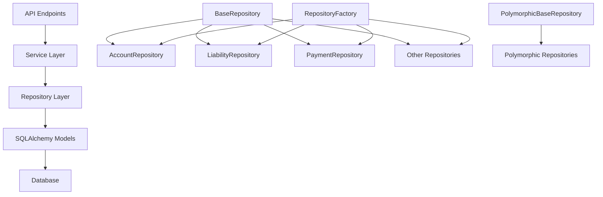

# ADR-014: Repository Layer for CRUD Operations

## Status

Accepted

## Executive Summary

This ADR establishes a repository pattern throughout the Debtonator platform to abstract database operations from business logic, providing a consistent interface for data access. It defines a type-safe base repository with specialized implementations for each model type, creates a standardized approach to validation, transaction management, and polymorphic entity support, and has been fully implemented across all 18 required models with comprehensive testing coverage.

## Context

Our services layer previously handled both CRUD operations and business logic, leading to several architectural challenges:

1. **Violation of Single Responsibility Principle (SRP)**: Services were responsible for both data access and business logic
2. **Code duplication (DRY violations)**: Common CRUD patterns were repeated across service classes
3. **Excessive complexity**: Services grew large and complex, mixing multiple concerns
4. **Testing challenges**: Services with mixed responsibilities were harder to test effectively
5. **Reduced maintainability**: Changes to data access patterns required updates across multiple service files

The previous implementation created a "spaghetti code" situation where business logic was intertwined with data access, making it difficult to evolve either aspect independently. This became particularly problematic as our model layer grew more complex with polymorphic entities and specialized account types.

## Decision

We will introduce a repository layer dedicated to CRUD operations for all SQLAlchemy models. This layer will:

1. Provide a consistent interface for database operations
2. Encapsulate SQLAlchemy-specific implementation details
3. Handle common data access patterns in a single location
4. Support transaction management across operations
5. Provide type-safe operations with proper generic typing
6. Support polymorphic entity operations with proper identity management

Services will use these repositories for data access while focusing on business logic, validation, and orchestration. The architectural principle that "all data access must go through repositories" will be strictly enforced throughout the codebase.

## Technical Details

### Architecture Overview

The repository layer fits into our overall architecture as follows:



Key architectural principles:

- Clear separation between data access and business logic
- Repository interfaces independent of ORM implementation details
- Services use repositories through dependency injection
- Repository factory manages repository instances
- Specialized repositories for polymorphic entities

### Data Layer

#### Models

The model layer remains focused on data structure and relationships:

```python
class Account(Base):
    __tablename__ = "accounts"
    
    id: Mapped[int] = mapped_column(primary_key=True)
    name: Mapped[str] = mapped_column(String(50), unique=True, nullable=False)
    type: Mapped[str] = mapped_column(String(20), nullable=False)
    available_balance: Mapped[Decimal] = mapped_column(Numeric(10, 2), nullable=False, default=0)
    total_limit: Mapped[Optional[Decimal]] = mapped_column(Numeric(10, 2), nullable=True)
    
    statements: Mapped[List["StatementHistory"]] = relationship(
        "StatementHistory", back_populates="account", cascade="all, delete-orphan"
    )
```

No model changes are required, as the repository pattern works with existing models. However, models should follow these principles:

- Focus on data structure and relationships
- No business logic methods
- No validation logic (as per ADR-012)
- Proper relationship definitions
- Clear type annotations

#### Repositories

##### Base Repository

The foundation is a generic base repository with type parameters for the model and primary key:

```python
from typing import TypeVar, Generic, Type, Optional, List, Any, Dict
from sqlalchemy import select, update, delete
from sqlalchemy.ext.asyncio import AsyncSession
from src.database.base import Base

ModelType = TypeVar("ModelType", bound=Base)
PKType = TypeVar("PKType")

class BaseRepository(Generic[ModelType, PKType]):
    """Base repository for CRUD operations on SQLAlchemy models."""
    
    def __init__(self, session: AsyncSession, model_class: Type[ModelType]):
        self.session = session
        self.model_class = model_class

    async def create(self, obj_in: Dict[str, Any]) -> ModelType:
        """Create a new record."""
        db_obj = self.model_class(**obj_in)
        self.session.add(db_obj)
        await self.session.flush()
        await self.session.refresh(db_obj)
        return db_obj

    async def get(self, id: PKType) -> Optional[ModelType]:
        """Get a record by ID."""
        result = await self.session.execute(
            select(self.model_class).where(self.model_class.id == id)
        )
        return result.scalars().first()

    async def get_multi(
        self, 
        *, 
        skip: int = 0, 
        limit: int = 100, 
        filters: Optional[Dict[str, Any]] = None
    ) -> List[ModelType]:
        """Get multiple records with optional filtering."""
        query = select(self.model_class).offset(skip).limit(limit)
        
        if filters:
            for field, value in filters.items():
                if hasattr(self.model_class, field):
                    query = query.where(getattr(self.model_class, field) == value)
        
        result = await self.session.execute(query)
        return result.scalars().all()

    async def update(
        self, 
        id: PKType, 
        obj_in: Dict[str, Any]
    ) -> Optional[ModelType]:
        """Update a record by ID."""
        db_obj = await self.get(id)
        if not db_obj:
            return None
            
        for field, value in obj_in.items():
            setattr(db_obj, field, value)
            
        await self.session.flush()
        await self.session.refresh(db_obj)
        return db_obj

    async def delete(self, id: PKType) -> bool:
        """Delete a record by ID."""
        result = await self.session.execute(
            delete(self.model_class).where(self.model_class.id == id)
        )
        return result.rowcount > 0
```

##### Model-Specific Repositories

For each model, we create a specific repository that inherits from BaseRepository and adds model-specific methods:

```python
class AccountRepository(BaseRepository[Account, int]):
    """Repository for account operations."""
    
    def __init__(self, session: AsyncSession):
        super().__init__(session, Account)
        
    async def get_by_name(self, name: str) -> Optional[Account]:
        """Get account by name."""
        result = await self.session.execute(
            select(Account).where(Account.name == name)
        )
        return result.scalars().first()
        
    async def get_with_statements(
        self, 
        account_id: int,
        after_date: Optional[date] = None
    ) -> Optional[Account]:
        """Get account with statement history."""
        query = (
            select(Account)
            .where(Account.id == account_id)
            .options(selectinload(Account.statements))
        )
        
        if after_date:
            query = query.join(Account.statements).where(
                StatementHistory.statement_date >= after_date
            )
            
        result = await self.session.execute(query)
        return result.scalars().first()
    
    async def get_accounts_by_type(
        self,
        account_type: str,
        skip: int = 0,
        limit: int = 100
    ) -> List[Account]:
        """Get accounts by type."""
        query = (
            select(Account)
            .where(Account.type == account_type)
            .offset(skip)
            .limit(limit)
        )
        result = await self.session.execute(query)
        return result.scalars().all()
```

##### Polymorphic Repository Pattern

For polymorphic models (like Account with its subclasses), we implement a specialized base repository:

```python
class PolymorphicBaseRepository(BaseRepository[PolyModelType, PKType]):
    """Base repository for polymorphic entities."""
    
    # Class variable to store the discriminator field name
    discriminator_field: ClassVar[str] = "type"
    
    # Registry to use for model class lookup
    registry = None
    
    async def create(self, obj_in: Dict[str, Any]) -> PolyModelType:
        """Disabled for polymorphic repositories."""
        raise NotImplementedError(
            "Direct creation through base repository is disabled for polymorphic entities. "
            "Use create_typed_entity() instead to ensure proper polymorphic identity."
        )
    
    async def create_typed_entity(
        self, 
        entity_type: str, 
        data: Dict[str, Any]
    ) -> PolyModelType:
        """Create a new entity with the specified polymorphic type."""
        # Validate entity type exists in registry
        if self.registry and not self.registry.is_registered(entity_type):
            raise ValueError(f"Unknown entity type: {entity_type}")
            
        # Get model class for type
        model_class = self.registry.get_class(entity_type) if self.registry else None
        
        # Filter data to include only fields that exist on the model class
        filtered_data = {}
        for field, value in data.items():
            if not model_class or hasattr(model_class, field):
                filtered_data[field] = value
                
        # Ensure discriminator field is set
        filtered_data[self.discriminator_field] = entity_type
        
        # Create entity
        entity = model_class(**filtered_data) if model_class else self.model_class(**filtered_data)
        self.session.add(entity)
        await self.session.flush()
        await self.session.refresh(entity)
        return entity
        
    async def update_typed_entity(
        self,
        id: PKType,
        entity_type: str,
        data: Dict[str, Any]
    ) -> Optional[PolyModelType]:
        """Update an entity with the specified polymorphic type."""
        # Get existing entity
        entity = await self.get(id)
        if not entity:
            return None
            
        # Verify entity type matches
        if getattr(entity, self.discriminator_field) != entity_type:
            raise ValueError(
                f"Entity type mismatch: expected {entity_type}, "
                f"got {getattr(entity, self.discriminator_field)}"
            )
            
        # Get model class for type
        model_class = self.registry.get_class(entity_type) if self.registry else None
        
        # Filter data to include only fields that exist on the model class
        filtered_data = {}
        for field, value in data.items():
            if field != self.discriminator_field and (not model_class or hasattr(model_class, field)):
                filtered_data[field] = value
                
        # Update entity fields
        for field, value in filtered_data.items():
            setattr(entity, field, value)
            
        await self.session.flush()
        await self.session.refresh(entity)
        return entity
```

##### Repository Factory

To simplify dependency injection, we create a repository factory:

```python
class RepositoryFactory:
    """Factory for creating repositories."""
    
    def __init__(self, session: AsyncSession):
        self.session = session
        self._repositories: Dict[Type[BaseRepository], BaseRepository] = {}
    
    def get_repository(self, repository_class: Type[T]) -> T:
        """Get or create a repository instance."""
        if repository_class not in self._repositories:
            self._repositories[repository_class] = repository_class(self.session)
        return self._repositories[repository_class]
        
    @classmethod
    async def create_account_repository(
        cls,
        session: AsyncSession,
        account_type: Optional[str] = None
    ) -> AccountRepository:
        """
        Create an account repository with specialized functionality based on account type.
        
        Args:
            session: SQLAlchemy async session
            account_type: Optional account type to determine specialized functionality
            
        Returns:
            AccountRepository with specialized functionality for the given type
        """
        # Create the base repository
        base_repo = AccountRepository(session)
        
        # Load type-specific functionality
        if account_type:
            module_path = cls._get_module_path(account_type)
            if module_path:
                module = cls._get_or_load_module(module_path)
                if module:
                    cls._bind_module_functions(base_repo, module, session)
                    
        return base_repo
        
    @classmethod
    def _get_module_path(cls, account_type: str) -> Optional[str]:
        """Get the module path for an account type."""
        # Mapping of account types to module paths
        type_to_module = {
            "checking": "src.repositories.account_types.banking.checking",
            "savings": "src.repositories.account_types.banking.savings",
            "credit": "src.repositories.account_types.banking.credit",
            "bnpl": "src.repositories.account_types.banking.bnpl",
            "ewa": "src.repositories.account_types.banking.ewa",
            "payment_app": "src.repositories.account_types.banking.payment_app",
        }
        return type_to_module.get(account_type)
```

### Business Logic Layer

#### Schemas

No changes are required to the schema layer, which continues to handle input/output validation as defined in ADR-012.

#### Services

Services now use repositories for data access while focusing on business logic:

```python
class AccountService:
    """Service for account operations."""
    
    def __init__(
        self, 
        account_repository: AccountRepository,
        statement_repository: StatementHistoryRepository
    ):
        self.account_repository = account_repository
        self.statement_repository = statement_repository
    
    async def create_account(self, account_data: AccountCreate) -> Account:
        """Create a new account."""
        # Business logic validation
        is_valid, error_message = await self.validate_account_create(account_data)
        if not is_valid:
            raise ValueError(error_message)
            
        # Use repository for data access
        account = await self.account_repository.create(account_data.model_dump())
        
        # Additional business logic
        if account.type == "credit" and account.total_limit is not None:
            await self.update_available_credit(account)
            
        return account
    
    async def update_statement_balance(
        self,
        account_id: int,
        statement_balance: Decimal,
        statement_date: date,
        minimum_payment: Optional[Decimal] = None,
        due_date: Optional[date] = None
    ) -> Optional[Account]:
        """Update account statement balance and create statement history entry."""
        # Get account
        account = await self.account_repository.get(account_id)
        if not account:
            return None

        # Validate statement update
        is_valid, error_message = await self.validate_statement_update(
            account,
            statement_balance,
            statement_date,
            minimum_payment,
            due_date
        )
        if not is_valid:
            raise ValueError(error_message)

        # Update account
        await self.account_repository.update(
            account_id,
            {
                "last_statement_balance": statement_balance,
                "last_statement_date": statement_date
            }
        )
        
        # Create statement history entry
        await self.statement_repository.create({
            "account_id": account_id,
            "statement_date": statement_date,
            "statement_balance": statement_balance,
            "minimum_payment": minimum_payment,
            "due_date": due_date
        })
        
        # Get updated account
        return await self.account_repository.get(account_id)
```

The service layer now has clear responsibilities:

- Business logic validation
- Orchestration of operations across repositories
- Error handling and messaging
- Complex calculations and state management
- Transaction management across multiple repositories

### API Layer

API endpoints use services that in turn use repositories:

```python
def get_account_repository(db: AsyncSession = Depends(get_db)) -> AccountRepository:
    """Dependency for AccountRepository."""
    return AccountRepository(db)

def get_statement_repository(db: AsyncSession = Depends(get_db)) -> StatementHistoryRepository:
    """Dependency for StatementHistoryRepository."""
    return StatementHistoryRepository(db)

def get_account_service(
    account_repo: AccountRepository = Depends(get_account_repository),
    statement_repo: StatementHistoryRepository = Depends(get_statement_repository)
) -> AccountService:
    """Dependency for AccountService."""
    return AccountService(account_repo, statement_repo)

@router.get("/{account_id}", response_model=AccountResponse)
async def get_account(
    account_id: int,
    account_service: AccountService = Depends(get_account_service)
):
    """Get an account by ID."""
    account = await account_service.get_account(account_id)
    if not account:
        raise HTTPException(status_code=404, detail="Account not found")
    return account

@router.post("/", response_model=AccountResponse)
async def create_account(
    account_data: AccountCreate,
    account_service: AccountService = Depends(get_account_service)
):
    """Create a new account."""
    try:
        account = await account_service.create_account(account_data)
        return account
    except ValueError as e:
        raise HTTPException(status_code=400, detail=str(e))
```

The API layer follows these patterns:

- Dependency injection for repositories and services
- Focused on request/response handling
- Error translation to HTTP responses
- Proper status codes and error messages
- Depends on the service layer for business logic

### Frontend Considerations

The frontend interacts with the repository layer indirectly through API endpoints. Key considerations include:

- Frontend components use API endpoints that leverage the repository layer
- Consistent error handling patterns for repository-based operations
- Response formats that align with repository data structures
- Support for bulk operations and pagination
- Clear loading states for asynchronous repository operations

### Config, Utils, and Cross-Cutting Concerns

#### Configuration

The repository layer requires configuration for:

- Database connection settings
- Repository factory configuration
- Default pagination settings
- Account type registry configuration

#### Registry Systems

We implement registry systems for polymorphic entities:

```python
class AccountTypeRegistry:
    """Registry for account types."""
    
    def __init__(self):
        self._types: Dict[str, Type[Account]] = {}
        
    def register(self, type_name: str, model_class: Type[Account]) -> None:
        """Register an account type."""
        self._types[type_name] = model_class
        
    def is_registered(self, type_name: str) -> bool:
        """Check if an account type is registered."""
        return type_name in self._types
        
    def get_class(self, type_name: str) -> Optional[Type[Account]]:
        """Get the model class for an account type."""
        return self._types.get(type_name)
        
    def get_all_types(self) -> List[str]:
        """Get all registered account types."""
        return list(self._types.keys())
```

#### Error Handling

The repository layer defines specific exception types:

```python
class RepositoryError(Exception):
    """Base class for repository errors."""
    pass

class EntityNotFoundError(RepositoryError):
    """Error raised when an entity is not found."""
    
    def __init__(self, entity_type: str, entity_id: Any):
        self.entity_type = entity_type
        self.entity_id = entity_id
        super().__init__(f"{entity_type} with ID {entity_id} not found")

class ValidationError(RepositoryError):
    """Error raised when validation fails."""
    pass

class TransactionError(RepositoryError):
    """Error raised when a transaction fails."""
    pass
```

### Dependencies and External Systems

The repository layer has these dependencies:

1. **SQLAlchemy 2.0+**
   - Full async support with AsyncSession
   - Type-annotated query building
   - Relationship loading options
   - Transaction management

2. **Pydantic 2.0+**
   - Schema validation
   - Type conversion
   - Model creation from dictionaries

3. **Database**
   - SQLite for development
   - MySQL/MariaDB for production
   - Connection pooling
   - Async driver support

### Implementation Impact

The repository layer has been fully implemented across all 18 required models:

1. **Foundation Components**:
   - BaseRepository implementation ✓
   - Repository factory ✓
   - Dependency injection system ✓
   - Polymorphic repository base class ✓

2. **Model-Specific Repositories**:
   - All 18 required repositories implemented ✓
   - AccountRepository with specialized methods ✓
   - LiabilityRepository with bill-specific methods ✓
   - PaymentRepository with payment-specific methods ✓
   - Additional specialized repositories for all models ✓

3. **Service Integration**:
   - Account service refactored to use repositories ✓
   - Service dependency injection setup ✓
   - Transaction management integration ✓
   - Other services refactored to use repositories ✓

4. **Advanced Features**:
   - Advanced querying support ✓
   - Pagination implementation ✓
   - Transaction support ✓
   - Bulk operations ✓
   - Polymorphic repository pattern ✓

The implementation required comprehensive refactoring of the service layer to use repositories instead of direct database access, with parallel updates to the API layer for dependency injection. All tests were updated to align with the new architecture.

## Consequences

### Positive

- **Improved SRP compliance**: Clear separation between data access and business logic
- **Reduced duplication**: Common CRUD patterns implemented in one place
- **Better testability**: Easier to test services and repositories independently
- **More maintainable code**: Smaller, more focused components
- **Standardized data access**: Consistent patterns across the application
- **Easier to extend**: New models just need repository implementation
- **Better transaction support**: Clearer transaction boundaries
- **Performance optimization potential**: Ability to optimize common queries in one place
- **Improved type safety**: Generic typing for base repositories
- **Better polymorphic entity support**: Specialized handling for polymorphic types

### Negative

- **Additional abstraction**: Adds another layer to the architecture
- **Migration effort**: Required significant refactoring of existing code
- **Learning curve**: New pattern for future developers to understand
- **Potential for over-abstraction**: Need to maintain pragmatic approach
- **Dependency management**: More dependencies to inject and manage
- **Increased boilerplate**: Need to create repository class for each model

### Neutral

- **Changed dependency flow**: Services depend on repositories instead of directly on session
- **Different testing approach**: Focus shifted to integration testing for repositories
- **Explicit transaction management**: More control but more responsibility
- **Centralized data access patterns**: Consistent but potentially less flexible
- **Repository interface standardization**: More predictable but possibly constraining

## Quality Considerations

- **Separation of Concerns**: Clear boundaries between data access and business logic
- **DRY Principle**: Eliminates duplicate data access patterns
- **Maintainability**: Smaller, more focused components with single responsibilities
- **Consistency**: Standardized approach to data access across the application
- **Testability**: Independent testing of repositories and services
- **Type Safety**: Generic typing prevents many runtime errors
- **Error Handling**: Consistent error patterns for data access operations
- **Documentation**: Clear repository interfaces with proper docstrings
- **Tech Debt Prevention**: Avoids ad-hoc query patterns scattered throughout services

## Performance and Resource Considerations

- **Query Optimization**: Repository methods can be optimized in one place
- **Relationship Loading**: Consistent eager loading patterns prevent N+1 query issues
- **Transaction Management**: Clear transaction boundaries improve database performance
- **Memory Usage**: Slightly increased due to additional layer
- **Connection Pooling**: Consistent session handling through repositories
- **Pagination**: Standardized approach prevents loading excessive data
- **Bulk Operations**: Repository methods for efficient bulk operations
- **Caching Opportunities**: Repositories provide a natural place for caching

## Development Considerations

- **Effort Estimation**:
  - Initial implementation: ~3 weeks
  - Service refactoring: ~2 weeks
  - Testing updates: ~1 week

- **Team Allocation**:
  - 2 backend developers for initial implementation
  - 1 developer for testing updates

- **Learning Curve**:
  - Documentation required for new pattern
  - Knowledge sharing sessions for team

- **Refactoring Scope**:
  - 18 model-specific repositories
  - Service layer refactoring
  - API dependency injection updates
  - Test suite updates

- **Testing Strategy**:
  - Unit tests for base repository
  - Integration tests for model-specific repositories
  - Service tests with repository dependencies

- **Documentation Requirements**:
  - Repository interface documentation
  - Usage examples
  - Best practices guide

## Security and Compliance Considerations

- **SQL Injection Prevention**: Parameterized queries through SQLAlchemy
- **Access Control**: Repositories enforce consistent access patterns
- **Audit Logging**: Centralized data access simplifies activity logging
- **Data Validation**: Consistent data validation before persistence
- **Transaction Integrity**: Proper transaction boundaries ensure data consistency
- **Error Handling**: Structured error handling prevents security issues from exceptions
- **Query Control**: Standardized queries prevent unintended data exposure

## Timeline

- **Phase 1 (Base Implementation)**: 2 weeks
  - BaseRepository implementation
  - Core repository interfaces
  - Initial testing framework

- **Phase 2 (Model-Specific Repositories)**: 2 weeks
  - Account repositories
  - Bill repositories
  - Payment repositories
  - Other model repositories

- **Phase 3 (Service Refactoring)**: 2 weeks
  - Update services to use repositories
  - Implement dependency injection
  - Transaction management

- **Phase 4 (Advanced Features)**: 2 weeks
  - Polymorphic repository pattern
  - Bulk operations
  - Advanced querying

- **Phase 5 (Testing and Documentation)**: 2 weeks
  - Comprehensive testing
  - Documentation
  - Knowledge sharing

## Monitoring & Success Metrics

- **Code Complexity**: Reduction in cyclomatic complexity for services
- **Test Coverage**: Repository test coverage > 90%
- **Query Performance**: Monitoring for query execution time improvements
- **Error Rates**: Tracking data access errors
- **Maintainability Index**: Static analysis metrics for code maintainability
- **Developer Feedback**: Team evaluation of new architecture
- **Code Review Efficiency**: Time spent on code reviews for data access patterns
- **Technical Debt Reduction**: Fewer ad-hoc query patterns

## Team Impact

- **Backend Team**: Required learning new repository pattern
- **API Team**: Updated dependency injection patterns
- **Testing Team**: New approach to integration testing
- **Documentation Team**: New documentation requirements
- **Onboarding Process**: Updates for new architectural pattern

## Related Documents

- [Project Brief](../../../project_brief.md)
- [System Patterns](../../../system_patterns.md)
- [ADR-012: Validation Layer Standardization](012-validation-layer-standardization.md)
- [Technical Context](../../../tech_context.md)

## Notes

### Alternatives Considered

1. **Direct ORM Use in Services**
   - Would have been simpler but wouldn't address SRP violations and code duplication
   - Would continue to mix data access and business logic
   - Rejected due to maintainability concerns

2. **Domain Driven Design Repositories**
   - More complex pattern focused on aggregate roots
   - Would have added unnecessary complexity for our use case
   - Rejected as overly complex for our needs

3. **Query Object Pattern**
   - Separate objects to encapsulate query logic
   - More complex for simpler use cases
   - Better suited for complex reporting queries
   - Rejected as excessive for our core CRUD operations

### Implementation Challenges

- Polymorphic identity management required specialized approach
- Transaction management across multiple repositories needed careful design
- Testing approach had to adapt to new architecture
- Service refactoring required careful coordination

## Updates

| Date | Revision | Author | Description |
|------|-----------|---------|-------------|
| 2025-01-10 | 1.0 | Unknown | Initial version |
| 2025-04-19 | 2.0 | Cline | Standardized format, enhanced technical details, added complete architecture sections |
