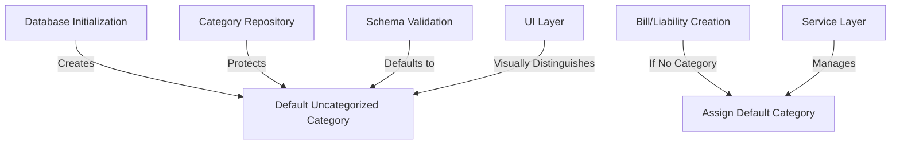

# ADR-015: Default Uncategorized Category

## Status

Accepted

## Executive Summary

Introduces a protected system category for uncategorized items to ensure data integrity and simplify categorization workflows. This feature implements an automatically created "Uncategorized" category with a fixed ID that cannot be modified or deleted, which is used as the default when no category is specified. The design strikes a balance between maintaining referential integrity in the database and improving user experience by not forcing premature categorization decisions, while also establishing a foundation for future machine learning-based categorization suggestions.

## Context

When creating liabilities (bills) in the application, we needed to determine how to handle category assignment. Requiring users to specify a category during initial data entry creates several challenges:

- Creates friction in the user experience during data entry
- Forces users to make premature categorization decisions
- Increases the likelihood of inconsistent categorization
- Complicates bulk import and API integration scenarios
- Risks NULL values in the database if categories are not properly enforced

These issues directly impact both data quality and user experience, with potentially cascading effects on reporting, analytics, and system reliability.

## Decision

Implement a default "Uncategorized" category that:

1. Has a fixed ID (1) defined in a constants file
2. Is automatically created during database initialization
3. Is protected from modification and deletion through a system flag
4. Is used as the default when no category is explicitly specified
5. Can be visually distinguished in the UI to encourage proper categorization

This approach balances data integrity (requiring a valid foreign key) with user experience (not requiring immediate categorization) while creating a foundation for future functionality.

## Technical Details

### Architecture Overview

The default category system integrates with the existing categorization framework with minimal changes:



This architecture ensures that the default category exists at all times, is automatically assigned when needed, and cannot be accidentally modified or removed.

### Data Layer

#### Models

**Category Model Updates**:

- Added a `system` flag to identify protected categories:

  ```python
  system: Mapped[bool] = mapped_column(
      Boolean, 
      default=False, 
      doc="System flag for protected categories that cannot be modified or deleted"
  )
  ```

- Added a display order field for UI presentation:

  ```python
  display_order: Mapped[int] = mapped_column(
      Integer,
      default=100,
      doc="Order for display in UI, system categories use special values"
  )
  ```

**Constants Definition**:

- Created `src/constants.py` with default category constants:

  ```python
  DEFAULT_CATEGORY_ID = 1
  DEFAULT_CATEGORY_NAME = "Uncategorized"
  DEFAULT_CATEGORY_DESCRIPTION = "Default category for uncategorized items"
  DEFAULT_CATEGORY_DISPLAY_ORDER = 999  # Display last in lists
  ```

**Database Migration**:

- Added migration to ensure the system flag exists on the categories table
- Added an index on the system flag for efficient querying

#### Repositories

**CategoryRepository Updates**:

- Override `update()` method to prevent modification of system categories:

  ```python
  async def update(self, id: int, obj_in: Dict[str, Any]) -> Category:
      """Update a category, but prevent modification of system categories."""
      category = await self.get(id)
      if category and category.system:
          raise CategoryError(
              f"Cannot modify system category '{category.name}' (ID: {id})"
          )
      return await super().update(id, obj_in)
  ```

- Override `delete()` method to prevent deletion of system categories:

  ```python
  async def delete(self, id: int) -> Category:
      """Delete a category, but prevent deletion of system categories."""
      category = await self.get(id)
      if category and category.system:
          raise CategoryError(
              f"Cannot delete system category '{category.name}' (ID: {id})"
          )
      return await super().delete(id)
  ```

- Added `get_default_category_id()` method to retrieve the default category ID:

  ```python
  async def get_default_category_id(self) -> int:
      """Get the default category ID, creating it if it doesn't exist."""
      try:
          category = await self.get(DEFAULT_CATEGORY_ID)
          if not category:
              category = await self._create_default_category()
          return category.id
      except Exception as e:
          logger.error(f"Error getting default category: {e}")
          # Fallback to constant value if DB access fails
          return DEFAULT_CATEGORY_ID
  ```

- Implemented private `_create_default_category()` method to handle initialization:

  ```python
  async def _create_default_category(self) -> Category:
      """Create the default category if it doesn't exist."""
      return await self.create({
          "id": DEFAULT_CATEGORY_ID,
          "name": DEFAULT_CATEGORY_NAME,
          "description": DEFAULT_CATEGORY_DESCRIPTION,
          "system": True,
          "display_order": DEFAULT_CATEGORY_DISPLAY_ORDER
      })
  ```

**Database Initialization**:

- Modified `init_db.py` to ensure the default category exists using the repository pattern

### Business Logic Layer

#### Schemas

**Category Schemas**:

- Updated `CategoryBase` schema to include the system flag:

  ```python
  class CategoryBase(BaseModel):
      """Base schema for Category model."""
      name: str
      description: str = ""
      system: bool = False
      display_order: int = 100
  ```

- Added validation to prevent setting system flag in `CategoryCreate`:

  ```python
  @model_validator(mode='after')
  def validate_system_flag(self) -> 'CategoryCreate':
      """Prevent setting system flag when creating categories through API."""
      if self.system and not get_current_user().is_admin:
          raise ValueError("Cannot create system categories")
      return self
  ```

**Liability Schemas**:

- Updated `LiabilityCreate` schema to make category_id optional:

  ```python
  class LiabilityCreate(LiabilityBase):
      """Schema for creating a new liability."""
      category_id: Optional[int] = None
  ```

- Added service-level logic to default to Uncategorized category

#### Services

**System Initialization Service**:

- Created dedicated service for system initialization:

  ```python
  class SystemInitializationService:
      """Service for initializing system data."""
      
      def __init__(self, category_repository: CategoryRepository):
          self.category_repository = category_repository
      
      async def ensure_default_category_exists(self) -> None:
          """Ensure the default category exists."""
          try:
              await self.category_repository.get_default_category_id()
          except Exception as e:
              logger.error(f"Failed to ensure default category exists: {e}")
              # Additional error handling as needed
  ```

**LiabilityService Updates**:

- Modified `create_liability()` to handle default category:

  ```python
  async def create_liability(self, liability_data: Dict[str, Any]) -> Liability:
      """Create a new liability with default category if not specified."""
      if "category_id" not in liability_data or liability_data["category_id"] is None:
          liability_data["category_id"] = await self.category_repository.get_default_category_id()
      return await self.liability_repository.create(liability_data)
  ```

### API Layer

- No direct changes needed to API endpoints
- API documentation updated to note that category_id is optional

### Frontend Considerations

- UI should visually distinguish uncategorized items
- Consider adding a filter for "Needs Categorization"
- Future enhancement to suggest categories based on item content

### Config, Utils, and Cross-Cutting Concerns

**Error Handling**:

- Added specialized `CategoryError` for system category operations:

  ```python
  class CategoryError(Exception):
      """Base error for category operations."""
      pass
      
  class SystemCategoryError(CategoryError):
      """Error for operations on system categories."""
      pass
  ```

**Logging**:

- Added logging for system category operations
- Log warnings for attempts to modify system categories

### Dependencies and External Systems

No new external dependencies are required for this implementation.

### Implementation Impact

This change affects several core components:

- Category model and repository
- Database initialization process
- System data management
- Liability creation workflow
- Default value handling in services

## Consequences

### Positive

- **Improved User Experience**: Users don't need to categorize items immediately during data entry
- **Data Integrity**: No null values in the database, maintaining proper referential integrity
- **Future Enhancements**: Foundation for future ML categorization suggestions
- **System Stability**: Protection mechanisms prevent accidental modification or deletion of the default category
- **Simplified APIs**: Optional category parameters simplify API usage and bulk imports

### Negative

- **Additional Repository Complexity**: Special handling for system categories increases complexity
- **System Category Management**: Need to ensure the default category exists in all environments
- **Testing Requirements**: Need to test against the possibility of orphaned records if the default category is somehow removed
- **Security Considerations**: Must ensure system flag cannot be abused by normal users

### Neutral

- **UI Adjustments**: UI will need to indicate which items still need categorization
- **Default Behavior Change**: New entries will default to "Uncategorized" rather than requiring explicit selection
- **Service Layer Logic**: Services now handle default value assignment rather than schemas

## Quality Considerations

This architectural change prevents technical debt in several ways:

- **Avoids NULL Foreign Keys**: Prevents database integrity issues and potential NULL pointer issues in code
- **Standardizes Default Handling**: Creates a consistent pattern for handling default values
- **Prevents Data Loss**: Ensures data relationships are maintained even with incomplete input
- **Simplifies Validation**: Reduces complexity in validation rules by handling defaults in a centralized manner
- **Proper Error Handling**: Creates clear error types and messaging for system category operations
- **Clean Architectural Boundaries**: Enforces repository layer responsibility for data integrity

## Performance and Resource Considerations

- **Minimal Performance Impact**: The default category lookup is a simple primary key query
- **Caching Opportunity**: The default category ID could be cached in-memory for improved performance
- **Database Indexes**: Proper indexing on the system flag ensures efficient queries
- **Startup Performance**: Database initialization only creates the default category if it doesn't exist

## Development Considerations

- **Development Effort**: Less than 1 day for implementation
- **Testing Requirements**:
  - Unit tests for system flag validation
  - Integration tests for repository protection methods
  - System initialization tests
  - Error handling tests
- **Documentation Updates**:
  - API documentation to note optional category_id
  - System category documentation for developers

## Security and Compliance Considerations

- **Access Control**: Only administrators should be able to view the system flag in the UI
- **Validation Security**: Ensure system flag cannot be set by regular users
- **Audit Logging**: Track attempts to modify system categories

## Timeline

Implementation was completed on March 23, 2025, with additional refinements on March 29 and April 2, 2025.

## Monitoring & Success Metrics

- **Key Metrics**:
  - Number of items using the default category
  - Rate of manual categorization from default to specific categories
  - System category creation/update/delete attempts (should be zero)

- **Monitoring Requirements**:
  - Log attempted modifications to system categories
  - Track category distribution in analytics

## Team Impact

- **Backend Team**: Implementation of system categories and protection
- **Frontend Team**: Updates to handle visual distinction of default categories
- **QA Team**: Testing of system category protection and default assignment

## Related Documents

- [ADR-012](./012-validation-layer-standardization.md): Validation Layer Standardization
- [ADR-014](./014-repository-layer-for-crud-operations.md): Repository Layer for CRUD Operations

## Notes

The implementation process revealed architectural challenges with circular dependencies that were resolved with two key patterns:

1. **Reference by ID + Service Composition Pattern** (Schema Layer):
   - Schema layer now uses ID references instead of embedded objects
   - Service layer composes rich response objects at runtime
   - This maintains all functionality while eliminating circular references
   - The approach better aligns with our architecture principles from ADR-012

2. **String References & Central Registration Pattern** (Model Layer):
   - Used string references in all model relationships (e.g., `relationship("Category")` instead of importing directly)
   - Created proper model registration in `src/models/__init__.py` to import all models in dependency order
   - This solved circular imports between model files at definition time

3. **Repository-Based System Initialization Pattern** (Service Layer):
   - Created a dedicated service for system initialization (`src/services/system_initialization.py`)
   - Moved default category creation to a service that uses the repository layer
   - Leveraged the existing `CategoryRepository.get_default_category_id()` which already handled this logic
   - This maintains architectural consistency by using repositories for all data access

These patterns have broader applicability beyond the default category implementation and should be considered for future architectural decisions.

## Updates

| Date | Revision | Author | Description |
|------|-----------|---------|-------------|
| 2025-03-23 | 1.0 | Team | Initial implementation |
| 2025-03-29 | 1.1 | Backend Engineer | Resolved schema circular references |
| 2025-04-02 | 1.2 | Backend Engineer | Resolved model circular references |
| 2025-04-20 | 2.0 | System Architect | Standardized format, added architectural details |
