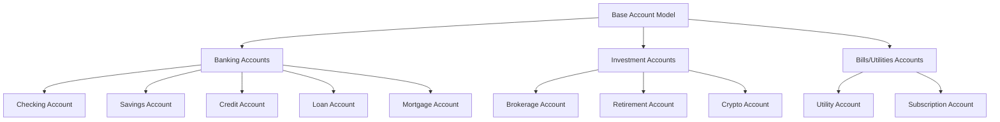
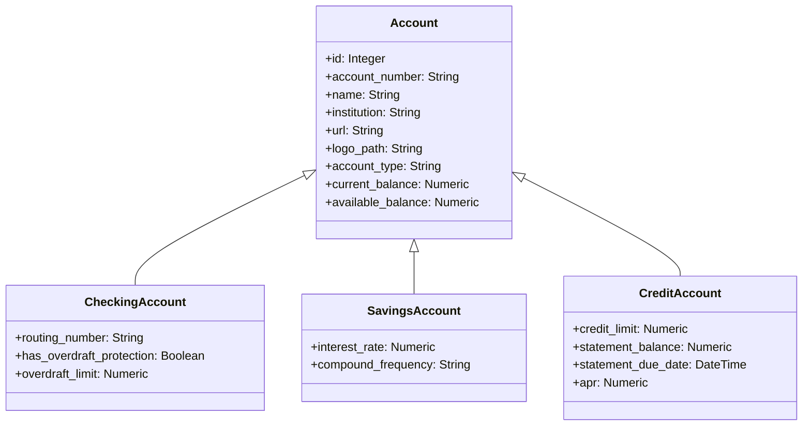
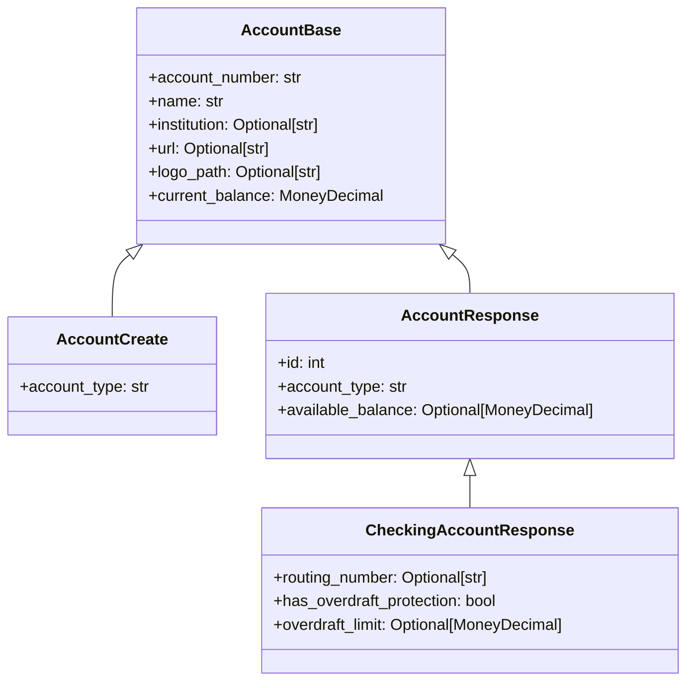
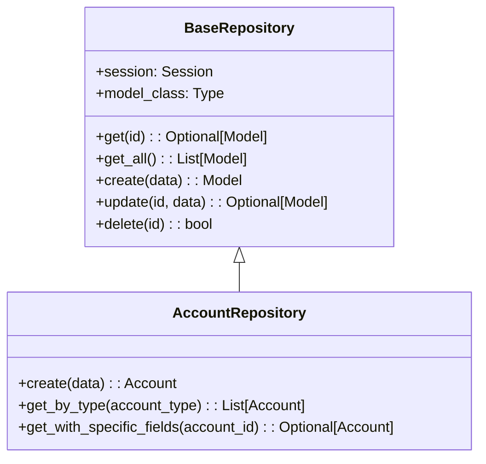
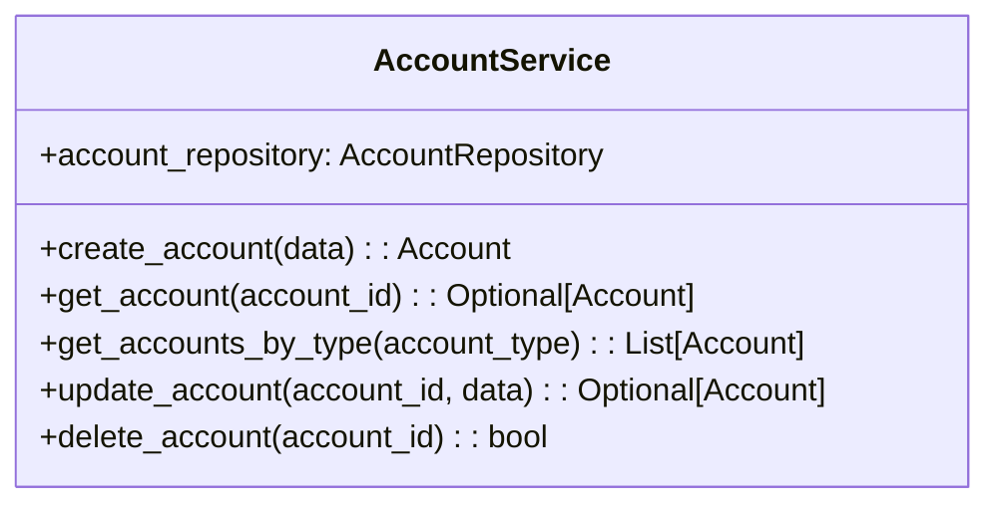
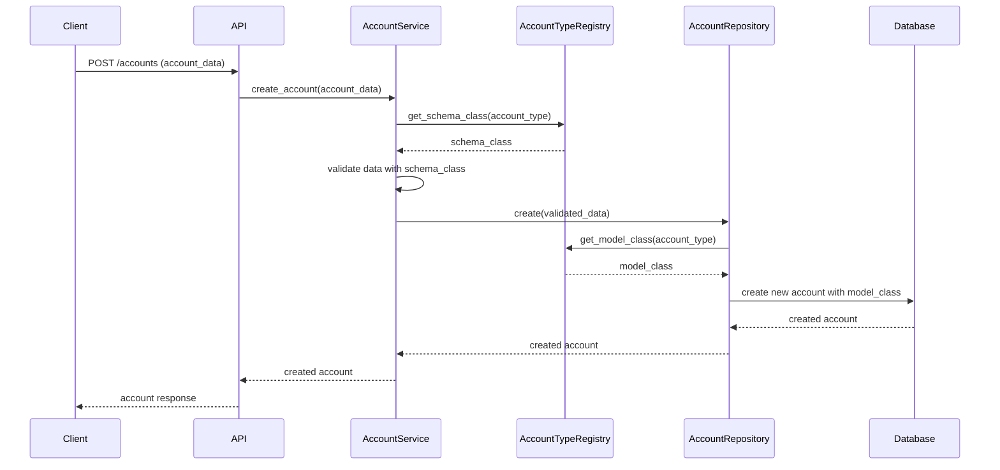
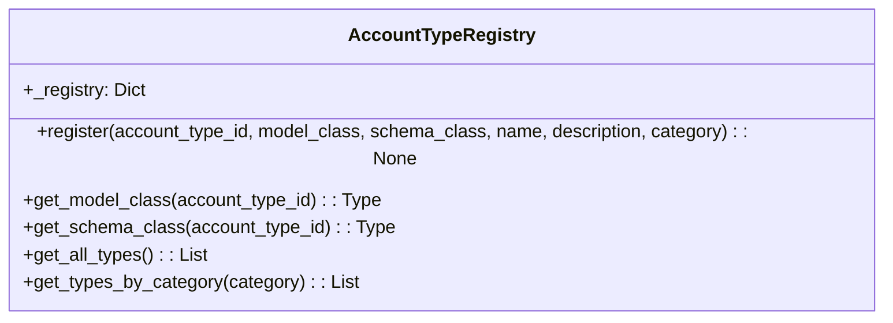

# Debtonator Account Type Expansion Design

## 1. Introduction and Context

The Debtonator application currently supports a limited set of account types (checking, savings, and credit) through a single-table design with optional fields. As financial management needs grow more complex, this design becomes limiting. This document proposes a comprehensive redesign based on the polymorphic inheritance pattern to support a wider range of financial account types while maintaining clean separation of concerns.

This design aligns with our technical philosophy:
- Avoiding technical debt is a primary goal
- Backward compatibility is not a priority, as we can reset the database
- We prioritize doing things right rather than easy
- The design should be extensible to accommodate future account types

## 2. Current Limitations

The existing account implementation has several shortcomings:

1. All account types share the same fields in a single table, with optional fields that may or may not apply
2. Adding account-type-specific fields requires modifying the base Account model
3. Business logic for different account types is scattered across services
4. Type-specific validation is inconsistently applied
5. Field naming inconsistencies exist (`type` vs. `account_type`)
6. Parameter mapping in schema factories doesn't match schema field names
7. Schema creation is inconsistent throughout tests

## 3. Design Approach Overview

We will implement a polymorphic inheritance pattern using SQLAlchemy that consists of:

1. A base Account model containing common fields and behaviors
2. Type-specific models that inherit from the base Account with specialized fields
3. An Account Type Registry to dynamically register and manage account types
4. Corresponding Pydantic schemas that mirror the inheritance structure
5. Updated repository, service, and API layers to work with the polymorphic models



## 4. Account Type Categorization

We'll organize account types into logical categories:

### Banking Accounts
- **Checking**: Day-to-day transaction accounts
- **Savings**: Interest-bearing accounts for saving money
- **Credit**: Revolving credit accounts with credit limits
- **Loan**: Fixed-term borrowing with scheduled payments
- **Mortgage**: Home loans with specific payment structures and property association

### Investment Accounts
- **Brokerage**: Accounts for buying/selling investments
- **Retirement**: Tax-advantaged accounts like 401(k), IRA, Roth IRA
- **Crypto**: Digital currency accounts/wallets

### Bills/Utilities Accounts
- **Utilities**: Accounts for services like electricity, water, gas
- **Subscriptions**: Recurring payment services with fixed billing cycles

This categorization provides a logical organization for the user interface while keeping the code structure clean and maintainable.

## 5. Common Account Attributes

All account types will share these core attributes:

| Attribute | Description | Type |
|-----------|-------------|------|
| id | Unique identifier | Integer |
| account_number | Account identifier with the institution | String |
| name | User-defined name for the account | String |
| institution | Financial institution name | String |
| account_type | Type discriminator field | String |
| url | Link to account website | String |
| logo_path | Path to institution logo | String |
| current_balance | Current account balance | Numeric(12,4) |
| available_balance | Available balance (may differ from current) | Numeric(12,4) |

## 6. Specific Account Type Attributes

Each account type will have specialized attributes in addition to the common ones:

### Banking Account Attributes

#### Checking Account
- routing_number: Bank routing number
- has_overdraft_protection: Whether account has overdraft protection
- overdraft_limit: Maximum overdraft amount allowed

#### Savings Account
- interest_rate: Current interest rate
- compound_frequency: How often interest compounds

#### Credit Account
- credit_limit: Maximum credit allowed
- statement_balance: Balance from last statement
- statement_due_date: When payment is due
- apr: Annual Percentage Rate

#### Loan Account
- loan_amount: Original loan amount
- interest_rate: Loan interest rate
- term_months: Loan term in months
- start_date: When loan began
- payment_amount: Monthly payment amount
- payment_due_day: Day of month payment is due

#### Mortgage Account
- property_address: Address of mortgaged property
- original_loan_amount: Starting loan amount
- interest_rate: Mortgage interest rate
- term_years: Mortgage term in years
- start_date: When mortgage began
- monthly_payment: Regular payment amount
- escrow_amount: Portion for taxes and insurance

### Investment Account Attributes

#### Brokerage Account
- tax_advantaged: Whether account has tax benefits
- cash_balance: Uninvested cash in account

#### Retirement Account
- retirement_type: Specific type (401k, IRA, etc.)
- contribution_limit: Annual contribution limit
- year_to_date_contribution: Current year contributions
- cash_balance: Uninvested cash in account

#### Crypto Account
- wallet_address: Public wallet address
- platform: Hosting platform/exchange

### Bills/Utilities Account Attributes

#### Utility Account
- service_type: Type of utility (electricity, water, etc.)
- account_holder: Name on account
- service_address: Address of service
- billing_cycle_day: Day of month billing occurs

#### Subscription Account
- renewal_frequency: How often it renews
- renewal_amount: Cost per renewal
- renewal_date: Next renewal date
- auto_renewal: Whether it auto-renews

## 7. Architecture and Relationships

### Model Layer Architecture

The SQLAlchemy model layer will use the joined table inheritance approach:



SQLAlchemy will manage the inheritance using a discriminator column (`account_type`) and join tables for specialized fields.

### Schema Layer Architecture

The Pydantic schema layer will mirror the model inheritance structure:



Pydantic's discriminated unions will be used to handle the polymorphic response types based on the `account_type` field.

### Repository Architecture

The repository layer will handle polymorphic queries and type-specific operations:



The AccountRepository will extend the BaseRepository with type-specific operations and handle the complexity of working with polymorphic models.

### Service Layer Architecture

The service layer will coordinate business logic and handle type-specific validation:



### API Layer Architecture

The API layer will provide endpoints for account type operations:

```mermaid
flowchart TD
    A[API Endpoints] --> B[GET /account_types]
    A --> C[GET /account_types/{category}]
    A --> D[POST /accounts]
    A --> E[GET /accounts/{account_id}]
    A --> F[PUT /accounts/{account_id}]
    A --> G[DELETE /accounts/{account_id}]
```

### Cross-Layer Interaction

The following diagram illustrates how the layers interact during account creation:



## 8. Registry Pattern for Account Types

A key component of the design is the AccountTypeRegistry, which facilitates dynamic account type management:



The registry provides a central place to:
1. Register new account types with their associated models and schemas
2. Look up model and schema classes by account type
3. Get information about available account types
4. Filter account types by category

This approach makes it easy to add new account types without modifying existing code.

## 9. Implementation Phases

We recommend implementing this design in the following phases:

### Phase 1: Define the Core Model Structure
- Create the base Account model with polymorphic identity
- Implement core account type models (Checking, Savings, Credit)
- Create the AccountTypeRegistry

### Phase 2: Schema Layer Updates
- Create corresponding Pydantic schemas for each model
- Implement validation rules for type-specific fields
- Update existing schema tests

### Phase 3: Repository Layer Updates
- Refactor AccountRepository to handle polymorphic queries
- Implement type-specific query methods
- Update repository tests

### Phase 4: Service Layer Updates
- Update AccountService to use type-specific operations
- Implement validation for type-specific operations
- Update service tests

### Phase 5: API Layer Updates
- Create endpoints for account type operations
- Update existing account endpoints
- Add comprehensive API tests

### Phase 6: Database Migration
- Create migration script for new tables
- Test migration thoroughly

## 10. Benefits and Considerations

### Benefits
1. **Clean Separation of Concerns**: Each account type has its own model and schema
2. **Type Safety**: The polymorphic design ensures type-specific operations are validated
3. **Extensibility**: New account types can be added by creating new models and registering them
4. **Improved Testing**: Each account type can be tested independently
5. **Better Developer Experience**: Clear model hierarchy and IDE support
6. **Reduced Technical Debt**: Proper domain modeling avoids hacks and workarounds

### Considerations
1. **Query Complexity**: Polymorphic queries may require more complex SQL
2. **Performance**: Multiple table joins might impact performance for large datasets
3. **Migration Effort**: Significant refactoring is required initially

## 11. Next Steps

1. Review and approve this design document
2. Create a detailed implementation plan with tasks and timeline
3. Begin implementation starting with the model layer
4. Develop tests for each component
5. Update existing documentation to reflect the new design
