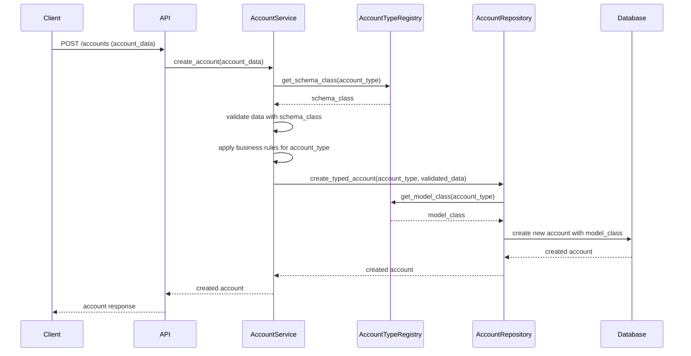
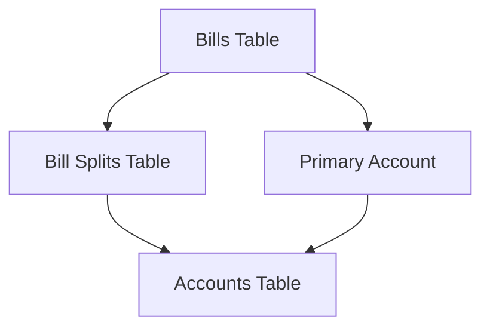

# ADR-016: Account Type Expansion - Foundation

## Status

Proposed

## Context

The Debtonator application currently supports a limited set of account types (checking, savings, and credit) through a single-table design with optional fields. As our users' financial management needs grow more complex, this design has become limiting. We need to expand our account type support to provide a comprehensive financial management solution.

### Current Limitations

1. All account types share the same fields in a single table, with optional fields that may or may not apply
2. Adding account-type-specific fields requires modifying the base Account model
3. Business logic for different account types is scattered across services
4. Type-specific validation is inconsistently applied
5. Field naming inconsistencies exist (`type` vs. `account_type`)
6. Parameter mapping in schema factories doesn't match schema field names
7. Schema creation is inconsistent throughout tests

### Technical Debt to Address

In addition to the architectural changes, we must address several layers of technical debt:

1. **Field Naming Inconsistency**: The discriminator field is named `type` in the schema instead of the more descriptive `account_type`, leading to ambiguity
2. **Parameter Mapping Confusion**: Schema factories use `account_type` as a parameter but map it to `type` in the schema
3. **Inconsistent Schema Creation**: Tests create schemas through different methods, leading to inconsistencies

## Decision

We will implement a comprehensive polymorphic inheritance pattern using SQLAlchemy that consists of:

1. A base Account model containing common fields and behaviors
2. Type-specific models that inherit from the base Account with specialized fields
3. An Account Type Registry to dynamically register and manage account types
4. Corresponding Pydantic schemas that mirror the inheritance structure
5. Updated repository, service, and API layers to work with the polymorphic models

### Account Type Categorization

We will organize account types into a three-tier hierarchical classification:

#### Tier 1: Major Categories
- Banking Accounts (liquid assets and revolving credit)
- Investment Accounts (growth-focused, long-term)
- Loan Accounts (fixed-term debt)
- Bills/Utilities Accounts (recurring obligations)

#### Tier 2: Account Types (Examples)
- Banking: Checking, Savings, Credit, Payment App
- Investment: Brokerage, Retirement, HSA, Crypto
- Loan: Personal Loan, Auto Loan, Mortgage, Student Loan, BNPL
- Bills/Utilities: Utility, Subscription, Insurance, Tax, Support Payment

#### Tier 3: Subtypes (When Needed)
- Retirement: 401(k), IRA, Roth IRA
- Tax: Property Tax, Income Tax

This categorization provides a logical organization for the user interface while keeping the code structure clean and maintainable.

### Base Account Model

All account types will share these core attributes in the base Account model:

```python
class Account(Base):
    __tablename__ = "accounts"
    
    id = Column(Integer, primary_key=True)
    account_number = Column(String, nullable=True)  # May be null for some account types
    name = Column(String, nullable=False)
    institution = Column(String, nullable=True)
    account_type = Column(String, nullable=False)  # Discriminator column
    url = Column(String, nullable=True)
    logo_path = Column(String, nullable=True)
    current_balance = Column(Numeric(12, 4), nullable=False)
    available_balance = Column(Numeric(12, 4), nullable=True)
    user_id = Column(Integer, ForeignKey("users.id"), nullable=False)
    created_at = Column(DateTime(timezone=True), nullable=False)
    updated_at = Column(DateTime(timezone=True), nullable=False)
    is_closed = Column(Boolean, default=False, nullable=False)
    
    __mapper_args__ = {
        "polymorphic_on": account_type,
        "polymorphic_identity": "account"
    }
```

### Type-Specific Models

Each account type will have its own model that inherits from the base Account model, with specialized fields:

```python
class CheckingAccount(Account):
    __tablename__ = "checking_accounts"
    
    id = Column(Integer, ForeignKey("accounts.id"), primary_key=True)
    routing_number = Column(String, nullable=True)
    has_overdraft_protection = Column(Boolean, default=False, nullable=False)
    overdraft_limit = Column(Numeric(12, 4), nullable=True)
    
    __mapper_args__ = {
        "polymorphic_identity": "checking"
    }

class CreditAccount(Account):
    __tablename__ = "credit_accounts"
    
    id = Column(Integer, ForeignKey("accounts.id"), primary_key=True)
    credit_limit = Column(Numeric(12, 4), nullable=False)
    statement_balance = Column(Numeric(12, 4), nullable=True)
    statement_due_date = Column(DateTime(timezone=True), nullable=True)
    minimum_payment = Column(Numeric(12, 4), nullable=True)
    apr = Column(Numeric(6, 4), nullable=True)
    
    __mapper_args__ = {
        "polymorphic_identity": "credit"
    }
```

### Account Type Registry

A key component of our design is the AccountTypeRegistry that facilitates dynamic account type management:

```python
class AccountTypeRegistry:
    def __init__(self):
        self._registry = {}
    
    def register(self, account_type_id, model_class, schema_class, name, description, category):
        """Register a new account type with its classes and metadata."""
        self._registry[account_type_id] = {
            "model_class": model_class,
            "schema_class": schema_class,
            "name": name,
            "description": description,
            "category": category
        }
    
    def get_model_class(self, account_type_id):
        """Get the model class for a given account type."""
        return self._registry.get(account_type_id, {}).get("model_class")
    
    def get_schema_class(self, account_type_id):
        """Get the schema class for a given account type."""
        return self._registry.get(account_type_id, {}).get("schema_class")
    
    def get_all_types(self):
        """Get all registered account types."""
        return [
            {
                "id": type_id,
                "name": info["name"],
                "description": info["description"],
                "category": info["category"]
            }
            for type_id, info in self._registry.items()
        ]
    
    def get_types_by_category(self, category):
        """Get account types filtered by category."""
        return [
            {
                "id": type_id,
                "name": info["name"],
                "description": info["description"],
                "category": info["category"]
            }
            for type_id, info in self._registry.items()
            if info["category"] == category
        ]
```

### Pydantic Schema Architecture

The Pydantic schema layer will mirror the model inheritance structure, using discriminated unions to handle polymorphic validation:

```python
class AccountBase(BaseModel):
    account_number: Optional[str] = None
    name: str
    institution: Optional[str] = None
    url: Optional[str] = None
    logo_path: Optional[str] = None
    current_balance: MoneyDecimal
    
    class Config:
        extra = "forbid"

class AccountCreate(AccountBase):
    account_type: str
    
    @validator("account_type")
    def validate_account_type(cls, v):
        allowed_types = account_type_registry.get_all_types()
        allowed_ids = [t["id"] for t in allowed_types]
        if v not in allowed_ids:
            raise ValueError(f"Invalid account type. Must be one of: {', '.join(allowed_ids)}")
        return v

class AccountResponse(AccountBase):
    id: int
    account_type: str
    available_balance: Optional[MoneyDecimal] = None
    created_at: datetime
    updated_at: datetime
    is_closed: bool = False
    
    class Config:
        orm_mode = True

# Type-specific schemas
class CheckingAccountCreate(AccountCreate):
    account_type: Literal["checking"]
    routing_number: Optional[str] = None
    has_overdraft_protection: bool = False
    overdraft_limit: Optional[MoneyDecimal] = None

class CheckingAccountResponse(AccountResponse):
    account_type: Literal["checking"]
    routing_number: Optional[str] = None
    has_overdraft_protection: bool = False
    overdraft_limit: Optional[MoneyDecimal] = None
```

### Discriminated Union for API

To handle all account types in a single API endpoint, we'll use Pydantic's discriminated unions:

```python
AccountCreateUnion = Annotated[
    Union[
        CheckingAccountCreate,
        SavingsAccountCreate,
        CreditAccountCreate,
        # Add all other account type create schemas
    ],
    Field(discriminator="account_type")
]

AccountResponseUnion = Annotated[
    Union[
        CheckingAccountResponse,
        SavingsAccountResponse,
        CreditAccountResponse,
        # Add all other account type response schemas
    ],
    Field(discriminator="account_type")
]
```

## Repository Layer Architecture

The repository layer will be enhanced to handle polymorphic operations efficiently:

### Base Repository Implementation

```python
class BaseRepository:
    """Base repository with common CRUD operations."""
    
    def __init__(self, session: Session):
        self.session = session
    
    def get(self, id: int) -> Optional[Model]:
        """Get entity by ID."""
        return self.session.query(self.model_class).get(id)
    
    def get_all(self) -> List[Model]:
        """Get all entities."""
        return self.session.query(self.model_class).all()
    
    def create(self, data: dict) -> Model:
        """Create new entity."""
        entity = self.model_class(**data)
        self.session.add(entity)
        self.session.commit()
        self.session.refresh(entity)
        return entity
    
    def update(self, id: int, data: dict) -> Optional[Model]:
        """Update entity by ID."""
        entity = self.get(id)
        if not entity:
            return None
        
        for key, value in data.items():
            setattr(entity, key, value)
        
        self.session.commit()
        self.session.refresh(entity)
        return entity
    
    def delete(self, id: int) -> bool:
        """Delete entity by ID."""
        entity = self.get(id)
        if not entity:
            return False
        
        self.session.delete(entity)
        self.session.commit()
        return True
```

### Polymorphic Account Repository

```python
class AccountRepository(BaseRepository):
    """Repository for Account entities with polymorphic operations."""
    
    def __init__(self, session: Session, account_type_registry: AccountTypeRegistry):
        super().__init__(session)
        self.model_class = Account
        self.account_type_registry = account_type_registry
    
    def get_with_type(self, id: int) -> Optional[Account]:
        """Get account by ID, ensuring type-specific data is loaded."""
        return self.session.query(Account).options(
            with_polymorphic('*')
        ).filter(Account.id == id).first()
    
    def get_by_type(self, account_type: str) -> List[Account]:
        """Get all accounts of a specific type."""
        model_class = self.account_type_registry.get_model_class(account_type)
        if not model_class:
            raise ValueError(f"Unknown account type: {account_type}")
        
        return self.session.query(model_class).all()
    
    def get_by_user(self, user_id: int) -> List[Account]:
        """Get all accounts for a specific user."""
        return self.session.query(Account).options(
            with_polymorphic('*')
        ).filter(Account.user_id == user_id).all()
    
    def get_by_user_and_type(self, user_id: int, account_type: str) -> List[Account]:
        """Get all accounts of a specific type for a specific user."""
        model_class = self.account_type_registry.get_model_class(account_type)
        if not model_class:
            raise ValueError(f"Unknown account type: {account_type}")
        
        return self.session.query(model_class).filter(model_class.user_id == user_id).all()
    
    def create_typed_account(self, account_type: str, data: dict) -> Account:
        """Create a new account of the specified type."""
        model_class = self.account_type_registry.get_model_class(account_type)
        if not model_class:
            raise ValueError(f"Unknown account type: {account_type}")
        
        entity = model_class(**data)
        self.session.add(entity)
        self.session.commit()
        self.session.refresh(entity)
        return entity
    
    def update_typed_account(self, id: int, account_type: str, data: dict) -> Optional[Account]:
        """Update an account of the specified type."""
        model_class = self.account_type_registry.get_model_class(account_type)
        if not model_class:
            raise ValueError(f"Unknown account type: {account_type}")
        
        entity = self.session.query(model_class).get(id)
        if not entity:
            return None
        
        for key, value in data.items():
            setattr(entity, key, value)
        
        self.session.commit()
        self.session.refresh(entity)
        return entity
    
    def get_available_types(self) -> List[dict]:
        """Get all available account types."""
        return self.account_type_registry.get_all_types()
    
    def get_types_by_category(self, category: str) -> List[dict]:
        """Get all account types in a specific category."""
        return self.account_type_registry.get_types_by_category(category)
```

## Service Layer Architecture

The service layer will coordinate business logic and handle type-specific validation:

```python
class AccountService:
    """Service for managing accounts with type-specific operations."""
    
    def __init__(
        self, 
        account_repository: AccountRepository,
        account_type_registry: AccountTypeRegistry
    ):
        self.account_repository = account_repository
        self.account_type_registry = account_type_registry
    
    def get_account(self, account_id: int) -> Optional[Account]:
        """Get account by ID with type-specific data."""
        return self.account_repository.get_with_type(account_id)
    
    def get_user_accounts(self, user_id: int) -> List[Account]:
        """Get all accounts for a user."""
        return self.account_repository.get_by_user(user_id)
    
    def get_user_accounts_by_type(self, user_id: int, account_type: str) -> List[Account]:
        """Get all accounts of a specific type for a user."""
        return self.account_repository.get_by_user_and_type(user_id, account_type)
    
    def create_account(self, data: dict) -> Account:
        """Create a new account with type-specific validation."""
        account_type = data.get("account_type")
        if not account_type:
            raise ValueError("Account type is required")
        
        schema_class = self.account_type_registry.get_schema_class(account_type)
        if not schema_class:
            raise ValueError(f"Unknown account type: {account_type}")
        
        # Validate data using type-specific schema
        validated_data = schema_class(**data).dict()
        
        # Apply any type-specific business rules
        self._apply_business_rules(account_type, validated_data)
        
        return self.account_repository.create_typed_account(account_type, validated_data)
    
    def update_account(self, account_id: int, data: dict) -> Optional[Account]:
        """Update an account with type-specific validation."""
        existing_account = self.get_account(account_id)
        if not existing_account:
            return None
        
        account_type = existing_account.account_type
        schema_class = self.account_type_registry.get_schema_class(account_type)
        
        # We need to merge existing data with update data for validation
        existing_data = {c.name: getattr(existing_account, c.name) 
                         for c in existing_account.__table__.columns}
        existing_data.update(data)
        
        # Validate the combined data
        validated_data = schema_class(**existing_data).dict(exclude_unset=True)
        
        # Only use the fields that were in the update request
        update_data = {k: validated_data[k] for k in data.keys()}
        
        # Apply any type-specific business rules
        self._apply_business_rules(account_type, update_data, is_update=True)
        
        return self.account_repository.update_typed_account(
            account_id, account_type, update_data)
    
    def delete_account(self, account_id: int) -> bool:
        """Delete an account."""
        return self.account_repository.delete(account_id)
    
    def get_available_account_types(self) -> List[dict]:
        """Get all available account types."""
        return self.account_repository.get_available_types()
    
    def get_account_types_by_category(self, category: str) -> List[dict]:
        """Get account types by category."""
        return self.account_repository.get_types_by_category(category)
    
    def _apply_business_rules(
        self, account_type: str, data: dict, is_update: bool = False
    ) -> None:
        """Apply type-specific business rules to account data."""
        # Example business rules
        if account_type == "checking":
            if data.get("has_overdraft_protection") and "overdraft_limit" not in data:
                raise ValueError("Overdraft limit is required when overdraft protection is enabled")
        
        elif account_type == "credit":
            if "credit_limit" in data and "available_balance" not in data:
                # Calculate available balance for credit accounts
                data["available_balance"] = data["credit_limit"] - data.get("current_balance", 0)
        
        # Add more type-specific business rules as needed
```

### Cross-Layer Interaction

The following diagram illustrates how the layers interact during account creation:



## Integration with Existing Features

### Bill Split Integration

The account type expansion must preserve and enhance Debtonator's core bill split functionality. The current implementation uses a primary account relationship and split relationships:



With the polymorphic account structure, bill splits will continue to reference the base Account model:

```python
class BillSplit(Base):
    __tablename__ = "bill_splits"
    
    id = Column(Integer, primary_key=True)
    bill_id = Column(Integer, ForeignKey("bills.id"), nullable=False)
    account_id = Column(Integer, ForeignKey("accounts.id"), nullable=False)
    amount = Column(Numeric(12, 4), nullable=False)
    
    # Relationships
    bill = relationship("Bill", back_populates="splits")
    account = relationship("Account", back_populates="bill_splits")
```

This design allows bill splits to reference any account type while maintaining the core validation rules:

1. Split amounts must sum to total bill amount
2. All account references must be valid (ensured by foreign key constraints)
3. No negative split amounts allowed (validated in schema)
4. Each bill-account combination must be unique (enforced by database constraint)

The polymorphic structure enhances bill splits by allowing:
- Type-specific validation (e.g., preventing bill splits assigned to certain account types)
- Better categorization of bill payments by account type
- Enhanced analytics on how bills are distributed across different account types

### Decimal Precision Handling

The system will maintain the two-tier precision model as defined in our technical standards:

- 4 decimal places for storage in database (Numeric(12, 4))
- 2 decimal places for display at UI/API boundaries

All account types will follow this pattern for monetary fields:

```python
# Model layer - 4 decimal places
current_balance = Column(Numeric(12, 4), nullable=False)
available_balance = Column(Numeric(12, 4), nullable=True)

# Schema layer - 2 decimal places for display
class AccountBase(BaseModel):
    current_balance: MoneyDecimal  # Custom type with 2 decimal display
    available_balance: Optional[MoneyDecimal] = None
```

Type-specific fields will use:

- **MoneyDecimal** type for monetary values (standard 2 decimal places)
- **PercentageDecimal** type for percentage values (4 decimal places)

### ADR-011 DateTime Standardization Compliance

All account-related date and time fields must comply with ADR-011 datetime standardization:

1. All datetime fields will use timezone-aware datetime objects
2. UTC will be used as the standard timezone for stored data
3. Conversion to local timezone will be handled in the UI layer

Implementation example:

```python
# Model layer
statement_due_date = Column(DateTime(timezone=True), nullable=True)
created_at = Column(DateTime(timezone=True), nullable=False)
updated_at = Column(DateTime(timezone=True), nullable=False)

# Schema layer - validate timezone awareness
@validator("statement_due_date", "created_at", "updated_at")
def ensure_timezone_awareness(cls, v):
    if v is not None and v.tzinfo is None:
        raise ValueError("Datetime must be timezone-aware")
    return v

# Repository layer - use utility functions
def get_upcoming_due_dates(self, user_id, days=30):
    now = datetime_utils.utc_now()
    end_date = datetime_utils.add_days(now, days)
    
    return self.session.query(CreditAccount).filter(
        CreditAccount.user_id == user_id,
        CreditAccount.statement_due_date.between(now, end_date)
    ).all()
```

Each account type-specific ADR will include explicit datetime handling requirements for that type's fields.

### ADR-012 Validation Layer Compliance

The account type expansion will follow ADR-012's multi-layer validation approach:

1. **Schema Layer**: Basic structural validation with Pydantic
2. **Service Layer**: Business logic validation
3. **Database Layer**: Data integrity constraints

The polymorphic design enhances validation by allowing:

```python
# Schema layer validation (type-specific)
class CreditAccountCreate(AccountCreate):
    account_type: Literal["credit"]
    credit_limit: MoneyDecimal
    
    @validator("credit_limit")
    def validate_credit_limit(cls, v):
        if v <= 0:
            raise ValueError("Credit limit must be greater than zero")
        return v

# Service layer validation (cross-field)
def _apply_business_rules(self, account_type, data, is_update=False):
    if account_type == "credit":
        if data.get("credit_limit") and data.get("current_balance"):
            if data["current_balance"] > data["credit_limit"]:
                raise ValueError("Balance cannot exceed credit limit")

# Database layer validation (constraints)
# In SQLAlchemy model definition:
credit_limit = Column(Numeric(12, 4), CheckConstraint("credit_limit > 0"), nullable=False)
```

## Performance Considerations

### Performance Benchmarks

While the polymorphic design may introduce some query complexity, we expect the following performance characteristics:

1. **Single Account Retrieval**: < 10ms
   - Direct ID lookup with polymorphic loading
   - Efficient due to primary key indexes

2. **User Account List**: < 50ms for typical users (10-30 accounts)
   - Performance scales linearly with number of accounts
   - Efficiently indexed joined queries

3. **Account Creation/Update**: < 100ms
   - Multiple validation layers but minimal impact
   - Single transaction for related data

4. **Type-Specific Queries**: < 30ms
   - Direct queries to subtype tables
   - Avoids complex joins when type is known

### Query Optimization Techniques

To maintain performance with the polymorphic structure:

1. **Selective Loading Strategy**:
   ```python
   # When only base fields are needed
   accounts = session.query(Account).filter(Account.user_id == user_id).all()
   
   # When full type details are needed
   accounts = session.query(Account).options(
       with_polymorphic('*')
   ).filter(Account.user_id == user_id).all()
   ```

2. **Indexing Strategy**:
   - Index on `account_type` in base Account table
   - Index on `user_id` for quick filtering
   - Index on frequently filtered fields like `is_closed`

3. **Caching Strategy**:
   - Cache account type registry in memory
   - Consider caching account lists at the API level with short TTL
   - Use etags for efficient client-side caching

4. **Pagination**:
   - Implement cursor-based pagination for large account lists
   - Default limit of 50 accounts per page

## Error Handling Strategy

The polymorphic account structure requires a robust error handling approach:

### Error Hierarchy

```python
class AccountError(Exception):
    """Base class for account-related errors."""
    pass

class AccountNotFoundError(AccountError):
    """Account not found error."""
    pass

class AccountTypeError(AccountError):
    """Error related to account types."""
    pass

class AccountValidationError(AccountError):
    """Validation error for account operations."""
    pass

# Type-specific errors
class CreditAccountError(AccountError):
    """Base class for credit account errors."""
    pass

class CreditLimitExceededError(CreditAccountError):
    """Credit limit exceeded error."""
    pass
```

### Layer-Specific Error Handling

1. **Repository Layer**:
   - Database access errors with contextual information
   - Not found errors for missing entities
   - Transaction rollback on errors

2. **Service Layer**:
   - Business logic errors with detailed context
   - Type-specific validation errors
   - Enriched error messages for UI consumption

3. **API Layer**:
   - Consistent error response format
   - Error codes mapped to HTTP status codes
   - User-friendly error messages

### Example Error Handling Flow

```python
def update_account(self, account_id: int, data: dict) -> Optional[Account]:
    """Update an account with type-specific validation."""
    try:
        existing_account = self.get_account(account_id)
        if not existing_account:
            raise AccountNotFoundError(f"Account with ID {account_id} not found")
        
        account_type = existing_account.account_type
        schema_class = self.account_type_registry.get_schema_class(account_type)
        if not schema_class:
            raise AccountTypeError(f"Unknown account type: {account_type}")
        
        # Validation and update logic...
        
    except AccountNotFoundError as e:
        logger.warning(f"Account not found: {str(e)}")
        return None
    except AccountTypeError as e:
        logger.error(f"Account type error: {str(e)}")
        raise
    except AccountValidationError as e:
        logger.warning(f"Account validation error: {str(e)}")
        raise
    except Exception as e:
        logger.exception(f"Unexpected error updating account: {str(e)}")
        raise AccountError(f"Failed to update account: {str(e)}")
```

## Schema Evolution

As the application evolves, the account type schema will need to adapt. Our strategy for schema evolution:

### Adding New Account Types

1. Create new model class inheriting from Account
2. Create new table with appropriate fields
3. Create corresponding Pydantic schemas
4. Register new type in AccountTypeRegistry
5. Add type-specific repository methods and tests
6. Add type-specific service logic and tests
7. Update API documentation

### Adding Fields to Existing Types

1. Add field to the appropriate model class
2. Create database migration to add the column
3. Update Pydantic schemas
4. Update validation logic
5. Update tests to cover the new field
6. Consider backward compatibility for API consumers

### Handling Deprecated Types

1. Mark type as deprecated in registry
2. Implement graceful fallback for deprecated types
3. Provide migration path for users with deprecated accounts
4. Eventually remove the type when no longer in use

## Reporting and Analytics Integration

The polymorphic account structure enhances reporting and analytics capabilities:

### Cross-Account Analysis

```python
def get_asset_liability_summary(self, user_id: int) -> dict:
    """Get summary of assets and liabilities for a user."""
    # Get all accounts for user
    accounts = self.account_repository.get_by_user(user_id)
    
    # Categorize and sum by account type
    assets = sum(a.current_balance for a in accounts 
                if a.account_type in ['checking', 'savings'])
    
    liabilities = sum(a.current_balance for a in accounts 
                     if a.account_type in ['credit', 'loan', 'mortgage'])
    
    return {
        "total_assets": assets,
        "total_liabilities": liabilities,
        "net_worth": assets - liabilities
    }
```

### Type-Specific Analytics

```python
def get_credit_utilization(self, user_id: int) -> dict:
    """Get credit utilization metrics for a user."""
    credit_accounts = self.account_repository.get_by_user_and_type(user_id, "credit")
    
    total_credit_limit = sum(a.credit_limit for a in credit_accounts)
    total_balance = sum(a.current_balance for a in credit_accounts)
    
    utilization = (total_balance / total_credit_limit * 100) if total_credit_limit else 0
    
    return {
        "total_credit_limit": total_credit_limit,
        "total_balance": total_balance,
        "utilization_percentage": utilization
    }
```

### Reporting Framework

The polymorphic structure enables:

1. **Category-Based Reporting**: Group accounts by category for high-level overview
2. **Type-Specific Metrics**: Calculate metrics relevant to specific account types
3. **Trend Analysis**: Track changes in account balances over time
4. **Cross-Account Insights**: Analyze relationships between different account types

## Test Data Generation

We will leverage and extend Debtonator's existing test fixtures and schema factories:

### Leveraging Existing Infrastructure

```python
# Existing pattern from /code/debtonator/tests/fixtures
@pytest.fixture
def test_checking_account(db_session):
    """Create a test checking account."""
    from tests.helpers.schema_factories import create_checking_account_schema
    
    schema = create_checking_account_schema()
    repository = AccountRepository(db_session, get_test_registry())
    return repository.create_typed_account("checking", schema.dict())
```

### Extending Schema Factories

We will extend the existing schema factories in `/code/debtonator/tests/helpers/schema_factories.py`:

```python
def create_checking_account_schema(**kwargs):
    """Create a checking account schema for testing."""
    defaults = {
        "name": "Test Checking Account",
        "account_number": "1234567890",
        "institution": "Test Bank",
        "account_type": "checking",
        "current_balance": Decimal("1000.00"),
        "available_balance": Decimal("1000.00"),
        "routing_number": "123456789",
        "has_overdraft_protection": True,
        "overdraft_limit": Decimal("500.00")
    }
    defaults.update(kwargs)
    return CheckingAccountCreate(**defaults)
```

### Realistic Test Data Sets

For comprehensive testing, we'll create detailed test scenarios:

1. **Account Type Tests**: Test data for each account type with realistic values
2. **Edge Cases**: Test data for boundary conditions like zero balances or high limits
3. **Cross-Type Scenarios**: Test data for scenarios involving multiple account types
4. **Historical Data**: Test data with realistic history for trending and forecasting

These test data generators will support our "real objects" testing philosophy while leveraging the existing infrastructure.

## Implementation Plan

We recommend implementing this design in the following phases, each with its own detailed ADR:

### Phase 1: Core Architecture (This ADR-016)
- Define the polymorphic model structure
- Establish the Account Type Registry
- Create base schema architecture
- Standardize field naming and parameter mapping
- Define repository and service layer patterns
- Update testing framework for polymorphic models

### Phase 2: Banking Account Types (ADR-019)
- Implement checking, savings, and credit card accounts
- Implement payment app accounts (PayPal, Venmo, Cash App)
- Implement Buy Now, Pay Later (BNPL) and Earned Wage Access (EWA) accounts
- Define field structures and validation rules
- Create type-specific repository methods
- Implement service-layer business rules
- Create comprehensive test suite

### Phase 3: Loan Account Types (ADR-020)
- Implement personal loan, auto loan, and mortgage accounts
- Implement student loan accounts with specialized fields
- Implement BNPL accounts (if not in Banking category)
- Define payment tracking and interest calculation logic
- Implement loan-specific repository methods
- Create service-layer business rules for loan accounts
- Create comprehensive test suite for loan accounts

### Phase 4: Investment Account Types (ADR-021)
- Implement brokerage and retirement accounts
- Implement HSA and crypto accounts
- Define contribution tracking and tax treatment
- Implement portfolio value calculation
- Create investment-specific repository methods
- Implement service-layer business rules for investments
- Create comprehensive test suite for investment accounts

### Phase 5: Bills and Obligations Account Types (ADR-022)
- Implement utility, subscription, and insurance accounts
- Implement tax and support payment accounts
- Define due date handling and recurrence patterns
- Implement balance semantics for bill accounts
- Create bill-specific repository methods
- Implement service-layer business rules for bills
- Create comprehensive test suite for bill accounts

### Phase 6: Frontend Integration (ADR-023)
- Implement UI for account type selection and management
- Design type-specific displays and forms
- Implement alert and notification strategies for each account type
- Define grouping and sorting strategies in the UI
- Create dashboard views for account categories
- Implement account-specific actions and operations
- Create comprehensive test suite for the UI layer

## Testing Strategy

Testing is critical for this implementation, as mistakes in a financial application cannot be tolerated. Users must trust our platform as a source of truth for their financial data. Our testing approach adheres to the "Real Objects Testing Philosophy":

### Testing Principles

1. **No Mocks Policy**: 
   - We strictly prohibit using unittest.mock, MagicMock, or any other mocking libraries
   - All tests must use real objects, real repositories, and real schemas
   - Every test uses a real database that gets set up and torn down between each test

2. **Integration-First Approach**:
   - Tests should verify actual interactions between components
   - Repository tests use real database sessions and real schemas
   - Service tests use real repositories connected to test database
   - Cross-layer validation testing to ensure proper interactions

3. **Comprehensive Coverage**:
   - We aim for as close to 100% code coverage as possible
   - Every account type must have complete test coverage
   - Every repository method must have test coverage for both success and failure paths
   - Every service method must have test coverage for validation and business rules

### Account Type Testing Strategy

For each account type, we will develop comprehensive tests covering:

1. **Schema Validation**:
   - Test creation with valid data
   - Test creation with missing required fields
   - Test type-specific field validation
   - Test updates to type-specific fields

2. **Repository Methods**:
   - Test CRUD operations for each account type
   - Test type-specific queries
   - Test error handling and edge cases
   - Test transactions and rollbacks

3. **Service Layer**:
   - Test business rule validation
   - Test type-specific behavior
   - Test cross-account operations
   - Test error handling and invalid cases

4. **API Endpoints**:
   - Test account creation, update, and retrieval
   - Test type-specific payload validation
   - Test error responses
   - Test account type listing endpoints

### Test Fixture Approach

Instead of using mocks or dummy data, we will use factory methods to create realistic test fixtures:

```python
def create_test_checking_account(db_session, user_id=1, **kwargs):
    """Create a realistic checking account for testing."""
    defaults = {
        "name": "Test Checking Account",
        "account_number": "1234567890",
        "institution": "Test Bank",
        "routing_number": "123456789",
        "current_balance": Decimal("1000.00"),
        "available_balance": Decimal("1000.00"),
        "has_overdraft_protection": True,
        "overdraft_limit": Decimal("500.00"),
        "user_id": user_id,
        "created_at": datetime.now(timezone.utc),
        "updated_at": datetime.now(timezone.utc)
    }
    defaults.update(kwargs)
    
    account = CheckingAccount(**defaults)
    db_session.add(account)
    db_session.commit()
    db_session.refresh(account)
    
    return account
```

### Test Case Examples

```python
class TestAccountRepository:
    def test_get_with_type_returns_correct_subclass(self, db_session):
        # Arrange
        checking = create_test_checking_account(db_session)
        savings = create_test_savings_account(db_session)
        credit = create_test_credit_account(db_session)
        
        repository = AccountRepository(db_session, get_test_registry())
        
        # Act
        retrieved_checking = repository.get_with_type(checking.id)
        retrieved_savings = repository.get_with_type(savings.id)
        retrieved_credit = repository.get_with_type(credit.id)
        
        # Assert
        assert isinstance(retrieved_checking, CheckingAccount)
        assert isinstance(retrieved_savings, SavingsAccount)
        assert isinstance(retrieved_credit, CreditAccount)
        
        # Verify specific fields are loaded
        assert retrieved_checking.routing_number == checking.routing_number
        assert retrieved_credit.credit_limit == credit.credit_limit
```

## Expected Benefits

1. **Clean Separation of Concerns**: Each account type has its own model and schema
2. **Type Safety**: The polymorphic design ensures type-specific operations are validated
3. **Extensibility**: New account types can be added by creating new models and registering them
4. **Improved Testing**: Each account type can be tested independently with real objects
5. **Better Developer Experience**: Clear model hierarchy and IDE support
6. **Reduced Technical Debt**: Proper domain modeling avoids hacks and workarounds
7. **Enhanced Validation**: Type-specific validation at both schema and service layers

## Technical Considerations

1. **Query Performance**: Polymorphic queries may be more complex than single-table queries, but the improved structure outweighs this cost for our use case
2. **Indexing Strategy**: We'll need to ensure proper indexing on the account_type field and foreign keys
3. **Implementation Effort**: Significant refactoring is required, but we'll break it into manageable phases
4. **Balance Field Semantics**: The meaning of current_balance varies by account type - for debt accounts it's a liability, for bills it's an amount due, and for assets it's a positive balance
5. **Registry Management**: The AccountTypeRegistry must be kept in sync with all account type implementations

## Alternatives Considered

1. **Extend the current approach**: Continue adding fields to the base Account model and use validation. Rejected due to increasing complexity and poor separation of concerns.

2. **Separate tables for each account type**: Create entirely separate models and tables without inheritance. Rejected due to duplication of common fields and logic.

3. **EAV (Entity-Attribute-Value) pattern**: Store type-specific attributes in a separate table. Rejected due to complexity and performance concerns.

4. **Single Table Inheritance**: Keep all fields in one table but use a type discriminator. Rejected due to sparse data and difficulty enforcing type-specific constraints.

## Database Implementation Note

Since we prioritize doing things right rather than backward compatibility, we will implement this new structure with a fresh database initialization rather than migrating existing data. This approach gives us the freedom to design the optimal data structure without compromise.

## References

- [SQLAlchemy Joined Table Inheritance](https://docs.sqlalchemy.org/en/14/orm/inheritance.html#joined-table-inheritance)
- [Pydantic Discriminated Unions](https://docs.pydantic.dev/latest/usage/types/#discriminated-unions-aka-tagged-unions)
