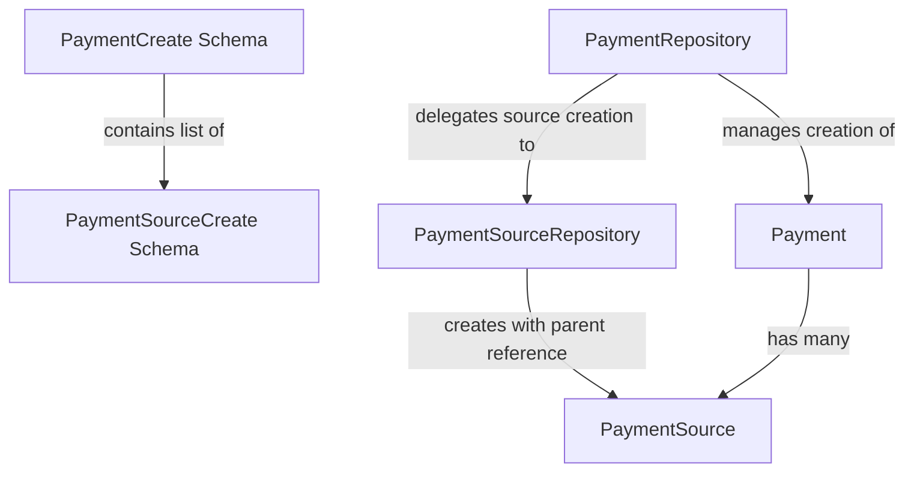

# ADR-017: Payment Source Schema Simplification

## Status

Accepted

## Executive Summary

Simplifies the payment source schema architecture by eliminating redundant schema definitions and establishing a clear parent-child relationship model for payments and their sources. This change resolves circular dependencies, reduces technical debt, and creates a more intuitive API by removing the standalone `PaymentSourceCreate` schema in favor of a nested approach where payment sources are always created in the context of a payment. The implementation shifts responsibility for payment ID assignment from the schema to the repository layer, resulting in more consistent validation, simplified testing, and clearer domain modeling throughout the application.

## Context

The PaymentSource model currently has two parallel schema definitions for creation, causing confusion and technical issues:

- **`PaymentSourceCreate`**: Requires a payment_id parameter, causing circular dependency issues when used in nested contexts
- **`PaymentSourceCreateNested`**: Used within a parent Payment creation process, doesn't require payment_id

This dual approach creates several problems across the application:

1. **Circular Dependencies**: Schema definitions that reference each other create import cycles
2. **Developer Confusion**: Two different patterns for essentially the same operation
3. **Technical Debt**: Developers must understand both approaches and when to use each
4. **Inconsistent Validation**: Different validation rules depending on creation path
5. **Test Failures**: Tests fail when using the wrong schema pattern for a given context
6. **Documentation Complexity**: Need to explain and maintain both patterns

We've already implemented an initial solution in the form of `PaymentSourceCreateNested`, but still maintain the original `PaymentSourceCreate` schema, creating maintenance overhead and ongoing technical debt.

## Decision

Simplify to a single schema approach for PaymentSource creation that properly models the parent-child relationship between payments and sources:

1. Remove the current `PaymentSourceCreate` class that requires payment_id
2. Rename `PaymentSourceCreateNested` to `PaymentSourceCreate`
3. Make `PaymentSourceCreate` the only creation schema for payment sources
4. Modify repositories to handle payment_id assignment at the repository level
5. Update schema factories and tests to use the simplified pattern

This approach recognizes that payment sources are child entities that should always be created in the context of a payment, and the payment_id should be managed by the repository layer rather than required in the schema.

## Technical Details

### Architecture Overview

The revised architecture establishes a clear parent-child relationship between payments and payment sources:



Key aspects of this architecture:

- Payment sources are always created as part of a payment
- Repository layer handles the parent-child relationship
- No circular dependencies in schema definitions
- Clear separation of concerns in validation

### Data Layer

#### Models

No changes are required to the underlying database models, as they already properly represent the relationship:

```python
class Payment(Base):
    __tablename__ = "payments"
    # Fields omitted for brevity
    sources: Mapped[List["PaymentSource"]] = relationship(
        "PaymentSource", back_populates="payment", cascade="all, delete-orphan"
    )

class PaymentSource(Base):
    __tablename__ = "payment_sources"
    # Fields omitted for brevity
    payment_id: Mapped[int] = mapped_column(ForeignKey("payments.id"))
    payment: Mapped["Payment"] = relationship("Payment", back_populates="sources")
```

#### Repositories

**PaymentSourceRepository**:

- Modified `create()` method to handle payment_id assignment:

  ```python
  async def create(self, obj_in: Dict[str, Any], payment_id: int) -> PaymentSource:
      """Create a new payment source with the provided payment ID."""
      obj_data = obj_in.copy()
      obj_data["payment_id"] = payment_id
      return await super().create(obj_data)
  ```

- Updated `bulk_create_sources()` method for the new schema:

  ```python
  async def bulk_create_sources(
      self, sources: List[Dict[str, Any]], payment_id: int
  ) -> List[PaymentSource]:
      """Create multiple payment sources for a single payment."""
      created_sources = []
      for source_data in sources:
          created_sources.append(await self.create(source_data, payment_id))
      return created_sources
  ```

**PaymentRepository**:

- Enhanced `create()` method to handle nested sources:

  ```python
  async def create(self, obj_in: Dict[str, Any]) -> Payment:
      """Create a payment with its sources."""
      sources_data = obj_in.pop("sources", [])
      payment = await super().create(obj_in)
      
      if sources_data:
          await self.payment_source_repository.bulk_create_sources(
              sources_data, payment.id
          )
          # Refresh payment to include sources
          payment = await self.get(payment.id)
      
      return payment
  ```

### Business Logic Layer

#### Schemas

**PaymentSourceBase Schema**:

- Removed requirement for payment_id:

  ```python
  class PaymentSourceBase(BaseModel):
      """Base schema for payment sources."""
      account_id: int
      amount: MoneyDecimal
      # payment_id is no longer defined here
  ```

**PaymentSourceCreate Schema**:

- Renamed from PaymentSourceCreateNested:

  ```python
  class PaymentSourceCreate(PaymentSourceBase):
      """Schema for creating a payment source as part of a payment."""
      # Inherits fields from PaymentSourceBase
      # Used within PaymentCreate schema
  ```

**PaymentCreate Schema**:

- Updated to use the renamed schema:

  ```python
  class PaymentCreate(PaymentBase):
      """Schema for creating a new payment."""
      sources: List[PaymentSourceCreate] = []
  ```

**Validation Logic**:

- Added validation to ensure payments have at least one source:

  ```python
  @model_validator(mode='after')
  def validate_sources(self) -> 'PaymentCreate':
      """Ensure payment has at least one source."""
      if not self.sources:
          raise ValueError("Payment must have at least one source")
      return self
  ```

#### Services

**PaymentService**:

- Updated to work with the simplified schema approach:

  ```python
  async def create_payment(self, payment_data: Dict[str, Any]) -> Payment:
      """Create a new payment with sources."""
      # Schema validation ensures at least one source exists
      payment = await self.payment_repository.create(payment_data)
      return payment
  ```

### API Layer

**API Endpoints**:

- Updated to use the simplified schema approach:

  ```python
  @router.post("/payments/", response_model=PaymentResponse)
  async def create_payment(
      payment: PaymentCreate, payment_service: PaymentService = Depends(get_payment_service)
  ):
      """Create a new payment with sources."""
      return await payment_service.create_payment(payment.model_dump())
  ```

### Frontend Considerations

The frontend will benefit from a simplified API contract:

- Forms only need to collect account_id and amount for sources
- No need to handle payment_id assignment
- Clearer validation messages for source requirements

### Config, Utils, and Cross-Cutting Concerns

**Schema Factories**:

- Removed `create_payment_source_schema` function
- Updated payment schema factory to use the simplified approach:

  ```python
  def create_payment_schema(
      amount: Decimal = Decimal("100.00"),
      sources: Optional[List[Dict[str, Any]]] = None,
      **kwargs
  ) -> Dict[str, Any]:
      """Create a payment schema with sources."""
      if sources is None:
          # Default to a single source
          sources = [create_payment_source_schema_nested(amount=amount)]
      
      return {
          "amount": amount,
          "sources": sources,
          **kwargs
      }
  ```

**Documentation**:

- Updated docstrings to explain the parent-child relationship:

  ```python
  class PaymentSourceRepository(BaseRepository[PaymentSource, int]):
      """
      Repository for payment source operations.
      
      Payment sources are always created in the context of a payment.
      They represent the accounts from which a payment is funded.
      """
  ```

### Dependencies and External Systems

No new external dependencies are required for this implementation.

### Implementation Impact

This change affects several components across the application:

- Schema definitions for payment sources
- Repository methods for payment creation and updates
- Schema factories used in tests
- Validation logic for payments and sources
- API documentation and examples

## Consequences

### Positive

- **Simplified API**: Clearer, more intuitive API for creating payment sources
- **Eliminated Circular Dependencies**: Resolved import cycles in schema definitions
- **Reduced Technical Debt**: Single pattern is easier to maintain and understand
- **Clearer Domain Modeling**: Proper parent-child relationship between payments and sources
- **Improved Code Organization**: Better separation of concerns between layers
- **More Consistent Validation**: Unified validation approach for payment sources
- **Reduced Repository Complexity**: Simpler repository methods with clear responsibilities
- **Improved Testing**: Fewer test permutations needed, clearer test fixtures

### Negative

- **Migration Effort**: Required coordinated changes across multiple layers
- **Test Updates**: Necessitated updates to all tests using payment sources
- **Remaining Work**: Some service layer and API integration still needed

### Neutral

- **Repository Responsibility Shift**: Repository now handles payment_id assignment
- **Validation Approach Change**: Validation now focuses on business rules rather than structure
- **Schema Factory Changes**: Factories changed to match the new pattern

## Quality Considerations

This change significantly improves code quality and prevents technical debt:

- **Simplified Mental Model**: Developers now have one clear way to create payment sources
- **Proper Domain Modeling**: The architecture now correctly represents that sources are part of payments
- **Reduced Duplication**: Eliminated redundant schema definitions and validation logic
- **Better Separation of Concerns**: Schema handles structure, repository handles relationships
- **Improved Documentation**: Clearer documentation of the parent-child relationship
- **Enhanced Testability**: Simpler, more consistent test fixtures and validation
- **Elimination of Circular Dependencies**: Removed a significant source of architectural complexity

## Performance and Resource Considerations

- **No Performance Impact**: The changes are structural and don't affect runtime performance
- **Reduced Code Size**: Fewer schema definitions and simpler repository methods
- **Simplified Testing**: Fewer test cases needed to cover all scenarios
- **Repository Operations**: No change in database query patterns or transaction boundaries

## Development Considerations

- **Development Effort**: Completed approximately 75% of the implementation
- **Remaining Effort**: 1-2 days to complete service/API integration
- **Testing Scope**: Comprehensive testing of all repository operations with the new pattern
- **Implementation Approach**: Used a phased approach to ensure backward compatibility during transition
- **Coordination Required**: Changes needed coordination across schema, repository, and service layers

## Security and Compliance Considerations

- **No Security Impact**: The changes are structural and don't affect security controls
- **Data Validation**: Improved validation ensures proper relationship integrity
- **Audit Trail**: No changes to existing audit functionality

## Timeline

- **Phase 1 (Schema Layer)**: Completed March 25, 2025
- **Phase 2 (Repository Layer)**: Completed March 26, 2025
- **Phase 3 (Test Updates)**: Completed March 28, 2025
- **Phase 4 (Service/API Layer)**: Planned for April 2025

## Monitoring & Success Metrics

- **Key Metrics**:
  - Test coverage of payment source operations
  - Number of test failures related to payment sources
  - Code complexity metrics for repository methods
  - Schema validation error rates

- **Success Criteria**:
  - All tests passing with the new schema approach
  - No circular dependency warnings or errors
  - Clear, consistent documentation of the parent-child pattern

## Team Impact

- **Backend Team**: Implementation of schema and repository changes
- **QA Team**: Verification of payment creation and updating
- **Documentation Team**: Updates to API documentation

## Related Documents

- [ADR-009](./009-bills-payments-separation.md): Bills and Payments Separation
- [ADR-014](./014-repository-layer-for-crud-operations.md): Repository Layer for CRUD Operations

## Notes

The implementation of this ADR follows the parent-child relationship pattern that is becoming standard throughout the application. This pattern, where child entities are always created in the context of their parent, provides several advantages:

1. **Clear Domain Boundaries**: Child entities belong to their parent conceptually
2. **Simplified API**: Fewer parameters needed at the schema level
3. **Better Relationship Management**: Parent entity controls lifecycle of children
4. **Improved Validation**: Business rules can be enforced at parent level
5. **Transaction Safety**: All related entities created in a single transaction

We should consider applying this pattern to other parent-child relationships in the application.

## Updates

| Date | Revision | Author | Description |
|------|-----------|---------|-------------|
| 2025-03-28 | 1.0 | Backend Team | Initial implementation with checklist approach |
| 2025-04-20 | 2.0 | System Architect | Standardized format, added architectural details |
