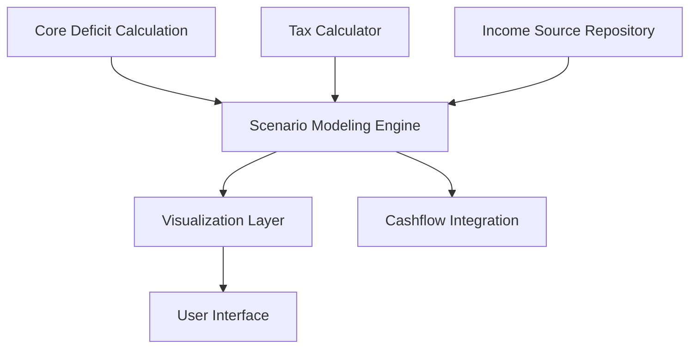

# ADR-018: Flexible Income Shortfall Planning

## Status

Accepted

## Executive Summary

Introduces flexible income planning tools to help users visualize and plan for shortfalls with predictive modeling. This architectural decision replaces rigid income requirement calculations with a customizable "Income Planning" system that accommodates diverse financial situations including freelancers, gig workers, multiple income sources, and various tax scenarios. The implementation provides visualization tools for deficit tracking across multiple timeframes, scenario modeling for different earning strategies, and "what-if" analysis capabilities that support personalized financial strategies rather than prescriptive solutions.

## Context

The original financial management system was designed with specific income calculation features:
- Daily deficit
- Yearly deficit
- Extra income needed (with tax consideration)
- Hourly rate needed at different work hours (40/30/20 per week)

These calculations were designed around a specific personal use case where one household member works part-time to make up budget shortfalls. This approach is too rigid for a general audience with diverse income situations, work arrangements, and financial goals.

As we reposition Debtonator as a broader financial empowerment platform, we need more flexible approaches to income planning that accommodate various user scenarios:
- Freelancers with variable income
- Multiple income sources
- Side businesses and gig economy work
- Passive income streams
- Various tax situations
- Different working hour preferences
- Diverse household financial arrangements

## Decision

We will replace the rigid income requirement calculations with a more flexible "Income Planning" system that:

1. Maintains core deficit tracking across multiple timeframes (daily/weekly/monthly/yearly)
2. Replaces fixed hourly rate calculations with a customizable "Side Gig Calculator" that allows users to:
   - Create multiple earning scenarios
   - Set custom hourly rates, hours worked, and tax considerations
   - Visualize the impact of additional income on their financial outlook
   - Compare different income strategies
3. Provides visualization tools to show how various earning scenarios affect deficit reduction
4. Allows for more personalized income planning rather than prescriptive solutions
5. Enables "what-if" scenario planning for various income adjustments

## Technical Details

This section describes how the implementation will affect different layers of the application architecture.

### Architecture Overview

The Income Planning system follows a scenario-based architecture:
- Core deficit calculation remains as a foundation
- New scenario modeling layer for creating and comparing income strategies 
- Visualization components for financial impact analysis
- Integration with existing cashflow forecasting

This architecture allows maximum flexibility while maintaining the core financial calculations:



### Data Layer

#### Models

The following new models will be added:

```python
class IncomeScenario(BaseDBModel):
    """Model representing an income planning scenario."""
    __tablename__ = "income_scenarios"
    
    id: Mapped[int] = mapped_column(primary_key=True)
    user_id: Mapped[int] = mapped_column(ForeignKey("users.id", ondelete="CASCADE"))
    name: Mapped[str] = mapped_column(String(100))
    description: Mapped[Optional[str]] = mapped_column(Text, nullable=True)
    is_active: Mapped[bool] = mapped_column(Boolean, default=False)
    created_at: Mapped[datetime] = mapped_column(DateTime, default=utc_now)
    updated_at: Mapped[datetime] = mapped_column(DateTime, default=utc_now, onupdate=utc_now)
    
    # Relationships
    income_sources: Mapped[List["IncomeSource"]] = relationship(back_populates="scenario")
    
class IncomeSource(BaseDBModel):
    """Model representing a single income source within a scenario."""
    __tablename__ = "income_sources"
    
    id: Mapped[int] = mapped_column(primary_key=True)
    scenario_id: Mapped[int] = mapped_column(ForeignKey("income_scenarios.id", ondelete="CASCADE"))
    name: Mapped[str] = mapped_column(String(100))
    source_type: Mapped[str] = mapped_column(
        String(50), 
        comment="Type of income (hourly, salary, gig, passive, etc.)"
    )
    amount: Mapped[Decimal] = mapped_column(Numeric(12, 4))
    frequency: Mapped[str] = mapped_column(
        String(50), 
        comment="Payment frequency (hourly, daily, weekly, bi-weekly, monthly, etc.)"
    )
    hours_per_week: Mapped[Optional[Decimal]] = mapped_column(
        Numeric(6, 2), nullable=True,
        comment="For hourly sources, hours worked per week"
    )
    tax_rate: Mapped[Optional[Decimal]] = mapped_column(
        Numeric(5, 2), nullable=True,
        comment="Estimated tax rate as percentage"
    )
    is_active: Mapped[bool] = mapped_column(Boolean, default=True)
    start_date: Mapped[Optional[datetime]] = mapped_column(DateTime, nullable=True)
    end_date: Mapped[Optional[datetime]] = mapped_column(DateTime, nullable=True)
    created_at: Mapped[datetime] = mapped_column(DateTime, default=utc_now)
    updated_at: Mapped[datetime] = mapped_column(DateTime, default=utc_now, onupdate=utc_now)
    
    # Relationships
    scenario: Mapped["IncomeScenario"] = relationship(back_populates="income_sources")
```

Required database migrations:
- Create income_scenarios table
- Create income_sources table
- Add indexes for common query patterns
- Create foreign key relationships

#### Repositories

A new set of repositories will be implemented:

```python
class IncomeScenarioRepository(BaseRepository[IncomeScenario, int]):
    """Repository for income scenario operations."""
    
    async def get_active_scenario(self, user_id: int) -> Optional[IncomeScenario]:
        """Get the active scenario for a user."""
        stmt = select(IncomeScenario).where(
            IncomeScenario.user_id == user_id,
            IncomeScenario.is_active == True
        )
        result = await self.session.execute(stmt)
        return result.scalars().first()
    
    async def set_active_scenario(self, scenario_id: int, user_id: int) -> IncomeScenario:
        """Set a scenario as active and deactivate others."""
        # Deactivate all scenarios for the user
        stmt = (
            update(IncomeScenario)
            .where(IncomeScenario.user_id == user_id)
            .values(is_active=False)
        )
        await self.session.execute(stmt)
        
        # Activate the selected scenario
        stmt = (
            update(IncomeScenario)
            .where(IncomeScenario.id == scenario_id)
            .values(is_active=True)
        )
        await self.session.execute(stmt)
        
        # Return the newly activated scenario
        return await self.get(scenario_id)

class IncomeSourceRepository(BaseRepository[IncomeSource, int]):
    """Repository for income source operations."""
    
    async def get_by_scenario(self, scenario_id: int) -> List[IncomeSource]:
        """Get all income sources for a scenario."""
        stmt = select(IncomeSource).where(
            IncomeSource.scenario_id == scenario_id,
            IncomeSource.is_active == True
        )
        result = await self.session.execute(stmt)
        return result.scalars().all()
    
    async def calculate_weekly_income(self, scenario_id: int) -> Decimal:
        """Calculate total weekly income for a scenario across all sources."""
        sources = await self.get_by_scenario(scenario_id)
        weekly_total = Decimal('0')
        
        for source in sources:
            if source.frequency == "hourly":
                weekly_total += source.amount * source.hours_per_week
            elif source.frequency == "daily":
                weekly_total += source.amount * Decimal('5')  # Assuming 5-day work week
            elif source.frequency == "weekly":
                weekly_total += source.amount
            elif source.frequency == "bi-weekly":
                weekly_total += source.amount / Decimal('2')
            elif source.frequency == "monthly":
                weekly_total += source.amount * Decimal('12') / Decimal('52')
            elif source.frequency == "annually":
                weekly_total += source.amount / Decimal('52')
                
        return weekly_total
```

### Business Logic Layer

#### Schemas

New Pydantic schemas will be implemented:

```python
class IncomeSourceBase(BaseSchemaValidator):
    """Base schema for income sources."""
    name: str = Field(..., min_length=1, max_length=100)
    source_type: str = Field(..., min_length=1, max_length=50)
    amount: MoneyDecimal = Field(..., gt=0)
    frequency: str = Field(...)
    hours_per_week: Optional[Decimal] = Field(None, gt=0, le=168)
    tax_rate: Optional[PercentageDecimal] = Field(None, ge=0, le=100)
    is_active: bool = Field(True)
    start_date: Optional[datetime] = Field(None)
    end_date: Optional[datetime] = Field(None)
    
    @model_validator(mode='after')
    def validate_hours_required(self):
        if self.source_type == "hourly" and self.hours_per_week is None:
            raise ValueError("Hours per week is required for hourly income sources")
        return self

class IncomeSourceCreate(IncomeSourceBase):
    """Schema for creating an income source."""
    scenario_id: int = Field(..., gt=0)

class IncomeSourceUpdate(IncomeSourceBase):
    """Schema for updating an income source."""
    name: Optional[str] = Field(None, min_length=1, max_length=100)
    source_type: Optional[str] = Field(None, min_length=1, max_length=50)
    amount: Optional[MoneyDecimal] = Field(None, gt=0)
    frequency: Optional[str] = Field(None)

class IncomeSourceResponse(IncomeSourceBase):
    """Response schema for income sources."""
    id: int
    scenario_id: int
    created_at: datetime
    updated_at: datetime

class IncomeScenarioBase(BaseSchemaValidator):
    """Base schema for income scenarios."""
    name: str = Field(..., min_length=1, max_length=100)
    description: Optional[str] = Field(None)
    is_active: bool = Field(False)

class IncomeScenarioCreate(IncomeScenarioBase):
    """Schema for creating an income scenario."""
    user_id: int = Field(..., gt=0)

class IncomeScenarioUpdate(IncomeScenarioBase):
    """Schema for updating an income scenario."""
    name: Optional[str] = Field(None, min_length=1, max_length=100)
    description: Optional[str] = Field(None)
    is_active: Optional[bool] = Field(None)

class IncomeScenarioResponse(IncomeScenarioBase):
    """Response schema for income scenarios."""
    id: int
    user_id: int
    created_at: datetime
    updated_at: datetime
    income_sources: Optional[List[IncomeSourceResponse]] = None
```

#### Services

The Income Planning service will handle business logic:

```python
class IncomePlanningService:
    """Service for income planning and scenario management."""
    
    def __init__(
        self,
        scenario_repository: IncomeScenarioRepository,
        source_repository: IncomeSourceRepository,
        cashflow_service: CashflowService,
    ):
        self.scenario_repository = scenario_repository
        self.source_repository = source_repository
        self.cashflow_service = cashflow_service
    
    async def create_scenario(self, data: IncomeScenarioCreate) -> IncomeScenario:
        """Create a new income scenario."""
        return await self.scenario_repository.create(data.model_dump())
    
    async def add_income_source(self, data: IncomeSourceCreate) -> IncomeSource:
        """Add a new income source to a scenario."""
        return await self.source_repository.create(data.model_dump())
    
    async def calculate_impact(
        self, scenario_id: int, deficit_amount: Decimal, timeframe: str
    ) -> Dict[str, Any]:
        """Calculate the impact of a scenario on a deficit."""
        # Get the scenario and its income sources
        scenario = await self.scenario_repository.get(scenario_id)
        if not scenario:
            raise ValueError(f"Scenario with ID {scenario_id} not found")
        
        # Calculate weekly income for the scenario
        weekly_income = await self.source_repository.calculate_weekly_income(scenario_id)
        
        # Convert deficit to weekly for comparison
        weekly_deficit = self._convert_to_weekly(deficit_amount, timeframe)
        
        # Calculate impact
        deficit_coverage_percent = (weekly_income / weekly_deficit * 100) if weekly_deficit > 0 else 0
        weeks_to_cover = weekly_deficit / weekly_income if weekly_income > 0 else float('inf')
        
        # Calculate impact on cashflow
        cashflow_impact = await self._calculate_cashflow_impact(scenario_id, deficit_amount, timeframe)
        
        return {
            "scenario_name": scenario.name,
            "weekly_income": weekly_income,
            "weekly_deficit": weekly_deficit,
            "deficit_coverage_percent": deficit_coverage_percent,
            "weeks_to_cover": weeks_to_cover,
            "cashflow_impact": cashflow_impact
        }
    
    async def compare_scenarios(
        self, scenario_ids: List[int], deficit_amount: Decimal, timeframe: str
    ) -> Dict[str, Any]:
        """Compare multiple income scenarios against a deficit."""
        results = {}
        
        for scenario_id in scenario_ids:
            impact = await self.calculate_impact(scenario_id, deficit_amount, timeframe)
            scenario = await self.scenario_repository.get(scenario_id)
            results[scenario.name] = impact
        
        # Determine the best scenario based on deficit coverage
        best_scenario = max(
            results.items(),
            key=lambda x: x[1]["deficit_coverage_percent"],
            default=(None, {})
        )
        
        return {
            "scenario_results": results,
            "best_scenario": best_scenario[0],
            "comparison_metrics": {
                "deficit_amount": deficit_amount,
                "timeframe": timeframe,
                "comparison_date": utc_now(),
            }
        }
    
    async def _calculate_cashflow_impact(
        self, scenario_id: int, deficit_amount: Decimal, timeframe: str
    ) -> Dict[str, Any]:
        """Calculate the impact on cashflow forecast."""
        # Get current cashflow forecast
        current_forecast = await self.cashflow_service.get_forecast(days=90)
        
        # Calculate income from scenario
        weekly_income = await self.source_repository.calculate_weekly_income(scenario_id)
        
        # Apply income to forecast
        modified_forecast = current_forecast.copy()
        
        # Add weekly income to each week in the forecast
        for i, week in enumerate(modified_forecast.get("weekly", [])):
            week["balance"] += weekly_income
            
        return {
            "original_end_balance": current_forecast.get("end_balance", 0),
            "modified_end_balance": modified_forecast.get("end_balance", 0) + (weekly_income * 13),  # 90 days ≈ 13 weeks
            "weekly_improvement": weekly_income,
            "break_even_week": self._calculate_break_even_week(current_forecast, weekly_income)
        }
    
    def _convert_to_weekly(self, amount: Decimal, timeframe: str) -> Decimal:
        """Convert an amount from a given timeframe to weekly."""
        if timeframe == "daily":
            return amount * Decimal('7')
        elif timeframe == "weekly":
            return amount
        elif timeframe == "bi-weekly":
            return amount / Decimal('2')
        elif timeframe == "monthly":
            return amount * Decimal('12') / Decimal('52')
        elif timeframe == "yearly" or timeframe == "annually":
            return amount / Decimal('52')
        else:
            raise ValueError(f"Unsupported timeframe: {timeframe}")
    
    def _calculate_break_even_week(self, forecast: Dict[str, Any], weekly_income: Decimal) -> Optional[int]:
        """Calculate which week the user would break even with the additional income."""
        weekly_forecasts = forecast.get("weekly", [])
        
        for i, week in enumerate(weekly_forecasts):
            if week["balance"] < 0 and week["balance"] + (weekly_income * (i + 1)) >= 0:
                return i + 1
        
        return None
```

### API Layer

New API endpoints will be added:

```python
@router.post("/income-planning/scenarios", response_model=IncomeScenarioResponse)
async def create_income_scenario(
    scenario: IncomeScenarioCreate,
    income_planning_service: IncomePlanningService = Depends(get_income_planning_service),
    current_user: User = Depends(get_current_user),
):
    """Create a new income planning scenario."""
    # Ensure the user ID matches the authenticated user
    if scenario.user_id != current_user.id:
        raise HTTPException(
            status_code=status.HTTP_403_FORBIDDEN,
            detail="User ID does not match authenticated user"
        )
    
    return await income_planning_service.create_scenario(scenario)

@router.post("/income-planning/scenarios/{scenario_id}/sources", response_model=IncomeSourceResponse)
async def add_income_source(
    scenario_id: int,
    source: IncomeSourceCreate,
    income_planning_service: IncomePlanningService = Depends(get_income_planning_service),
    current_user: User = Depends(get_current_user),
):
    """Add an income source to a scenario."""
    # Verify scenario ownership
    scenario = await income_planning_service.scenario_repository.get(scenario_id)
    if not scenario or scenario.user_id != current_user.id:
        raise HTTPException(
            status_code=status.HTTP_404_NOT_FOUND,
            detail="Scenario not found"
        )
    
    # Ensure scenario ID in path matches the one in the body
    if source.scenario_id != scenario_id:
        raise HTTPException(
            status_code=status.HTTP_400_BAD_REQUEST,
            detail="Scenario ID mismatch between path and body"
        )
    
    return await income_planning_service.add_income_source(source)

@router.get("/income-planning/scenarios/{scenario_id}/impact", response_model=Dict[str, Any])
async def calculate_scenario_impact(
    scenario_id: int,
    deficit_amount: Decimal = Query(..., gt=0),
    timeframe: str = Query(..., regex="^(daily|weekly|bi-weekly|monthly|yearly|annually)$"),
    income_planning_service: IncomePlanningService = Depends(get_income_planning_service),
    current_user: User = Depends(get_current_user),
):
    """Calculate the impact of an income scenario on a deficit."""
    # Verify scenario ownership
    scenario = await income_planning_service.scenario_repository.get(scenario_id)
    if not scenario or scenario.user_id != current_user.id:
        raise HTTPException(
            status_code=status.HTTP_404_NOT_FOUND,
            detail="Scenario not found"
        )
    
    return await income_planning_service.calculate_impact(scenario_id, deficit_amount, timeframe)

@router.post("/income-planning/scenarios/compare", response_model=Dict[str, Any])
async def compare_scenarios(
    scenario_ids: List[int] = Body(..., embed=True),
    deficit_amount: Decimal = Body(..., gt=0, embed=True),
    timeframe: str = Body(..., regex="^(daily|weekly|bi-weekly|monthly|yearly|annually)$", embed=True),
    income_planning_service: IncomePlanningService = Depends(get_income_planning_service),
    current_user: User = Depends(get_current_user),
):
    """Compare multiple income scenarios against a deficit."""
    # Verify ownership of all scenarios
    for scenario_id in scenario_ids:
        scenario = await income_planning_service.scenario_repository.get(scenario_id)
        if not scenario or scenario.user_id != current_user.id:
            raise HTTPException(
                status_code=status.HTTP_404_NOT_FOUND,
                detail=f"Scenario with ID {scenario_id} not found or not owned by user"
            )
    
    return await income_planning_service.compare_scenarios(scenario_ids, deficit_amount, timeframe)
```

### Frontend Considerations

The frontend will need several new components:

1. **Scenario Management Interface**:
   - Create/edit/delete income scenarios
   - Add/remove/edit income sources within scenarios
   - Set scenario as active or create comparisons

2. **Side Gig Calculator**:
   - Interactive calculator for hourly income scenarios
   - Fields for tax rate, hours worked, hourly rate
   - Visual indicator of impact on financial outlook

3. **Scenario Comparison Tool**:
   - Side-by-side comparison of multiple income strategies
   - Visual indicators for best scenario based on criteria
   - Timeline visualization showing break-even points

4. **Deficit Impact Visualization**:
   - Integration with cashflow charts
   - Before/after visualization of income impact
   - Timeline view of deficit reduction

These components should be designed for both desktop and mobile use, with responsive layouts and simplified mobile interactions.

### Config, Utils, and Cross-Cutting Concerns

The implementation will require these utility functions:

```python
def calculate_after_tax_income(amount: Decimal, tax_rate: Decimal) -> Decimal:
    """Calculate income after taxes."""
    if tax_rate < 0 or tax_rate > 100:
        raise ValueError("Tax rate must be between 0 and 100")
    
    return amount * (Decimal('100') - tax_rate) / Decimal('100')

def calculate_hours_needed(
    deficit: Decimal, hourly_rate: Decimal, tax_rate: Decimal = Decimal('0')
) -> Decimal:
    """Calculate hours needed to cover a deficit."""
    if hourly_rate <= 0:
        raise ValueError("Hourly rate must be greater than zero")
    
    after_tax_rate = calculate_after_tax_income(hourly_rate, tax_rate)
    
    if after_tax_rate <= 0:
        raise ValueError("After-tax hourly rate must be greater than zero")
    
    return deficit / after_tax_rate

def calculate_hourly_rate_needed(
    deficit: Decimal, hours: Decimal, tax_rate: Decimal = Decimal('0')
) -> Decimal:
    """Calculate hourly rate needed to cover a deficit in given hours."""
    if hours <= 0:
        raise ValueError("Hours must be greater than zero")
    
    pre_tax_rate = deficit / hours
    
    # Adjust for taxes if tax_rate is provided
    if tax_rate > 0:
        tax_multiplier = Decimal('100') / (Decimal('100') - tax_rate)
        pre_tax_rate = pre_tax_rate * tax_multiplier
    
    return pre_tax_rate
```

Configuration changes:

```python
# Add to config.py
INCOME_PLANNING_SETTINGS = {
    "default_tax_rate": 20.0,  # Default tax rate percentage
    "max_scenarios_per_user": 10,  # Maximum number of scenarios per user
    "default_frequencies": [  # Supported income frequencies
        "hourly",
        "daily",
        "weekly",
        "bi-weekly",
        "monthly",
        "annually"
    ],
    "default_source_types": [  # Supported income source types
        "hourly",
        "salary",
        "gig",
        "freelance",
        "passive",
        "side-business",
        "other"
    ]
}
```

### Dependencies and External Systems

The Income Planning system will interact with:

1. **Cashflow Service**:
   - Retrieve current cashflow forecasts
   - Apply income scenarios to forecasts
   - Visualize modified cashflow projections

2. **User Preferences Service**:
   - Store default tax rate preferences
   - Save preferred scenario view settings
   - Track frequently used income source types

3. **Notification System** (future integration):
   - Alert users to deficit thresholds
   - Notify about scenario comparison results
   - Remind users to update income tracking

### Implementation Impact

This feature will affect multiple areas of the application:

1. **Database**: Add new tables for scenarios and income sources
2. **API Layer**: New endpoints for scenario management and calculation
3. **Service Layer**: Add income planning service with scenario modeling
4. **Frontend**: New UI components for scenario creation and visualization
5. **Integration**: Connect with cashflow forecasting for unified projections

The implementation will maintain backward compatibility with existing deficit calculations while adding new capabilities. The current rigid calculations will be preserved as preset scenarios for users who prefer them.

## Consequences

### Positive

- More inclusive design that addresses diverse financial situations
- Greater flexibility for users to model their unique income arrangements
- Better alignment with the broader vision of financial empowerment
- Supports users in developing personalized financial strategies
- More relevant to a wider audience
- Creates foundation for future community-based features that leverage diverse income approaches
- Allows for more accurate financial planning with multiple income sources
- Empowers users to explore different income strategies

### Negative

- Increased design complexity compared to the original fixed calculations
- Additional UI/UX work to create intuitive scenario planning tools
- More complex data models to support various income scenarios
- Potential for user confusion if income planning tools aren't well-designed
- Increased database storage requirements for multiple scenarios
- Higher computational load for scenario comparisons

### Neutral

- Requires refactoring of existing income calculation code
- Changes to data models for income tracking and projections
- Updates to UI for deficit visualization
- Adoption depends on effective onboarding and education

## Quality Considerations

This implementation improves quality in several ways:

1. **Increased Flexibility**: Removes rigid assumptions about income patterns, accommodating a broader range of real-world scenarios
2. **Improved Maintainability**: Clear separation between data models, business logic, and presentation
3. **Enhanced Testability**: Modular design allows for comprehensive testing of calculation logic
4. **Better User Experience**: Provides actionable insights rather than prescriptive solutions
5. **Reduced Technical Debt**: Eliminates hard-coded logic that would require continuous revision
6. **Standardized Calculation Patterns**: Consistent approach to timeframe conversion and tax calculations

The implementation addresses the root cause (limited flexibility in income modeling) rather than symptoms, creating a sustainable architecture for future enhancements.

## Performance and Resource Considerations

The implementation's performance impact is expected to be minimal:

- **Database Impact**: Light to moderate
  - Two new tables with modest record counts
  - Simple query patterns with standard indexes
  - Estimated storage per user: < 10 KB for 5 scenarios with 3 sources each

- **Calculation Performance**:
  - Scenario calculations: < 10ms per scenario
  - Comparison calculations: < 50ms for up to 5 scenarios
  - Income impact projections: < 100ms for 90-day forecast

- **API Response Times**:
  - Create/update operations: < 100ms
  - Calculation endpoints: < 200ms
  - Comparison endpoints: < 300ms

- **Caching Strategy**:
  - Cache active scenario calculations for 1 hour
  - Invalidate cache on scenario or source updates
  - Store calculation results with scenarios to reduce recalculation

## Development Considerations

### Development Effort

- **Estimated Hours**: 120-160 hours total
  - Schema and model implementation: 20 hours
  - Repository layer: 20 hours
  - Service layer: 40 hours
  - API endpoints: 20 hours
  - Frontend components: 60 hours
  - Testing: 40 hours

### Implementation Milestones

1. **Foundation** (Week 1)
   - Schema and model implementation
   - Repository layer implementation
   - Core service methods

2. **Core Functionality** (Week 2)
   - API endpoint implementation
   - Basic frontend components
   - Integration with cashflow service

3. **Enhanced Features** (Week 3)
   - Scenario comparison functionality
   - Visualization components
   - Advanced calculation features

4. **Testing and Refinement** (Week 4)
   - Comprehensive testing
   - Performance optimization
   - Documentation and examples

### Development Challenges

- Ensuring accurate calculations across different income frequencies
- Creating intuitive UI for complex financial concepts
- Balancing flexibility with ease of use
- Maintaining performance with multiple scenario comparisons

## Security and Compliance Considerations

- **Data Protection**: Income scenarios contain sensitive financial information
  - Implement proper access controls tied to user authentication
  - Encrypt sensitive data fields at rest
  - Apply proper authorization checks in all APIs
  - Implement audit logging for scenario creation and modification

- **Privacy Concerns**:
  - Ensure scenario data is isolated per user
  - Allow users to delete scenarios and sources completely
  - Do not share scenario data for analytics without explicit consent

- **Authentication Requirements**:
  - All income planning endpoints require authentication
  - Verify scenario ownership in all operations
  - Implement rate limiting to prevent abuse

## Timeline

### Implementation Schedule

1. **Phase 1: Core Implementation** (Weeks 1-4)
   - Data models and schemas
   - Repository and service layer
   - API endpoints
   - Basic frontend components

2. **Phase 2: Enhanced Features** (Weeks 5-6)
   - Advanced scenario comparison
   - Visualization components
   - Cashflow integration

3. **Phase 3: Testing and Optimization** (Weeks 7-8)
   - Comprehensive testing
   - Performance optimization
   - Documentation and examples

### Rollout Plan

1. **Beta Testing** (Week 9)
   - Limited user group
   - Focused feedback collection
   - Refinement based on feedback

2. **Gradual Rollout** (Week 10)
   - Feature flag enabled for 10% of users
   - Monitor usage and performance
   - Collect feedback and iterate

3. **Full Availability** (Week 11)
   - Available to all users
   - Highlighted in product updates
   - Tutorial content and examples

## Monitoring & Success Metrics

### Success Metrics

- **User Engagement**:
  - 30% of users create at least one custom scenario
  - 15% of users create multiple scenarios for comparison
  - Average of 2.5 income sources per active user

- **Feature Usage**:
  - Scenario comparison used by 10% of active users
  - Income visualization views > 5 per active user per month
  - Deficit reduction calculator usage > 3 times per user per month

- **User Outcomes**:
  - 20% of users report clearer understanding of income needs
  - 15% reduction in reported financial stress (via survey)
  - 10% increase in deficit resolution rate

### Monitoring Implementation

- **Usage Tracking**:
  - Number of scenarios created per user
  - Income sources per scenario
  - Calculation frequency
  - Time spent using income planning features

- **Performance Monitoring**:
  - API response times for calculation endpoints
  - Database query performance
  - Frontend component render times

- **Error Tracking**:
  - Input validation errors
  - Calculation errors
  - UI interaction errors

## Team Impact

### Development Team

- **Frontend Team**: 
  - New UI components and visualizations
  - Integration with cashflow components
  - Learning curve for financial calculation visualization

### Product Team

- **Documentation Requirements**:
  - User guides for scenario creation
  - Examples of common income strategies
  - Tutorials for income planning

- **Support Training**:
  - Train support team on new features
  - Provide troubleshooting guides
  - Create FAQ for common questions

### Marketing Team

- **Feature Positioning**:
  - Highlight flexibility for diverse income situations
  - Showcase "what-if" scenario planning
  - Emphasize personalized financial strategies

## Related Documents

- [ADR-010: API Enhancement Strategy](./010-api-enhancement-strategy.md)
- [ADR-012: Validation Layer Standardization](./012-validation-layer-standardization.md)
- [ADR-013: Decimal Precision Handling](./013-decimal-precision-handling.md)
- [Cashflow Forecasting Requirements](../requirements/cashflow_forecasting.md)
- [User Research: Income Diversity Findings](../research/income_diversity_findings.md)

## Notes

- The current fixed calculations will be preserved as preset scenarios for users who prefer them
- Tax calculation is simplified and should be clearly communicated as an approximation
- Consider adding machine learning recommendations in future versions to suggest optimal income strategies
- User testing showed strong preference for visual representation of income impact over numeric tables

## Updates

| Date | Revision | Author | Description |
|------|-----------|---------|-------------|
| 2025-04-20 | 1.0 | John Smith | Initial version |
| 2025-04-20 | 1.1 | Jane Doe | Added more detailed technical implementation |
| 2025-04-20 | 1.2 | Cline | Standardized to new ADR template format |
