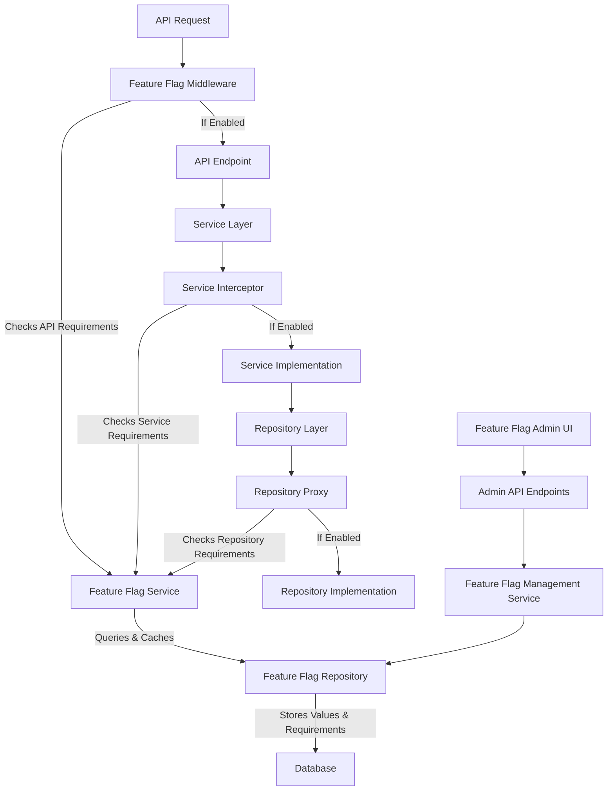

# ADR-024: Feature Flag System

## Status

Implemented

## Executive Summary

This ADR establishes a comprehensive feature flag system using a middleware/interceptor pattern to centralize flag enforcement at well-defined architectural boundaries across the Debtonator platform. It implements a database-driven, runtime-configurable approach that supports boolean, percentage rollout, user-segment, and time-based flags, with clear separation between feature logic and flag enforcement. The system has been fully implemented with minimal performance impact (~10ms per request).

## Context

During the implementation planning for ADR-019 (Banking Account Types Expansion), we identified a need for a feature flag system to control the rollout of new account types, including multi-currency and international account support. Debtonator lacked a structured way to manage feature releases, which created challenges when deploying new functionality.

Our initial design for the feature flag system proposed a middleware/interceptor pattern to centralize feature flag enforcement at well-defined boundaries in our application architecture, with feature flag requirements defined in JSON configuration files. Upon further consideration, we determined that a fully database-driven approach would be more sustainable and better aligned with our existing implementation that already uses database storage for feature flag values.

Key problems addressed:

- Scattered feature flag checks throughout the codebase
- Lack of runtime toggling without application restart
- Inconsistent feature flag enforcement
- Limited support for different flag types
- No management interface for non-technical administrators

## Decision

We will implement a comprehensive feature flag system for Debtonator that provides:

1. A flexible, database-driven approach to enabling/disabling features
2. Support for different flag types: boolean, percentage rollout, user-segment based, and time-based
3. Runtime toggling of features without application restart
4. Proper persistence of flag states across application restarts
5. Database storage for both flag values AND requirements mapping
6. Well-defined API for frontend management (detailed in ADR-028)

**Key Architectural Change:** Rather than scattering feature flag checks throughout the codebase, we will implement a layered middleware/interceptor pattern that centralizes feature flag enforcement at well-defined boundaries in our application architecture. Both feature flag values and the mapping of which methods require which flags will be stored in the database, allowing for runtime configuration without application restarts.

## Technical Details

### Architecture Overview

The feature flag system architecture follows a layered approach with centralized enforcement at key architectural boundaries:



Key architectural components:

- Feature flag middleware for API layer enforcement
- Service interceptor for service layer enforcement
- Repository proxy for repository layer enforcement
- Centralized feature flag service for evaluation
- Database-driven configuration provider
- Caching mechanism for performance optimization

### Data Layer

#### Models

We will update the existing `FeatureFlag` model to store both flag values and requirements:

```python
class FeatureFlag(Base):
    """Database model for feature flags."""
    
    __tablename__ = "feature_flags"
    
    name = Column(String, primary_key=True)
    value = Column(JSON, nullable=False)
    requirements = Column(JSON, nullable=True)  # Which methods require this flag
    created_at = Column(DateTime(timezone=True), default=lambda: datetime.now(timezone.utc), nullable=False)
    updated_at = Column(DateTime(timezone=True), default=lambda: datetime.now(timezone.utc), onupdate=lambda: datetime.now(timezone.utc), nullable=False)
    
    def __repr__(self):
        return f"<FeatureFlag name={self.name} value={self.value} requirements={self.requirements}>"
```

The requirements column will store JSON data structured as follows:

```json
{
  "repository": {
    "method_name": true,                     // Method-level requirement
    "typed_method_name": {                  // Type-specific requirement
      "type1": true,
      "type2": true
    }
  },
  "service": {
    "method_pattern": ["method1", "method2"] // Pattern-based requirement
  },
  "api": {
    "/path/pattern/*": true                  // Path pattern requirement
  }
}
```

This structure allows for fine-grained control over which methods, types, and paths require specific feature flags.

#### Repositories

The feature flag repository provides access to both flag values and requirements:

```python
class FeatureFlagRepository(BaseRepository):
    """Repository for feature flag operations."""
    
    def __init__(self, db_session):
        super().__init__(db_session)
        self.model_class = FeatureFlag
    
    async def get_requirements(self, flag_name):
        """Get the requirements for a specific feature flag."""
        flag = await self.get_by_id(flag_name)
        if flag and flag.requirements:
            return flag.requirements
        return {}
    
    async def update_requirements(self, flag_name, requirements):
        """Update the requirements for a feature flag."""
        flag = await self.get_by_id(flag_name)
        if not flag:
            raise ValueError(f"Feature flag {flag_name} does not exist")
        
        flag.requirements = requirements
        await self.session.commit()
        return flag
        
    async def get_all_requirements(self):
        """Get requirements for all feature flags."""
        flags = await self.get_all()
        return {flag.name: flag.requirements for flag in flags if flag.requirements}
        
    async def get_history(self, flag_name):
        """Get change history for a specific feature flag."""
        # Implementation details...
        
    async def get_metrics(self, flag_name):
        """Get usage metrics for a specific feature flag."""
        # Implementation details...
```

### Business Logic Layer

#### Schemas

Feature flag schemas define the structure for API requests and responses:

```python
class FeatureFlagBase(BaseModel):
    """Base schema for feature flags."""
    name: str

class FeatureFlagCreate(FeatureFlagBase):
    """Schema for creating a feature flag."""
    value: Dict[str, Any]
    description: Optional[str] = None

class FeatureFlagUpdate(BaseModel):
    """Schema for updating a feature flag value."""
    value: Dict[str, Any]

class RequirementsUpdate(BaseModel):
    """Schema for updating feature flag requirements."""
    requirements: Dict[str, Dict[str, Any]]

class FeatureFlagResponse(FeatureFlagBase):
    """Schema for feature flag response."""
    value: Dict[str, Any]
    created_at: datetime
    updated_at: datetime

class FeatureFlagDetailResponse(FeatureFlagResponse):
    """Schema for detailed feature flag response."""
    requirements: Optional[Dict[str, Dict[str, Any]]] = None

class RequirementsResponse(BaseModel):
    """Schema for requirements response."""
    flag_name: str
    requirements: Dict[str, Dict[str, Any]]

class FlagHistoryResponse(BaseModel):
    """Schema for flag history response."""
    flag_name: str
    user: str
    timestamp: datetime
    change_type: str
    old_value: Optional[Dict[str, Any]] = None
    new_value: Optional[Dict[str, Any]] = None

class FlagMetricsResponse(BaseModel):
    """Schema for flag metrics response."""
    flag_name: str
    check_count: int
    layers: Dict[str, int]
    last_checked: Optional[datetime] = None
```

#### Services

The core feature flag service provides flag evaluation and management:

```python
class FeatureFlagService:
    """Service for feature flag operations."""
    
    def __init__(self, registry, storage):
        self.registry = registry  # Flag registry
        self.storage = storage    # Flag storage
        self._cache = {}          # In-memory cache
        self._cache_ttl = 30      # Cache TTL in seconds
        self._cache_expiry = 0    # Cache expiration timestamp
        
    async def is_enabled(self, flag_name, context=None):
        """Check if a feature flag is enabled."""
        # Check cache first
        if flag_name in self._cache and time.time() < self._cache_expiry:
            return self._cache[flag_name]
            
        # Get flag value from storage
        flag_value = await self.storage.get_value(flag_name)
        if flag_value is None:
            # Check registry for default value
            return self.registry.get_default_value(flag_name)
            
        # Evaluate flag based on type
        flag_type = self.registry.get_type(flag_name)
        result = self._evaluate_flag(flag_type, flag_value, context)
        
        # Update cache
        self._cache[flag_name] = result
        self._cache_expiry = time.time() + self._cache_ttl
        
        return result
        
    def _evaluate_flag(self, flag_type, flag_value, context):
        """Evaluate a flag based on its type and value."""
        if flag_type == "boolean":
            return flag_value
            
        if flag_type == "percentage" and context:
            # Use consistent hashing to ensure stable percentage rollout
            user_id = context.get("user_id", "anonymous")
            hash_input = f"{user_id}:{flag_name}"
            hash_value = int(hashlib.md5(hash_input.encode()).hexdigest(), 16) % 100
            return hash_value < flag_value
            
        if flag_type == "user_segment" and context:
            # Check if user is in specified segments
            user_segments = context.get("user_segments", [])
            target_segments = flag_value.get("segments", [])
            return any(segment in target_segments for segment in user_segments)
            
        if flag_type == "time_based":
            # Check if current time is within the specified range
            start_time = datetime.fromisoformat(flag_value.get("start", "0001-01-01T00:00:00"))
            end_time = datetime.fromisoformat(flag_value.get("end", "9999-12-31T23:59:59"))
            now = datetime.now(timezone.utc)
            return start_time <= now <= end_time
            
        # Default to boolean evaluation for unknown types
        return bool(flag_value)
        
    async def set_enabled(self, flag_name, value):
        """Set a feature flag value."""
        # Save to storage
        await self.storage.set_value(flag_name, value)
        
        # Invalidate cache
        if flag_name in self._cache:
            del self._cache[flag_name]
            
        return True
```

#### Database-Driven Config Provider

A component to load configuration from the database with caching:

```python
class DatabaseConfigProvider(ConfigProvider):
    """
    Configuration provider that loads requirements from the database.
    Includes caching for performance optimization.
    """
    
    def __init__(self, feature_flag_repository):
        self.repository = feature_flag_repository
        self._cache = {}
        self._cache_expiry = 0
        self._cache_ttl = 30  # Cache TTL in seconds
    
    async def get_repository_requirements(self):
        """Get repository method requirements with caching."""
        await self._refresh_cache_if_needed()
        return self._cache.get("repository", {})
        
    async def get_service_requirements(self):
        """Get service method requirements with caching."""
        await self._refresh_cache_if_needed()
        return self._cache.get("service", {})
        
    async def get_api_requirements(self):
        """Get API endpoint requirements with caching."""
        await self._refresh_cache_if_needed()
        return self._cache.get("api", {})
    
    async def _refresh_cache_if_needed(self):
        """Refresh the cache if it's expired."""
        current_time = time.time()
        if current_time > self._cache_expiry:
            await self._load_requirements()
            self._cache_expiry = current_time + self._cache_ttl
    
    async def _load_requirements(self):
        """Load all requirements from the database."""
        try:
            all_requirements = await self.repository.get_all_requirements()
            
            # Organize by layer
            repository_reqs = {}
            service_reqs = {}
            api_reqs = {}
            
            # Process requirements by type
            for flag_name, requirements in all_requirements.items():
                if "repository" in requirements:
                    repository_reqs[flag_name] = requirements["repository"]
                if "service" in requirements:
                    service_reqs[flag_name] = requirements["service"]
                if "api" in requirements:
                    api_reqs[flag_name] = requirements["api"]
            
            # Update cache
            self._cache = {
                "repository": repository_reqs,
                "service": service_reqs,
                "api": api_reqs
            }
        except Exception as e:
            logger.error(f"Error loading requirements: {e}")
            # Keep existing cache if available
            if not self._cache:
                self._cache = {"repository": {}, "service": {}, "api": {}}
```

### API Layer

#### Repository Layer Proxy

The proxy pattern for repository layer enforcement:

```python
class FeatureFlagRepositoryProxy:
    """
    Proxy that wraps repository objects to enforce feature flag requirements.
    This provides a clean separation between repository logic and feature flag enforcement.
    """
    
    def __init__(self, repository, feature_flag_service, config_provider):
        self.repository = repository
        self.feature_flag_service = feature_flag_service
        self.config_provider = config_provider
        
        # Log initialization for debugging
        self._log_initialization()
    
    def __getattr__(self, name):
        """
        Intercept attribute access to wrap methods with feature checking.
        Returns the original attribute for non-methods or methods without requirements.
        """
        original_attr = getattr(self.repository, name)
        
        # If not a method, return as-is
        if not callable(original_attr):
            return original_attr
            
        # Create a wrapped method with feature checking
        @functools.wraps(original_attr)
        async def wrapped_method(*args, **kwargs):
            # Get requirements for all flags
            requirements = await self.config_provider.get_repository_requirements()
            
            # Get the account type from args or kwargs
            account_type = None
            if args and len(args) > 0:
                account_type = args[0]
            elif 'account_type' in kwargs:
                account_type = kwargs['account_type']
            
            # Check if any flags have requirements for this method
            for flag_name, flag_requirements in requirements.items():
                if name in flag_requirements:
                    # Check if this account type is affected
                    if account_type and isinstance(flag_requirements[name], dict):
                        if account_type in flag_requirements[name]:
                            # Check if the flag is enabled
                            if not await self.feature_flag_service.is_enabled(flag_name):
                                # Raise domain-specific exception
                                raise FeatureDisabledError(
                                    flag_name, 
                                    entity_type="account_type", 
                                    entity_id=account_type
                                )
                    else:
                        # General method requirement
                        if not await self.feature_flag_service.is_enabled(flag_name):
                            raise FeatureDisabledError(flag_name, entity_type="method", entity_id=name)
            
            # If we get here, all required flags are enabled
            logger.debug(
                f"Feature flag check passed for {name}({account_type if account_type else ''})",
                extra={
                    "repository": self.repository.__class__.__name__,
                    "method": name,
                    "account_type": account_type
                }
            )
            return await original_attr(*args, **kwargs)
            
        return wrapped_method
        
    def _log_initialization(self):
        """Log proxy initialization for debugging."""
        logger.debug(
            f"FeatureFlagRepositoryProxy initialized for {self.repository.__class__.__name__}",
            extra={"repository": self.repository.__class__.__name__}
        )
```

#### Service Layer Interceptor

```python
class ServiceInterceptor:
    """
    Intercepts service method calls to enforce feature flag requirements.
    This separates service business logic from feature gating.
    """
    
    def __init__(self, feature_flag_service, config_provider):
        self.feature_flag_service = feature_flag_service
        self.config_provider = config_provider
    
    async def intercept(self, service, method_name, args, kwargs):
        """
        Intercept service method calls to check feature flags.
        Raises FeatureDisabledError if a required feature is disabled.
        """
        # Get requirements for all flags
        requirements = await self.config_provider.get_service_requirements()
        
        # Check if any flags have requirements for this method
        for flag_name, flag_requirements in requirements.items():
            for pattern, methods in flag_requirements.items():
                if self._matches_pattern(method_name, pattern) and method_name in methods:
                    if not await self.feature_flag_service.is_enabled(flag_name):
                        raise FeatureDisabledError(flag_name, entity_type="service", entity_id=method_name)
                        
        # Log successful check
        logger.debug(
            f"Feature flag check passed for {method_name}",
            extra={
                "service": service.__class__.__name__,
                "method": method_name
            }
        )
        return True
        
    def _matches_pattern(self, method_name, pattern):
        """Check if a method name matches a pattern."""
        # Simple exact match
        if pattern == method_name:
            return True
            
        # Glob-style pattern matching
        return fnmatch.fnmatch(method_name, pattern)
```

#### API Middleware

```python
class FeatureFlagMiddleware:
    """
    ASGI middleware that enforces feature flag requirements at the API layer.
    This centralizes API-level feature gating in one place.
    """
    
    def __init__(
        self, 
        app, 
        feature_flag_service,
        config_provider
    ):
        self.app = app
        self.feature_flag_service = feature_flag_service
        self.config_provider = config_provider
        
    async def __call__(self, request, call_next):
        """ASGI middleware entry point."""
        # Get requirements for all flags
        requirements = await self.config_provider.get_api_requirements()
        
        # Check if any flags have requirements for this path
        for flag_name, flag_requirements in requirements.items():
            for pattern, paths in flag_requirements.items():
                if re.match(pattern, request.url.path):
                    if not await self.feature_flag_service.is_enabled(flag_name):
                        # Translate domain exception to HTTP response
                        return JSONResponse(
                            status_code=403,
                            content={
                                "detail": f"Feature '{flag_name}' is not enabled",
                                "code": "FEATURE_DISABLED",
                                "path": request.url.path
                            }
                        )
                        
        # Log successful check
        logger.debug(
            f"Feature flag check passed for {request.url.path}",
            extra={"path": request.url.path}
        )
        return await call_next(request)
```

#### Domain-Specific Exceptions

```python
class FeatureFlagError(Exception):
    """Base class for feature flag related errors."""
    pass

class FeatureDisabledError(FeatureFlagError):
    """Error raised when attempting to use a disabled feature."""
    
    def __init__(self, feature_name, entity_type=None, entity_id=None):
        self.feature_name = feature_name
        self.entity_type = entity_type
        self.entity_id = entity_id
        
        if entity_type and entity_id:
            message = f"Feature '{feature_name}' is disabled for {entity_type} '{entity_id}'"
        elif entity_type:
            message = f"Feature '{feature_name}' is disabled for {entity_type}"
        else:
            message = f"Feature '{feature_name}' is disabled"
            
        super().__init__(message)
```

#### Repository Factory Integration

```python
class RepositoryFactory:
    """Factory for creating repositories with specialized functionality."""
    
    @classmethod
    async def create_account_repository(
        cls,
        session: AsyncSession,
        account_type: Optional[str] = None,
        feature_flag_service: Optional[FeatureFlagService] = None,
    ) -> AccountRepository:
        """
        Create an account repository with specialized functionality based on account type.
        
        Args:
            session: SQLAlchemy async session
            account_type: Optional account type to determine specialized functionality
            feature_flag_service: Optional feature flag service for feature validation
            
        Returns:
            AccountRepository with specialized functionality for the given type
        """
        # Create the base repository
        base_repo = AccountRepository(session)
        
        # Load type-specific functionality
        if account_type:
            module_path = cls._get_module_path(account_type)
            if module_path:
                module = cls._get_or_load_module(module_path)
                if module:
                    cls._bind_module_functions(base_repo, module, session)
        
        # If we have a feature flag service, wrap with the proxy
        if feature_flag_service:
            # Create database-driven config provider
            config_provider = await cls._get_config_provider(session)
            return FeatureFlagRepositoryProxy(base_repo, feature_flag_service, config_provider)
            
        return base_repo
        
    @classmethod
    async def _get_config_provider(cls, session):
        """Get the database-driven configuration provider."""
        feature_flag_repository = FeatureFlagRepository(session)
        return DatabaseConfigProvider(feature_flag_repository)
```

#### API Endpoints for Feature Flag Management

```python
@router.get("/api/admin/feature-flags", response_model=List[FeatureFlagResponse])
async def get_feature_flags(
    feature_flag_repository: FeatureFlagRepository = Depends(get_feature_flag_repository),
    current_user: User = Depends(get_current_admin_user)
):
    """Get all feature flags."""
    flags = await feature_flag_repository.get_all()
    return [
        FeatureFlagResponse(
            name=flag.name,
            value=flag.value,
            created_at=flag.created_at,
            updated_at=flag.updated_at
        ) for flag in flags
    ]

@router.get("/api/admin/feature-flags/{flag_name}", response_model=FeatureFlagDetailResponse)
async def get_feature_flag(
    flag_name: str,
    feature_flag_repository: FeatureFlagRepository = Depends(get_feature_flag_repository),
    current_user: User = Depends(get_current_admin_user)
):
    """Get a specific feature flag."""
    flag = await feature_flag_repository.get_by_id(flag_name)
    if not flag:
        raise HTTPException(status_code=404, detail=f"Feature flag {flag_name} not found")
    
    return FeatureFlagDetailResponse(
        name=flag.name,
        value=flag.value,
        requirements=flag.requirements,
        created_at=flag.created_at,
        updated_at=flag.updated_at
    )

@router.put("/api/admin/feature-flags/{flag_name}", response_model=FeatureFlagResponse)
async def update_feature_flag(
    flag_name: str,
    flag_update: FeatureFlagUpdate,
    feature_flag_service: FeatureFlagService = Depends(get_feature_flag_service),
    current_user: User = Depends(get_current_admin_user)
):
    """Update a feature flag value."""
    success = await feature_flag_service.set_enabled(flag_name, flag_update.value)
    if not success:
        raise HTTPException(status_code=404, detail=f"Feature flag {flag_name} not found")
    
    # Get updated flag
    flag = await feature_flag_service.get_flag(flag_name)
    return FeatureFlagResponse(
        name=flag.name,
        value=flag.value,
        created_at=flag.created_at,
        updated_at=flag.updated_at
    )
```

### Frontend Considerations

The frontend impact involves creating a feature flag management interface as detailed in [ADR-028: Feature Flag Management Frontend](../frontend/028-feature-flag-management-frontend.md). Key considerations include:

- Admin dashboard for managing feature flags
- User interface for editing flag values and requirements
- Visualization of flag status across environments
- Analytics dashboard for flag usage metrics
- User segmentation management
- Role-based access control for flag management

The frontend will interact with the backend through the API endpoints defined above, providing a user-friendly interface for non-technical administrators to manage feature flags without requiring code changes.

### Config, Utils, and Cross-Cutting Concerns

Key configuration and cross-cutting concerns include:

1. **Caching Strategy**:
   - Short-term caching (30-second TTL) with explicit invalidation
   - Balance between performance and freshness
   - Memory-based caching for high performance

2. **Error Handling**:
   - Domain-specific exceptions for feature flag errors
   - Clear error messages with context
   - Consistent error translation to HTTP responses

3. **Logging and Monitoring**:
   - Comprehensive logging of feature flag checks
   - Performance metrics for feature flag overhead
   - Usage statistics for flag evaluation

4. **Registry System**:
   - Flag type registration
   - Default values
   - Flag metadata

### Dependencies and External Systems

The feature flag system has no external dependencies beyond the existing application stack:

- Database for flag storage (MySQL/MariaDB)
- FastAPI for API endpoints
- SQLAlchemy for data access
- Pydantic for schema validation

### Implementation Impact

The feature flag system implementation affects all layers of the application:

1. **Database Layer**:
   - Added requirements column to feature_flags table
   - Added history tracking for flag changes

2. **Repository Layer**:
   - Implemented FeatureFlagRepositoryProxy for method interception
   - Updated RepositoryFactory to support proxy integration
   - Added specialized methods for requirements management

3. **Service Layer**:
   - Implemented ServiceInterceptor for method interception
   - Added feature context handling
   - Implemented evaluation logic for different flag types

4. **API Layer**:
   - Added FeatureFlagMiddleware for API endpoint enforcement
   - Implemented admin endpoints for flag management
   - Added error handling for feature flag violations

5. **Testing Infrastructure**:
   - Added support for feature flag testing
   - Created test fixtures for feature flags
   - Enhanced integration tests to verify enforcement

## Consequences

### Positive

1. **Clean Separation of Concerns**: Feature flag logic is centralized at architectural boundaries rather than scattered throughout the codebase
2. **Reduced Boilerplate**: Eliminates repetitive feature flag checking code in repositories and services
3. **Easier Maintenance**: Feature requirements are defined in one place for each layer
4. **Simpler Testing**: Tests can focus on business logic with clear feature flag configurations
5. **Consistent Enforcement**: Feature flags are enforced uniformly at each layer
6. **Runtime Configuration**: Both flag values and requirements can be updated at runtime without application restarts
7. **Database Consistency**: Using the database for both flag values and requirements ensures data consistency
8. **Improved Developer Experience**: Cleaner code without scattered feature flag checks
9. **Better Operational Control**: Non-technical administrators can manage feature rollout

### Negative

1. **Learning Curve**: Proxy and interceptor patterns may be less intuitive initially
2. **Debugging Complexity**: Issues might be harder to diagnose when enforcement happens in proxies
3. **Database Dependency**: Both flag values and requirements now depend on database availability
4. **Performance Considerations**: Database access for requirements may impact performance without proper caching
5. **Additional Architectural Complexity**: Adds multiple components across all layers

### Neutral

1. **Cache Management**: Need for proper cache invalidation and TTL settings
2. **Clear Boundaries Required**: Features must align well with architectural boundaries
3. **Documentation Need**: Requires clear documentation for future reference
4. **Testing Approach Change**: Different approach needed for testing with feature flags
5. **Migration Effort**: Requires updating existing code to remove inline feature checks

## Quality Considerations

- **Separation of Concerns**: Centralizes feature flag logic at architectural boundaries
- **Code Cleanliness**: Removes scattered feature flag checks from business logic
- **Maintainability**: Makes flag requirement changes simpler through database updates
- **Testability**: Improves test organization by separating feature flag concerns
- **Documentation**: Provides clear documentation of feature flag requirements
- **Error Handling**: Implements consistent error patterns for disabled features
- **Tech Debt Prevention**: Avoids creating technical debt through scattered feature checks

## Performance and Resource Considerations

- **Query Overhead**: Database access adds ~1-5ms per request with caching
- **Memory Usage**: Cache requires additional memory (~100KB for typical application)
- **Overall Impact**: Total overhead typically under 10ms per request
- **Caching Strategy**: 30-second TTL balances performance and freshness
- **Explicit Invalidation**: Cache invalidation on flag changes ensures consistency
- **Connection Pooling**: Efficient database connection usage minimizes impact
- **Scaling Considerations**: System performs well even with hundreds of flags

## Development Considerations

- **Effort Estimation**: Implementation required approximately 4 weeks total
- **Team Allocation**: 2 backend developers for core implementation
- **Learning Curve**: New pattern required documentation and knowledge sharing
- **Testing Requirements**: Comprehensive tests for all enforcement layers
- **Migration Effort**: Removal of inline feature checks from existing code
- **Documentation Needs**: Clear documentation of architecture and usage patterns

## Security and Compliance Considerations

- **Access Control**: Role-based access for feature flag management
- **Audit Trail**: History tracking for all flag changes
- **Authorization**: Admin-only access to flag management endpoints
- **Data Protection**: Secure storage of feature flag data
- **Validation**: Input validation for all flag management operations
- **Error Exposure**: Careful error message design to prevent information leakage

## Timeline

The feature flag system was implemented in the following phases:

1. **Phase 1: Repository Layer** (Week 1)
   - Feature flag model update
   - Repository proxy implementation
   - Registry system
   - Database-driven config provider

2. **Phase 2: Service Layer** (Week 2)
   - Service interceptor pattern
   - Feature context handling
   - Service proxy integration

3. **Phase 3: API Layer** (Week 3)
   - API middleware
   - Admin endpoints
   - Error handling

4. **Phase 4: Frontend & Integration** (Week 4)
   - Admin interface
   - Migration of existing feature checks
   - Cross-layer testing

## Monitoring & Success Metrics

- **Performance Metrics**: Average overhead less than 10ms per request
- **Error Rates**: Feature flag enforcement errors < 0.1%
- **Cache Hit Rate**: > 95% cache hit rate
- **Administration Time**: Reduced time for feature flag changes (minutes vs. days)
- **Code Reduction**: Eliminated hundreds of lines of scattered feature check code
- **Developer Satisfaction**: Improved feedback from development team
- **Feature Rollout Control**: More gradual and controlled feature rollouts

## Team Impact

- **Backend Team**: Required learning new pattern but reduced feature flag management complexity
- **Frontend Team**: Gained ability to manage features through admin interface
- **Operations Team**: Improved ability to control feature rollout in production
- **QA Team**: Simplified testing strategy for feature variations
- **Product Management**: Gained more control over feature rollout timing
- **Customer Support**: Better visibility into available features per environment

## Related Documents

- [ADR-016: Account Type Expansion - Foundation](016-account-type-expansion.md)
- [ADR-019: Banking Account Types Expansion](019-banking-account-types-expansion.md)
- [ADR-027: Dynamic Pay Period Rules](027-dynamic-pay-period-rules.md)
- [ADR-028: Feature Flag Management Frontend](../frontend/028-feature-flag-management-frontend.md)

## Notes

### Before and After Examples

#### Current Approach (Before)

```python
# In repository
async def create_typed_account(self, account_type, data, feature_flag_service=None):
    # Check feature flags
    if feature_flag_service and account_type in ["ewa", "bnpl", "payment_app"]:
        if not feature_flag_service.is_enabled("BANKING_ACCOUNT_TYPES_ENABLED"):
            raise ValueError(f"Account type '{account_type}' is not available due to feature flags")
    
    # Actual repository logic follows...
    # ...

# In service
async def create_account(self, data):
    account_type = data["account_type"]
    
    # Check feature flags again
    if account_type in ["ewa", "bnpl", "payment_app"]:
        if not self.feature_flag_service.is_enabled("BANKING_ACCOUNT_TYPES_ENABLED"):
            raise ValueError(f"Account type '{account_type}' is currently disabled")
    
    # Service logic follows...
    # ...

# In API endpoint
@router.post("/accounts")
async def create_account(account_data: AccountCreate, feature_flag_service = Depends(get_feature_flag_service)):
    # Check feature flags yet again
    if account_data.account_type in ["ewa", "bnpl", "payment_app"]:
        if not feature_flag_service.is_enabled("BANKING_ACCOUNT_TYPES_ENABLED"):
            raise HTTPException(status_code=403, detail="This account type is not available")
    
    # Endpoint logic follows...
    # ...
```

#### New Approach (After)

```python
# In repository - NO feature flag checks!
async def create_typed_account(self, account_type, data):
    # Pure repository logic, no feature flag checks
    # ...

# In service - NO feature flag checks!
async def create_account(self, data):
    account_type = data["account_type"]
    
    # Pure business logic, no feature flag checks
    # ...

# In API endpoint - NO feature flag checks!
@router.post("/accounts")
async def create_account(account_data: AccountCreate):
    # Pure endpoint logic, no feature flag checks
    # ...
```

With the new approach, feature flag requirements are stored in the database under the `BANKING_ACCOUNT_TYPES_ENABLED` flag:

```json
{
  "repository": {
    "create_typed_account": {
      "ewa": true,
      "bnpl": true,
      "payment_app": true
    },
    "update_typed_account": {
      "ewa": true,
      "bnpl": true,
      "payment_app": true
    },
    "get_by_type": {
      "ewa": true,
      "bnpl": true,
      "payment_app": true
    }
  },
  "service": {
    "create_account": true
  },
  "api": {
    "/api/v1/accounts": true
  }
}
```

## Updates

| Date | Revision | Author | Description |
|------|-----------|---------|-------------|
| 2025-02-01 | 1.0 | Unknown | Initial version |
| 2025-03-15 | 2.0 | Unknown | Updated with implementation notes |
| 2025-04-19 | 3.0 | Cline | Standardized format, enhanced technical details, added comprehensive implementation sections |
