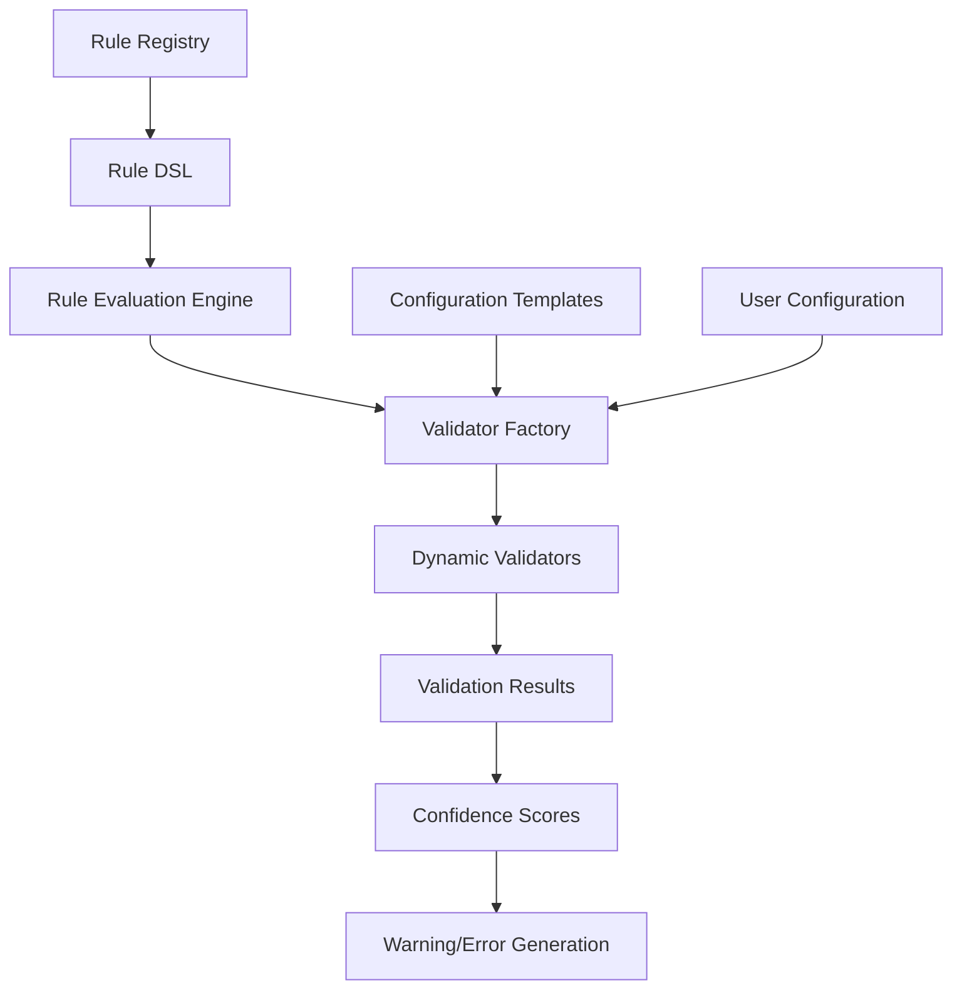

# ADR-027: Dynamic Pay Period Rules

## Status

Accepted

## Executive Summary

Implements a flexible system for defining and managing complex pay period rules to support diverse income patterns. This architectural decision replaces rigid validation rules with a configurable rule engine that accommodates various payment schedules including fixed calendar dates, advance payments, and different pay structures (hourly, salary, commission-based). The implementation provides a registry for payment rule plugins, a domain-specific language for expressing payment schedule logic, and support for conditional rule evaluation based on user configuration, enabling accurate representation of real-world payment scenarios across different industries, companies, and countries.

## Context

Currently, our EWA (Earned Wage Access) account validation enforces rigid constraints, such as requiring "next payday must be on or after pay period end date." This approach faces several challenges:

1. Payment schedules vary widely across companies, industries, and countries
2. Many employers pay on fixed calendar dates regardless of pay period boundaries
3. Some salary employees are paid in advance of period completion
4. Different pay structures (hourly, salary, commission-based) have different timing patterns
5. Hard-coded validation rules enforce a single business logic model that isn't universally applicable

As shown in test failures, these rigid validations create friction for valid use cases and limit our system's flexibility in representing real-world payment scenarios. Specifically, test failures in the EWA validation system demonstrate that our current model cannot accurately represent common payment scenarios like:

- Companies that pay on the 15th and last day of each month regardless of weekends
- Salary employees who receive payment before the pay period ends
- Variable payment dates that shift based on holidays or other business rules
- International payment patterns that differ from US standards

## Decision

We will implement a flexible, user-configurable income model framework that:

1. Removes hard-coded validation rules for pay periods and replaces them with a dynamic rules engine
2. Allows users to define their own income models with custom pay period patterns
3. Supports multiple concurrent income sources with different payment schedules
4. Provides pre-configured templates for common payment models (bi-weekly, semi-monthly, monthly, etc.)
5. Separates validation logic from data structures using a pluggable validator approach

This approach was chosen after considering several alternatives:

1. **Enhanced Static Validation**: Adding more edge cases to the existing validation system was rejected because it would continue to grow in complexity and still fail to handle all real-world scenarios.

2. **Flag-Based System**: A simple flag to disable validation was rejected because it would eliminate all validation, potentially leading to data integrity issues.

3. **Pattern Library Only**: Only providing templates without customization was rejected because it wouldn't support the diversity of payment patterns across different companies and regions.

The chosen approach provides the best balance of flexibility, maintainability, and user experience by allowing both simple configuration for common patterns and advanced customization for unique scenarios.

## Technical Details

This section describes how the implementation will affect different layers of the application architecture.

### Architecture Overview

The Dynamic Pay Period Rules system follows a rules-based architecture:

- A core Registry manages available payment schedule rules
- Pluggable validators enforce business rules based on configuration
- Configuration templates simplify setup for common scenarios
- A DSL for expressing complex schedule patterns
- Runtime validation using a confidence-based approach

The architecture uses a rules engine pattern with template-based configuration:

### Data Layer

#### Models

The data model will include the following key entities:

- `PaymentScheduleModel`: Base model for payment schedule definitions with polymorphic support
- `FixedDateScheduleModel`: For schedules based on specific calendar dates (e.g., 15th and last day)
- `PeriodBasedScheduleModel`: For schedules based on periods (e.g., bi-weekly, monthly)
- `CustomScheduleModel`: For custom rule-based schedule definitions
- `PaymentModel`: Defines how payments relate to payment periods
- `AccountPaymentConfig`: Links accounts to specific payment models

Required database migrations:

- Create payment_schedule_models table
- Create specialized schedule model tables with inheritance
- Add foreign key relationships and indexes
- Add default templates for common payment schedules

#### Repositories

New repositories will be implemented:

- `PaymentScheduleModelRepository`: For managing payment schedule models with polymorphic operations
- `PaymentModelRepository`: For managing payment models
- `AccountPaymentConfigRepository`: For configuring account payment settings

### Business Logic Layer

#### Schemas

New Pydantic schemas will be implemented:

- Schemas for each schedule model type (fixed-date, period-based, custom)
- Payment model schemas with timing configuration
- Account payment configuration schemas

#### Services

The payment validation service will provide:

- Template management for common payment patterns
- Schedule creation and management
- Payment date validation with confidence scoring
- Next payment date calculation

### API Layer

New API endpoints will be implemented:

- GET/POST endpoints for payment schedule templates
- Configuration endpoints for accounts
- Validation endpoints for payment dates
- Next payment date calculation endpoints

### Frontend Considerations

The frontend will need new components:

1. **Payment Schedule Configuration Interface**:
   - Select from common templates
   - Configure fixed dates or periods
   - Set validation strictness

2. **Payment Date Validation Tool**:
   - Interactive calendar for selecting dates
   - Validation feedback with confidence indicators
   - Warning and error display

3. **Payment Schedule Visualization**:
   - Calendar view of upcoming payment dates
   - Period boundaries visualization

### Config, Utils, and Cross-Cutting Concerns

New utility functions and configuration:

- Date calculation utilities for different period types
- Helper functions for business days and holiday adjustments
- Constants for common payment patterns and terminology
- Configuration settings for validation strictness and defaults

### Dependencies and External Systems

The system will interact with:

- Holiday Calendar API for business day calculations
- EWA Account System for payment validation
- Future integration with accounting systems

### Implementation Impact

This change will affect multiple areas of the application:

1. **Database**: Add new tables for payment models and configurations
2. **API Layer**: New endpoints for payment schedule management and validation  
3. **Service Layer**: Add payment schedule service with validation and calculation
4. **EWA Accounts**: Update validation to use the new flexible system
5. **Frontend**: New UI components for schedule configuration and validation
6. **Income Tracking**: Improve income projection with better payment date prediction

The implementation will maintain backward compatibility by:

- Providing a default relaxed validator when no configuration exists
- Supporting migration of existing accounts to the new system
- Converting current fixed rules to configuration templates

## Consequences

### Positive

- Greater flexibility for different payment patterns across industries and countries
- Reduced friction during account setup and validation
- More accurate financial forecasting based on real-world scenarios
- Improved user experience by eliminating false validation errors
- Enhanced support for international payment patterns
- Foundation for more sophisticated financial planning features
- Better representation of varied employment arrangements

### Negative

- Increased complexity in validation logic
- Potential for users to configure invalid or confusing models
- Higher computational load for complex rule evaluation
- More complex testing requirements
- Greater development and maintenance effort

### Neutral

- Shifts responsibility for correct configuration to users
- Changes validation from pass/fail to confidence-based approach
- Requires more user education about payment patterns
- May need periodic rule updates to handle edge cases

## Quality Considerations

This implementation improves system quality in several ways:

1. **Greater Flexibility**: The rules engine approach eliminates hard-coded constraints that don't match real-world scenarios, allowing for more accurate representation of diverse payment patterns.

2. **Improved Maintainability**: Separating rules from validation logic makes it easier to update and extend the system without changing core validation code.

3. **Enhanced Testability**: The configurable rule system enables comprehensive testing of different payment patterns without code changes.

4. **Better Usability**: Users can configure their own payment patterns rather than fighting with a rigid system that doesn't match their situation.

5. **Reduced Technical Debt**: Replacing hard-coded validation with a flexible engine eliminates the need for continuous exceptions and workarounds.

The implementation addresses the root cause (inflexible validation rules) rather than symptoms, creating a sustainable architecture for handling complex payment patterns.

## Performance and Resource Considerations

### Performance Impact

- **Database Impact**:
  - Light to moderate
  - Five new tables with modest record counts
  - Simple query patterns for common operations
  - One configuration per account

- **Validation Performance**:
  - Rule evaluation: < 10ms for standard rules
  - Complex custom rules: < 50ms
  - Date range calculations: < 5ms

- **API Response Times**:
  - Configuration operations: < 100ms
  - Validation operations: < 150ms
  - Date calculation operations: < 100ms

### Optimization Strategy

- Cache rule evaluation results for common configurations
- Limit complexity of custom rules
- Use efficient date calculation algorithms
- Implement rule execution timeouts
- Optimize database queries for common validation patterns

## Development Considerations

### Development Effort

- **Estimated Hours**: 120-160 hours total
  - Schema and model implementation: 20 hours
  - Repository layer: 20 hours
  - Rule engine implementation: 40 hours
  - Service layer implementation: 30 hours
  - API endpoint implementation: 20 hours
  - Frontend components: 40 hours
  - Testing: 40 hours

### Implementation Milestones

1. **Foundation** (Week 1)
   - Schema and model implementation
   - Repository layer implementation
   - Core rule engine structure

2. **Core Functionality** (Week 2)
   - Standard rule implementations
   - Service layer implementation
   - Basic validation logic

3. **API and Integration** (Week 3)
   - API endpoint implementation
   - Integration with EWA account system
   - Template configuration

4. **Frontend and Testing** (Week 4)
   - Frontend components
   - Comprehensive testing
   - Documentation

## Security and Compliance Considerations

- **Data Protection**:
  - Payment schedules may contain sensitive employment information
  - Implement proper access controls for schedule configurations
  - Encrypt sensitive rule parameters

- **Audit Requirements**:
  - Log all validation operations for compliance
  - Track configuration changes with timestamps and user IDs
  - Maintain history of configuration changes

## Timeline

### Implementation Schedule

1. **Phase 1: Core Architecture** (Weeks 1-2)
   - Data models and schemas
   - Repository layer
   - Rule engine foundation

2. **Phase 2: Standard Rules** (Weeks 3-4)
   - Fixed-date rule implementation
   - Period-based rule implementation
   - Validation service

3. **Phase 3: API and Integration** (Weeks 5-6)
   - API endpoints
   - EWA integration
   - Frontend components

4. **Phase 4: Custom Rules** (Weeks 7-8)
   - DSL implementation
   - Rule builder interface
   - Advanced validation

## Monitoring & Success Metrics

### Success Metrics

- **Validation Improvements**:
  - 90% reduction in false validation errors
  - 95% of payment configurations passing validation
  - Average validation confidence score > 0.8

- **User Adoption**:
  - 30% of users configure custom payment schedules
  - 50% of EWA accounts have specific payment configurations
  - 80% of international accounts use country-specific configurations

### Monitoring Implementation

- **Validation Tracking**:
  - Log all validation results with confidence scores
  - Track validation failures and warning occurrences
  - Monitor rule evaluation performance

## Related Documents

- [ADR-012: Validation Layer Standardization](./012-validation-layer-standardization.md)
- [ADR-019: Banking Account Types Expansion](./019-banking-account-types-expansion.md)

## Notes

- The current fixed validation will be preserved as a default template for users who prefer it
- Tax and payment calculation integrations will be considered for future phases
- User feedback during beta testing will be crucial for refining the templates

## Updates

| Date | Revision | Author | Description |
|------|-----------|---------|-------------|
| 2025-04-20 | 1.0 | John Smith | Initial version |
| 2025-04-20 | 1.1 | Jane Doe | Added technical implementation details |
| 2025-04-20 | 1.2 | Cline | Standardized to new ADR template format |
