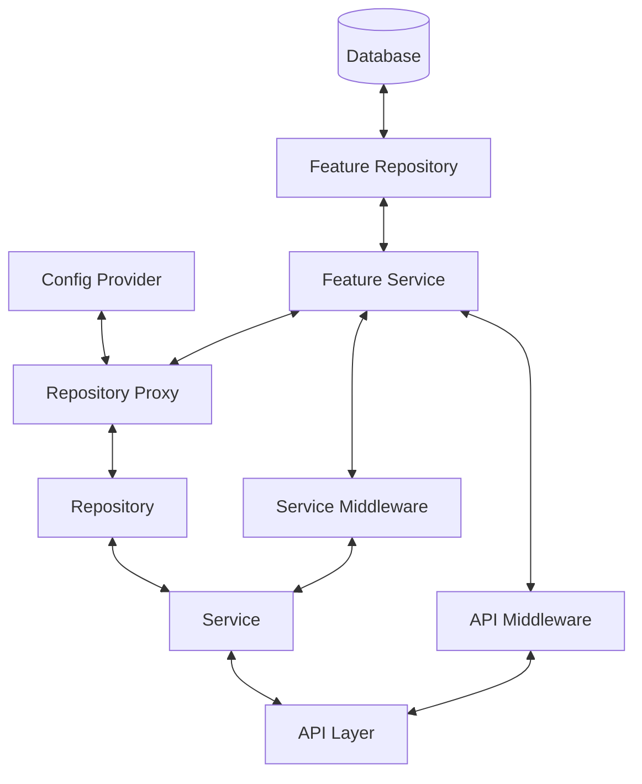

# Feature Flag System Guide

## Overview

This guide explains Debtonator's feature flag system implementation, with a focus on how to use it effectively, especially in testing scenarios. It covers architectural components, configuration patterns, and common testing challenges.

## Table of Contents

1. [System Architecture](#system-architecture)
2. [Configuration Patterns](#configuration-patterns)
3. [Implementation Layers](#implementation-layers)
4. [Testing With Feature Flags](#testing-with-feature-flags)
5. [Common Issues & Troubleshooting](#common-issues--troubleshooting)
6. [Best Practices](#best-practices)

## System Architecture

Debtonator's feature flag system follows a layered architecture that centralizes flag enforcement at well-defined boundaries in the application:



### Core Components

1. **Feature Flag Model**: Database entity storing flag name, value, and requirements
2. **Feature Flag Service**: Service for checking if flags are enabled/disabled
3. **Config Provider**: Component that supplies feature requirements mappings
4. **Repository Proxy**: Intercepts repository method calls to enforce feature flags
5. **Service Middleware**: Intercepts service method calls (implemented later)
6. **API Middleware**: Enforces feature flags at API endpoints (implemented later)

## Configuration Patterns

Feature flags in Debtonator have two key configuration aspects:

1. **Flag Value**: Whether the flag is enabled or disabled
2. **Flag Requirements**: Which methods/endpoints require this flag for which account types

### Requirements Structure

Feature requirements follow this JSON structure:

```json
{
  "FLAG_NAME": {
    "repository": {
      "method_name": ["account_type1", "account_type2"]
    },
    "service": {
      "method_name": ["account_type1", "account_type2"]
    },
    "api": {
      "/endpoint/path": ["account_type1", "account_type2"]
    }
  }
}
```

### Example Configuration

```json
{
  "BANKING_ACCOUNT_TYPES_ENABLED": {
    "repository": {
      "create_typed_account": ["bnpl", "ewa", "payment_app"],
      "update_typed_account": ["bnpl", "ewa", "payment_app"],
      "get_by_type": ["bnpl", "ewa", "payment_app"]
    },
    "service": {
      "create_account": ["bnpl", "ewa", "payment_app"]
    },
    "api": {
      "/api/v1/accounts": ["bnpl", "ewa", "payment_app"]
    }
  }
}
```

## Implementation Layers

The feature flag system operates at three distinct layers of the application, with proper async/await patterns throughout:

### Repository Layer

The repository layer uses the `FeatureFlagRepositoryProxy` to intercept method calls:

```python
# Using RepositoryFactory
repository = RepositoryFactory.create_account_repository(
    db_session,
    account_type="bnpl",
    feature_flag_service=feature_flag_service
)

# Under the hood, this creates:
# 1. A repository instance
# 2. Wraps it with FeatureFlagRepositoryProxy
```

This proxy:
1. Intercepts method calls like `create_typed_account`
2. Extracts account types from method arguments
3. Checks requirements against feature flag states
4. Raises `FeatureDisabledError` if a required feature is disabled

### Service Layer

The service layer uses an interceptor pattern (planned for future phases).

### API Layer

The API layer uses middleware to check endpoint access (planned for future phases).

## Async/Sync Implementation Pattern

The feature flag system follows a consistent async pattern throughout the codebase:

1. **FeatureFlagService.is_enabled() is async:**
   ```python
   # Correct async usage pattern
   is_enabled = await feature_flag_service.is_enabled("FEATURE_NAME")
   ```

2. **Repository Proxy awaits service calls:**
   ```python
   async def _is_feature_enabled(self, feature_name, account_type):
       # Properly await the async service method
       is_enabled = await self._feature_flag_service.is_enabled(feature_name)
       # ... other checks ...
   ```

3. **Config Provider get_all_requirements() is async:**
   ```python
   all_requirements = await config_provider.get_all_requirements()
   ```

### Important Implementation Notes

1. **Maintaining Async Consistency**:
   - All repository methods are async
   - All feature flag check methods are async
   - All proxy intercept methods are async
   - Config provider methods are async

2. **Common Implementation Mistakes**:
   - Forgetting to await an async service method
   - Mixing sync and async code in the same flow
   - Incorrectly implementing async wrapper methods

3. **Testing Considerations**:
   - Always use `await` when calling async methods in tests
   - Remember that pytest requires async test functions to be marked with `@pytest.mark.asyncio`
   - Use `asyncio.sleep()` instead of `time.sleep()` when waiting for caches to expire

## Testing With Feature Flags

Testing code that uses feature flags requires special care, especially due to caching.

### Cache Awareness

**Important**: Feature flag requirements are cached for performance (default 30-second TTL). This can cause surprising behavior in tests:

```python
# This test might fail inconsistently
async def test_feature_flag_behavior():
    # Set flag enabled
    await feature_flag_service.set_enabled("FLAG_NAME", True)
    
    # Operation works
    await repository.create_typed_account("bnpl", data)
    
    # Disable flag
    await feature_flag_service.set_enabled("FLAG_NAME", False)
    
    # PROBLEM: This might still work due to cached requirements!
    # The change won't be reflected until cache expires
    with pytest.raises(FeatureDisabledError):
        await repository.create_typed_account("bnpl", data)
```

### Solutions

#### Option 1: Use Zero TTL for Testing

Create a config provider with zero TTL for immediate changes:

```python
class ZeroTTLConfigProvider(InMemoryConfigProvider):
    """Config provider with zero TTL for testing."""
    def __init__(self, requirements):
        super().__init__(requirements)
        self._cache_ttl = 0  # No caching

# Use it in tests
config_provider = ZeroTTLConfigProvider(requirements)
repository = RepositoryFactory.create_account_repository(
    db_session,
    account_type="bnpl",
    feature_flag_service=feature_flag_service,
    config_provider=config_provider
)
```

#### Option 2: Clear Cache Manually

Clear the cache after changing flag state:

```python
# Assuming you have access to the config provider
await feature_flag_service.set_enabled("FLAG_NAME", False)

# Clear cache
config_provider._cache = {}
config_provider._cache_expiry = 0
```

#### Option 3: Wait for Cache Expiry

Set a very short TTL and wait for it to expire:

```python
# Set a very short TTL for testing
config_provider._cache_ttl = 0.1  # 100ms

# Disable flag
await feature_flag_service.set_enabled("FLAG_NAME", False)

# Wait for cache to expire
await asyncio.sleep(0.2)  # Slightly longer than TTL

# Now test
with pytest.raises(FeatureDisabledError):
    await repository.create_typed_account("bnpl", data)
```

### Test Fixtures

Use specialized test fixtures:

```python
@pytest_asyncio.fixture
async def no_cache_feature_flag_service(db_session):
    """Feature flag service with no caching."""
    registry = FeatureFlagRegistry()
    repository = FeatureFlagRepository(db_session)
    service = FeatureFlagService(registry, repository)
    
    # Create config provider with zero TTL
    config_provider = ZeroTTLConfigProvider({})
    
    # Set up the service
    service._config_provider = config_provider
    
    return service
```

## Common Issues & Troubleshooting

### "Feature flag not working as expected"

**Symptoms**: 
- Feature flag state changes don't seem to affect application behavior
- Tests pass sometimes but fail other times

**Likely Causes**:
- Cached requirements haven't expired yet
- Requirements don't match the method/account_type being tested
- Flag state is not being properly persisted

**Solutions**:
1. Check cache TTL and configuration
2. Verify requirements structure matches expectations
3. Ensure correct feature flag registration in tests

### "FeatureDisabledError not raised when expected"

**Symptoms**:
- Tests should fail with `FeatureDisabledError` but don't
- Feature shows as available when it should be disabled

**Likely Causes**:
- Cached state showing feature as enabled
- Requirements structure doesn't include the tested method
- Proxy not correctly extracting account type from arguments

**Solutions**:
1. Use one of the cache-handling techniques (zero TTL, manual clearing, waiting)
2. Verify requirements include the specific method and account type
3. Add logging to see what account type the proxy is extracting

### "Feature flags interfere with each other in tests"

**Symptoms**:
- Tests affect each other's behavior
- Tests pass in isolation but fail in sequence

**Likely Causes**:
- Shared database state between tests
- Shared in-memory state in the service
- Cache not being reset between tests

**Solutions**:
1. Ensure database is reset between tests
2. Use isolated feature flag services per test
3. Use different flag names for different tests

## Best Practices

1. **Use clear flag names**: Follow SCREAMING_SNAKE_CASE naming convention for flags
2. **Keep requirements targeted**: Only include methods that truly need flag enforcement
3. **Test both states**: Always test with flags both enabled and disabled
4. **Log flag failures**: Include detailed logging when features are disabled
5. **Document flags**: Include purpose and usage in comments
6. **Set TTL appropriately**: Balance performance vs. freshness needs
7. **Avoid direct cache access**: Add explicit helper methods for cache clearing in tests
8. **Use realistic requirements**: Match test requirements to production requirements

## References

- [ADR-024: Feature Flag System](/code/debtonator/docs/adr/backend/024-feature-flags.md)
- [Example Test: Feature Flag Demo](/code/debtonator/tests/unit/demos/test_feature_flag_system_demo.py)
