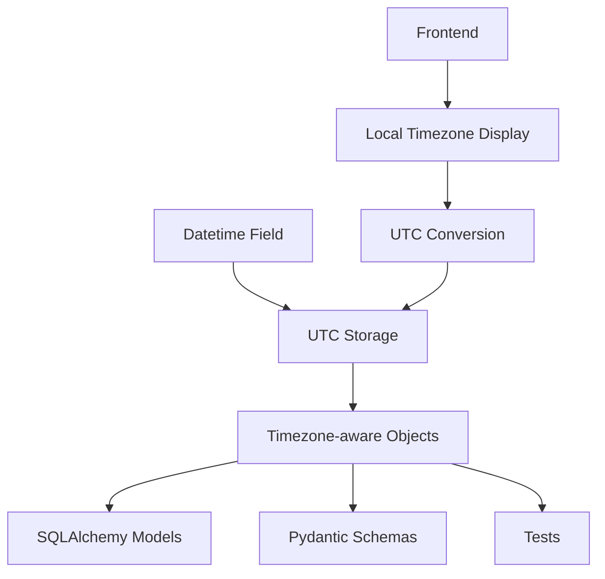
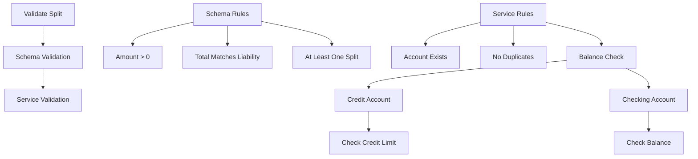
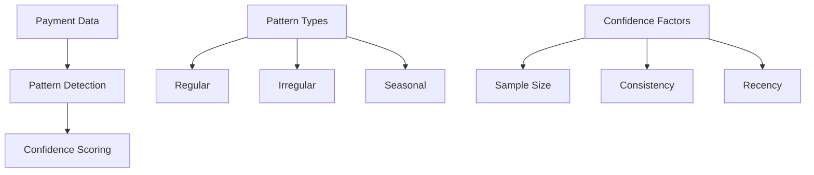
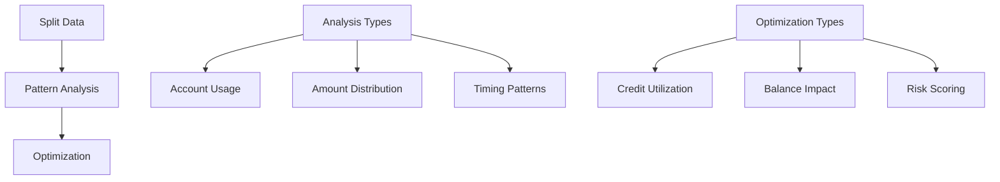

# System Patterns: Debtonator

## Core Patterns

### Datetime Standardization


```python
# SQLAlchemy Model Pattern
class BaseModel:
    created_at = Column(DateTime(timezone=True), default=lambda: datetime.now(ZoneInfo("UTC")))
    updated_at = Column(DateTime(timezone=True), default=lambda: datetime.now(ZoneInfo("UTC")))

# Pydantic Schema Pattern
class BaseSchema(BaseModel):
    created_at: datetime
    updated_at: datetime

    class Config:
        json_encoders = {
            datetime: lambda dt: dt.isoformat()
        }

# Test Pattern
def setup_test_data():
    now = datetime.now(ZoneInfo("UTC"))
    return {
        "timestamp": now,
        "start_date": now - timedelta(days=30),
        "end_date": now + timedelta(days=30)
    }
```

## Validation Patterns

### Bill Splits Validation


```python
# Schema-level validation
class BillSplitValidation(BaseModel):
    liability_id: int = Field(..., gt=0)
    total_amount: Decimal = Field(..., gt=0)
    splits: List[BillSplitCreate]

    @validator('splits')
    @classmethod
    def validate_splits(cls, v, values):
        if not v:
            raise ValueError("At least one split is required")
        
        total_split = sum(split.amount for split in v)
        if abs(total_split - values['total_amount']) > Decimal('0.01'):
            raise ValueError(
                f"Sum of splits ({total_split}) must equal total amount ({values['total_amount']})"
            )
        return v

# Service-level validation
async def validate_splits(self, validation: BillSplitValidation) -> Tuple[bool, Optional[str]]:
    try:
        # Verify liability exists
        liability = await self.get_liability(validation.liability_id)
        if not liability:
            return False, f"Liability not found"

        # Get all accounts
        accounts = await self.get_accounts(validation.splits)
        
        # Check for duplicate accounts
        if len(set(accounts)) != len(accounts):
            return False, "Duplicate accounts found"
            
        # Validate each account's balance/credit
        for split in validation.splits:
            account = accounts[split.account_id]
            if not await self.validate_account_capacity(account, split.amount):
                return False, f"Insufficient funds in {account.name}"
                
        return True, None
    except Exception as e:
        return False, str(e)
```

### Payment Validation
- Total amount matching
- Account availability
- Balance sufficiency
- Source constraints
- Business rules compliance

### Account Validation
- Balance consistency
- Credit limit enforcement
- Transaction validation
- Payment capacity
- Historical data consistency

## Service Patterns

### Payment Pattern Analysis


### Bill Split Analysis


## Error Handling Patterns

### Service Layer
```python
class ServiceError(Exception):
    def __init__(self, message: str, code: str = None):
        self.message = message
        self.code = code
        super().__init__(self.message)

async def handle_service_operation(self):
    try:
        # Service operation
        pass
    except ValidationError as e:
        raise ServiceError(str(e), "VALIDATION_ERROR")
    except DBAPIError as e:
        raise ServiceError(str(e), "DATABASE_ERROR")
    except Exception as e:
        raise ServiceError(str(e), "INTERNAL_ERROR")
```

### API Layer
```python
@router.post("/endpoint")
async def endpoint(request: RequestModel):
    try:
        result = await service.operation(request)
        return result
    except ServiceError as e:
        raise HTTPException(
            status_code=400,
            detail={"message": e.message, "code": e.code}
        )
    except Exception as e:
        raise HTTPException(
            status_code=500,
            detail={"message": "Internal server error", "code": "INTERNAL_ERROR"}
        )
```

## Testing Patterns

### Service Tests
```python
@pytest.mark.asyncio
async def test_service_operation(db_session: AsyncSession):
    # Arrange
    service = Service(db_session)
    test_data = create_test_data()
    
    # Act
    result = await service.operation(test_data)
    
    # Assert
    assert result.status == "success"
    assert result.data == expected_data
```

### API Tests
```python
@pytest.mark.asyncio
async def test_api_endpoint(client: AsyncClient):
    # Arrange
    test_data = create_test_data()
    
    # Act
    response = await client.post("/api/endpoint", json=test_data)
    
    # Assert
    assert response.status_code == 200
    assert response.json() == expected_response
```

## Database Patterns

### Model Relationships
```python
class Payment(Base):
    __tablename__ = "payments"
    
    id = Column(Integer, primary_key=True)
    bill_id = Column(Integer, ForeignKey("bills.id"))
    amount = Column(Numeric(10, 2))
    
    bill = relationship("Bill", back_populates="payments")
    sources = relationship("PaymentSource", back_populates="payment")

class PaymentSource(Base):
    __tablename__ = "payment_sources"
    
    id = Column(Integer, primary_key=True)
    payment_id = Column(Integer, ForeignKey("payments.id"))
    account_id = Column(Integer, ForeignKey("accounts.id"))
    amount = Column(Numeric(10, 2))
    
    payment = relationship("Payment", back_populates="sources")
    account = relationship("Account", back_populates="payment_sources")
```

### Query Patterns
```python
async def get_with_relationships(self, id: int):
    result = await self.db.execute(
        select(Model)
        .options(
            joinedload(Model.relationship1),
            joinedload(Model.relationship2)
        )
        .where(Model.id == id)
    )
    return result.scalar_one_or_none()

async def list_with_pagination(
    self,
    skip: int = 0,
    limit: int = 100,
    **filters
):
    query = select(Model).offset(skip).limit(limit)
    for key, value in filters.items():
        if value is not None:
            query = query.where(getattr(Model, key) == value)
    result = await self.db.execute(query)
    return result.scalars().all()
```

## Frontend Integration Patterns

### API Client
```typescript
class ApiClient {
    async get<T>(endpoint: string): Promise<T> {
        const response = await fetch(`/api/${endpoint}`);
        if (!response.ok) {
            throw new ApiError(response);
        }
        return response.json();
    }

    async post<T>(endpoint: string, data: any): Promise<T> {
        const response = await fetch(`/api/${endpoint}`, {
            method: 'POST',
            headers: {'Content-Type': 'application/json'},
            body: JSON.stringify(data)
        });
        if (!response.ok) {
            throw new ApiError(response);
        }
        return response.json();
    }
}
```

### Data Management
```typescript
interface State {
    data: any[];
    loading: boolean;
    error: Error | null;
}

const initialState: State = {
    data: [],
    loading: false,
    error: null
};

const reducer = (state: State, action: Action): State => {
    switch (action.type) {
        case 'FETCH_START':
            return { ...state, loading: true };
        case 'FETCH_SUCCESS':
            return { ...state, loading: false, data: action.payload };
        case 'FETCH_ERROR':
            return { ...state, loading: false, error: action.payload };
        default:
            return state;
    }
};
```

### Form Handling
```typescript
interface FormData {
    name: string;
    amount: number;
    dueDate: Date;
}

const useForm = (initialData: FormData) => {
    const [data, setData] = useState(initialData);
    const [errors, setErrors] = useState({});
    
    const validate = () => {
        const newErrors = {};
        if (!data.name) newErrors.name = 'Name is required';
        if (data.amount <= 0) newErrors.amount = 'Amount must be positive';
        setErrors(newErrors);
        return Object.keys(newErrors).length === 0;
    };
    
    const handleSubmit = async (e: FormEvent) => {
        e.preventDefault();
        if (validate()) {
            try {
                await api.post('/endpoint', data);
            } catch (error) {
                setErrors({ submit: error.message });
            }
        }
    };
    
    return { data, setData, errors, handleSubmit };
};
