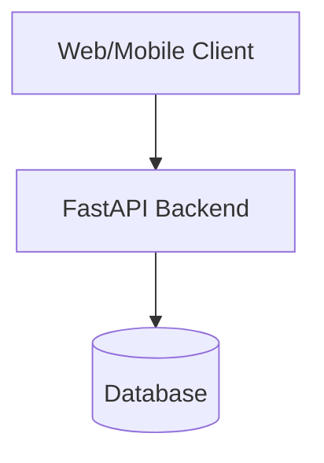
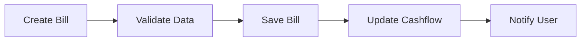
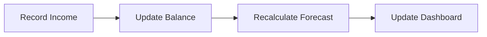
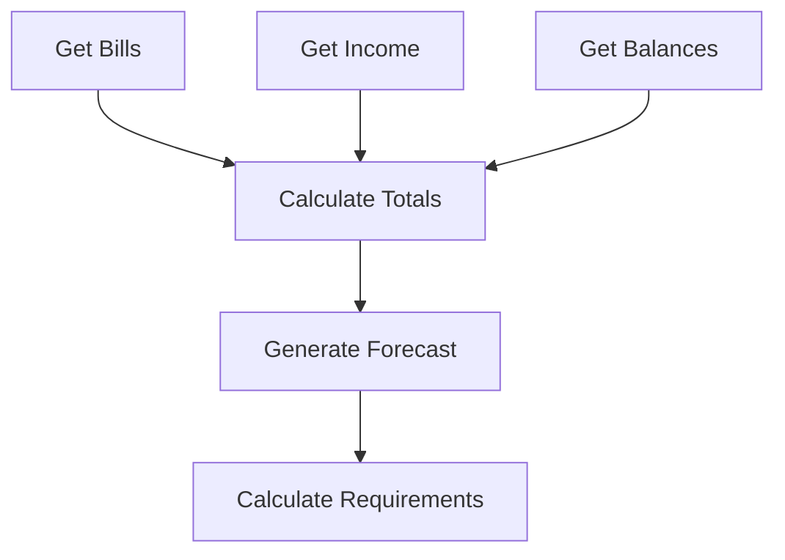

# System Patterns: Debtonator

## Architecture Overview

### Three-Tier Architecture


### Key Components
1. **Frontend Layer**
   - React components
   - State management
   - API integration
   - Real-time calculations

2. **API Layer**
   - FastAPI endpoints
   - Business logic
   - Data validation
   - Authentication

3. **Data Layer**
   - Database schema
   - Data access patterns
   - Caching strategy

## Design Patterns

### Repository Pattern
- Abstracts data access
- Enables database switching
- Centralizes data operations

```python
class BillRepository:
    async def get_bills_by_date_range(self, start_date: date, end_date: date) -> List[Bill]:
        pass
    
    async def get_unpaid_bills(self) -> List[Bill]:
        pass
```

### Service Layer Pattern
- Encapsulates business logic
- Manages transactions
- Handles complex calculations

```python
class CashflowService:
    async def calculate_forecast(self, days: int) -> CashflowForecast:
        pass
    
    async def calculate_required_income(self, target_balance: Decimal) -> IncomeRequirement:
        pass
```

### Factory Pattern
- Creates complex objects
- Manages object lifecycle
- Enables dependency injection

```python
class BillFactory:
    @staticmethod
    def create_recurring_bill(template: BillTemplate) -> Bill:
        pass
```

## Data Flow Patterns

### Bill Management


### Income Tracking


### Cashflow Calculation


## State Management

### Frontend State
- Global application state
- Component-level state
- Form state
- API cache state

### Backend State
- Database transactions
- Session management
- Cache invalidation
- Background tasks

## Error Handling

### Frontend Errors
- API error handling
- Form validation errors
- Network error recovery
- State inconsistency handling

### Backend Errors
- Database errors
- Validation errors
- Business rule violations
- External service errors

## Security Patterns

### Authentication
- JWT tokens
- Session management
- Role-based access

### Data Protection
- Encryption at rest
- Secure communication
- Input validation
- Output sanitization

## Testing Patterns

### Unit Testing
- Business logic
- Data validation
- Calculations
- Component rendering

### Integration Testing
- API endpoints
- Database operations
- Service interactions
- User workflows

### End-to-End Testing
- Critical paths
- User scenarios
- Mobile responsiveness
- Performance testing
