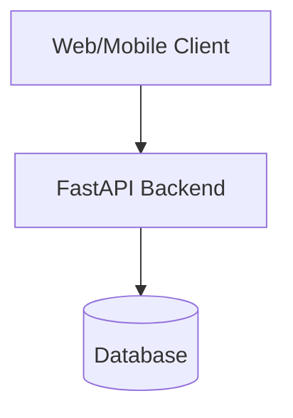
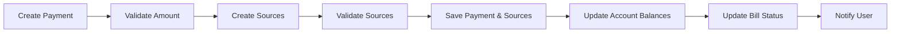
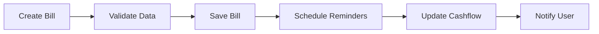
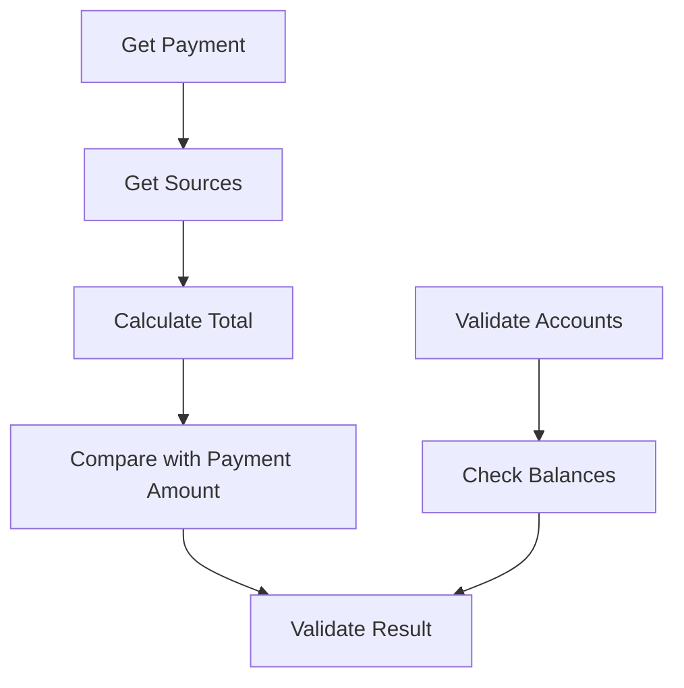
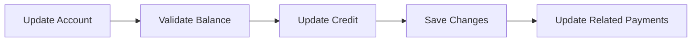
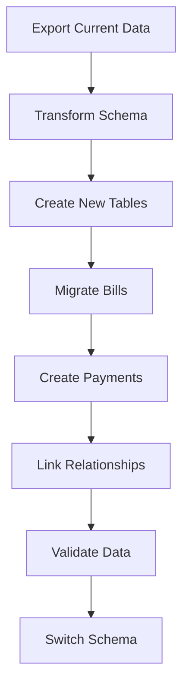

# System Patterns: Debtonator

## Architecture Overview

### Three-Tier Architecture


### Key Components
1. **Frontend Layer**
   - React components
   - State management
   - API integration
   - Real-time calculations
   - Dynamic account management
   - Payment tracking

2. **API Layer**
   - FastAPI endpoints
   - Business logic
   - Data validation
   - Authentication
   - Account management
   - Payment processing

3. **Data Layer**
   - Database schema
   - Data access patterns
   - Caching strategy
   - Account relationships
   - Payment tracking

## Design Patterns

### Double-Entry Accounting Pattern
- Separates bills from payments
- Tracks liabilities independently
- Maintains payment history
- Supports multiple payment sources

```python
class Bill:  # Liability
    id: int
    name: str
    amount: Decimal
    due_date: date
    category: str
    
class Payment:  # Transaction
    id: int
    bill_id: Optional[int]  # Optional for non-bill expenses
    amount: Decimal
    payment_date: date
    category: str
    
class PaymentSource:  # Entry
    id: int
    payment_id: int
    account_id: int
    amount: Decimal
```

### Repository Pattern
- Abstracts data access
- Enables database switching
- Centralizes data operations

```python
class BillRepository:
    async def get_bills_by_date_range(self, start_date: date, end_date: date) -> List[Bill]:
        pass
    
    async def get_unpaid_bills(self) -> List[Bill]:
        pass

class PaymentRepository:
    async def get_payments_for_bill(self, bill_id: int) -> List[Payment]:
        pass
    
    async def get_payment_sources(self, payment_id: int) -> List[PaymentSource]:
        pass
```

### Service Layer Pattern
- Encapsulates business logic
- Manages transactions
- Handles complex calculations

```python
class PaymentService:
    async def create_payment(
        self, payment_data: PaymentCreate, sources: List[PaymentSourceCreate]
    ) -> Payment:
        pass
    
    async def validate_payment_sources(self, payment_id: int) -> bool:
        pass

class AccountService:
    async def update_balance(self, account_id: int, amount: Decimal) -> Account:
        pass
    
    async def calculate_available_credit(self, account_id: int) -> Decimal:
        pass
```

## Data Flow Patterns

### Payment Processing


### Bill Management


### Payment Source Validation


### Account Management


## State Management

### Frontend State
- Global application state
- Component-level state
- Form state
- API cache state
- Account state management
- Payment tracking state

### Backend State
- Database transactions
- Session management
- Cache invalidation
- Background tasks
- Account balance tracking
- Payment validation

## Error Handling

### Frontend Errors
- API error handling
- Form validation errors
- Network error recovery
- State inconsistency handling
- Payment validation errors
- Account balance errors

### Backend Errors
- Database errors
- Validation errors
- Business rule violations
- External service errors
- Payment total mismatch errors
- Account balance constraints

## Security Patterns

### Authentication
- JWT tokens
- Session management
- Role-based access

### Data Protection
- Encryption at rest
- Secure communication
- Input validation
- Output sanitization
- Account data protection
- Balance information security

## Testing Patterns

### Unit Testing
- Business logic
- Data validation
- Calculations
- Component rendering
- Payment validation
- Account balance calculations

### Integration Testing
- API endpoints
- Database operations
- Service interactions
- User workflows
- Account management flows
- Payment processing flows

### End-to-End Testing
- Critical paths
- User scenarios
- Mobile responsiveness
- Performance testing
- Account operations
- Payment scenarios

## Validation Patterns

### Payment Validation
- Total amount matching
- Account availability
- Balance sufficiency
- Source constraints
- Business rules compliance

### Account Validation
- Balance consistency
- Credit limit enforcement
- Transaction validation
- Payment capacity
- Historical data consistency

## Migration Patterns

### Data Migration


### Feature Migration
```mermaid
graph LR
    A[Deploy Schema] --> B[Update API]
    B --> C[Deploy Backend]
    C --> D[Update Frontend]
    D --> E[Deploy Frontend]
    E --> F[Verify System]
