# System Patterns: Debtonator

## Core Patterns

### Dynamic Accounts and Bill Split Management

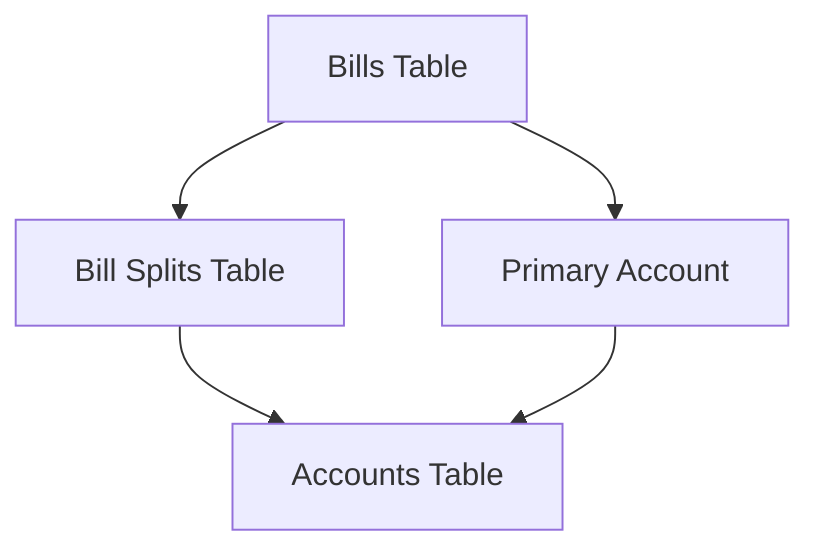

- **Primary Account Relationship**: Each bill has a primary account (required)
- **Split Relationships**: Bills can be split across multiple accounts
- **Split Amount Logic**: Primary account amount = total bill amount - sum of splits
- **Auto-Split Creation**: Primary account split is created automatically

#### Validation Rules

1. Split amounts must sum to total bill amount
2. All account references must be valid
3. No negative split amounts allowed
4. Each bill-account combination must be unique (enforced by database constraint)

#### Implementation Pattern

1. Bill creation:
   - Assign primary account
   - Create splits for non-primary accounts
   - Calculate and create primary account split automatically
2. Bill update:
   - Validate split integrity
   - Update or create splits as needed
   - Recalculate primary account split amount

### Datetime Standardization

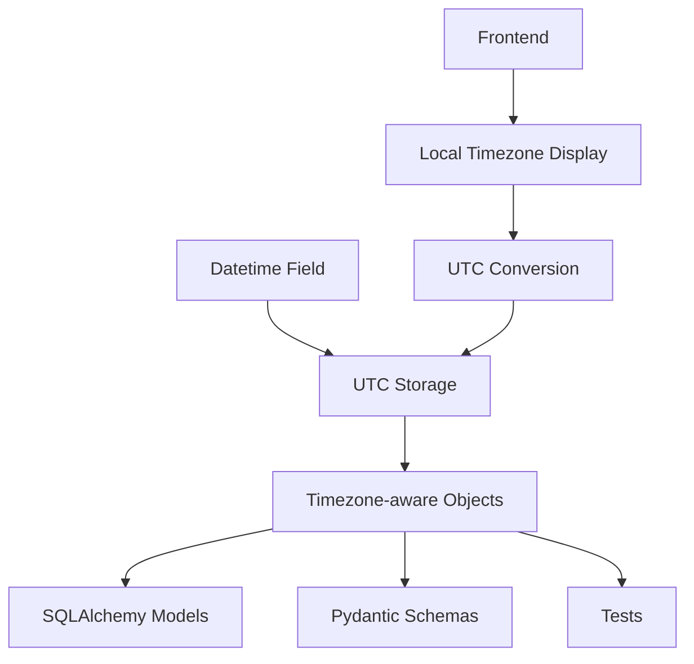

- Store all datetime values in UTC timezone
- Use timezone-aware objects throughout the system
- Convert to local timezone only at presentation layer
- Validate timezone correctness in schemas

## Repository Patterns

### Repository Architecture

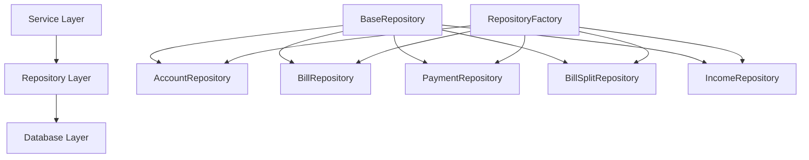

- BaseRepository provides generic CRUD operations
- Model-specific repositories extend BaseRepository with specialized methods
- RepositoryFactory manages repository instances for dependency injection
- Each repository focuses on a single model with related operations

### Repository Module Pattern

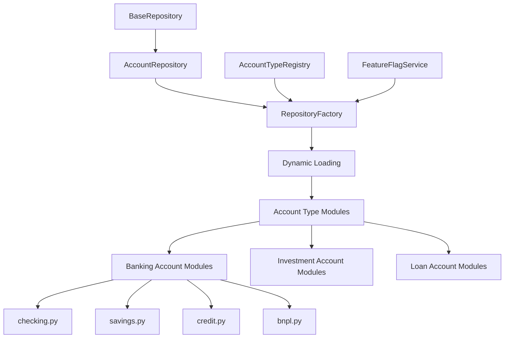

The Repository Module Pattern allows for specialized repository functionality to scale to hundreds of account types without creating unwieldy monolithic repositories. Key aspects include:

1. **Module Organization**: Account type-specific repository operations are organized into specialized modules:
   - `src/repositories/account_types/{category}/{type}.py` (e.g., banking/checking.py)
   - Each module contains functions specific to a particular account type
   - All functions take SQLAlchemy session as their first parameter

2. **Dynamic Loading**: The `RepositoryFactory` dynamically:
   - Loads the correct module based on account type
   - Binds specialized functions to the repository instance
   - Handles missing modules gracefully with fallbacks
   - Provides runtime introspection of available operations

3. **Registry Integration**: The `AccountTypeRegistry`:
   - Maps account types to their repository modules
   - Controls which modules should be loaded
   - Integrates with feature flag system for conditional loading

4. **Feature Flag Integration**:
   - Repository modules can be enabled/disabled through feature flags
   - Type-specific operations are only available when features are enabled
   - Graceful degradation when features are disabled

### Polymorphic Repository Pattern

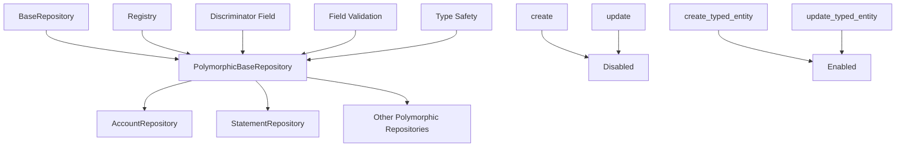

The Polymorphic Repository Pattern provides a specialized base repository for polymorphic entities that enforces proper type handling and identity management. Key aspects include:

1. **Enforced Polymorphic Identity**:
   - Base `create` and `update` methods are disabled with `NotImplementedError`
   - Only type-specific creation and updates are allowed through specialized methods
   - Prevents SQLAlchemy warnings about "Flushing object with incompatible polymorphic identity"
   - Example:

   ```python
   # ✅ Correct: Using typed entity creation
   account = await account_repository.create_typed_entity("checking", account_data)
   
   # ❌ Incorrect: Using base create method (raises NotImplementedError)
   account = await account_repository.create(account_data)
   ```

2. **Clear Separation of Concerns**:
   - `PolymorphicBaseRepository` provides a clear distinction between repositories for simple and polymorphic entities
   - Consistent interface for all polymorphic repositories
   - Type-specific validation and field filtering
   - Example implementation:

   ```python
   class PolymorphicBaseRepository(BaseRepository[PolyModelType, PKType]):
       """Base repository for polymorphic entities."""
       
       # Class variable to store the discriminator field name
       discriminator_field: ClassVar[str] = "type"
       
       # Registry to use for model class lookup
       registry = None
       
       async def create(self, obj_in: Dict[str, Any]) -> PolyModelType:
           """Disabled for polymorphic repositories."""
           raise NotImplementedError(
               "Direct creation through base repository is disabled for polymorphic entities. "
               "Use create_typed_entity() instead to ensure proper polymorphic identity."
           )
       
       async def create_typed_entity(
           self, 
           entity_type: str, 
           data: Dict[str, Any]
       ) -> PolyModelType:
           """Create a new entity with the specified polymorphic type."""
           # Implementation details...
   ```

3. **Registry Integration**:
   - Built-in support for type registries ensures proper model class lookup
   - Automatic field filtering based on model class
   - Preserves required fields and prevents setting them to NULL
   - Example usage:

   ```python
   class AccountRepository(PolymorphicBaseRepository[Account, int]):
       """Repository for account operations."""
       
       # Set the discriminator field for accounts
       discriminator_field = "account_type"
       
       # Set the registry for account types
       registry = account_type_registry
   ```

4. **Field Validation and Filtering**:
   - Automatically filters input data to include only valid fields for the specific model class
   - Prevents setting invalid fields that don't exist on the model
   - Preserves required fields during updates
   - Ensures discriminator field is always set correctly

5. **Future-Proof Design**:
   - Scales to support any number of polymorphic entity types (accounts, statements, etc.)
   - Consistent interface across all polymorphic repositories
   - Simplifies adding new polymorphic entity types

### Refined Repository and Service Integration Pattern

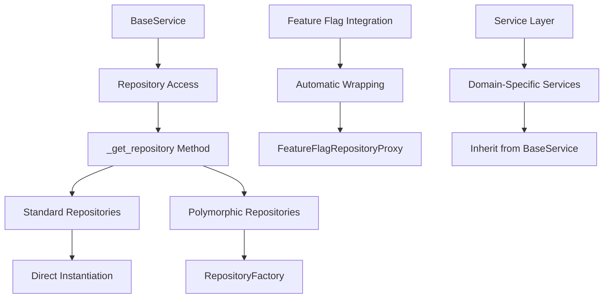

The Refined Repository and Service Integration Pattern provides a standardized way to instantiate and access repositories from the service layer, with automatic feature flag integration and proper handling of polymorphic entities.

#### Key Aspects of the Pattern

1. **Repository Type Distinction**:
   - **Polymorphic Repositories**: Used for entities with subtypes (e.g., accounts)
   - **Standard Repositories**: Used for regular entities without polymorphic relationships

2. **Repository Access Method**:
   - All repositories are accessed through the `_get_repository()` method
   - Method automatically determines whether to use factory or direct instantiation
   - Provides consistent caching and feature flag integration

3. **Lazy Loading and Caching**:
   - Repositories are created only when needed
   - Created repositories are cached for reuse
   - Repository instances are stored with type-specific keys

4. **Feature Flag Integration**:
   - Automatic wrapping with `FeatureFlagRepositoryProxy`
   - Consistent feature flag handling across all repositories
   - Centralized logic for applying feature flags

5. **Repository Factory Focus**:
   - Repository factory used ONLY for polymorphic repositories
   - Standard repositories use direct instantiation
   - Clear separation of concerns between patterns

#### Service Implementation Pattern

```python
class SomeService(BaseService):
    """Service for some domain operations."""
    
    async def some_operation(self) -> Result:
        # Get repository instance
        repo = await self._get_repository(SomeRepository)
        
        # Use repository methods
        result = await repo.some_method()
        return result
        
    async def account_specific_operation(self, account_type: str) -> Result:
        # Get polymorphic repository
        account_repo = await self._get_repository(
            AccountRepository, 
            polymorphic_type=account_type
        )
        
        # Use repository methods
        result = await account_repo.some_method()
        return result
```

#### Repository Factory Simplification

The Repository Factory should be simplified to focus solely on polymorphic entity repositories:

```python
class RepositoryFactory:
    """Factory for creating polymorphic repositories with specialized functionality."""
    
    # Keep only the account repository method and related methods
    @classmethod
    async def create_account_repository(
        cls,
        session: AsyncSession,
        account_type: Optional[str] = None,
        feature_flag_service: Optional[FeatureFlagService] = None,
        config_provider: Optional[Any] = None,
    ) -> AccountRepository:
        """Create an account repository with specialized functionality."""
        # Implementation details...
```

#### Implementation Guidelines

1. **Service Inheritance**:
   - All services should inherit from BaseService
   - Services should use _get_repository method for all repository access
   - Service constructors should pass session and feature flag service to `super().__init__`

2. **Repository Factory Usage**:
   - Use RepositoryFactory only for polymorphic entities
   - Remove non-polymorphic repository methods from factory
   - Keep factory focused on its original purpose

3. **Repository Implementation**:
   - Standard repositories inherit from BaseRepository
   - Polymorphic repositories inherit from PolymorphicBaseRepository
   - Follow consistent implementation patterns

## Validation Patterns

### Multi-Layer Validation Approach

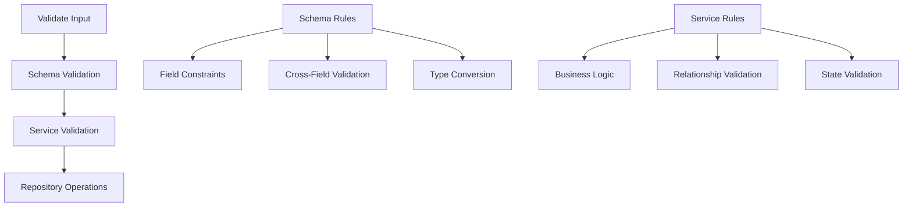

- Schema Layer: Field constraints, type validation, basic cross-field validation
- Service Layer: Business rules, complex validation, state-dependent validation
- Repository Layer: Data access without validation logic
- Clear separation of validation responsibilities between layers

### Decimal Precision Strategy

- Two-tier precision model:
  - 4 decimal places for storage in database (Numeric(12, 4))
  - 2 decimal places for display at UI/API boundaries
- MoneyDecimal type for monetary values (2 decimal places)
- PercentageDecimal type for percentage values (4 decimal places)
- Annotated types with Field constraints for validation

### Pydantic v2 Discriminated Union Pattern

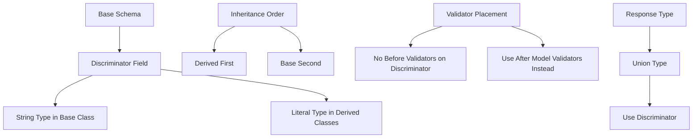

- **Discriminated Union Requirements**:
  - Discriminator field must be a `Literal` type in derived classes
  - Base class typically defines it as a string type
  - No `mode="before"` validators can affect discriminator fields
  - Inheritance order in response classes is crucial

- **Response Model Inheritance Pattern**:
  - Put derived class first in inheritance list: `class CheckingResponse(CheckingBase, AccountResponse)`
  - Explicitly redeclare the discriminator field in each response class
  - Example: `account_type: Literal["checking"] = "checking"`
  - This ensures the `Literal` type takes precedence over the string type

- **Validator Pattern for Discriminated Fields**:
  - Avoid wildcard field validators that apply to all fields (`@field_validator("*")`)
  - Use model-level validators with `mode="after"` for field validation
  - For fields that could be discriminators, implement type-specific validation in service layer
  - Move domain validation from schema to service layer when using discriminated unions

- **Common Pydantic v2 Issues to Avoid**:
  - `mode="before"` validators on discriminator fields cause runtime errors
  - Incorrect inheritance order leads to string type precedence over Literal
  - Wildcard field validators affect discriminator fields even if conditional logic tries to skip them
  - These issues often appear during schema generation, before any validation code runs

## Error Handling Patterns

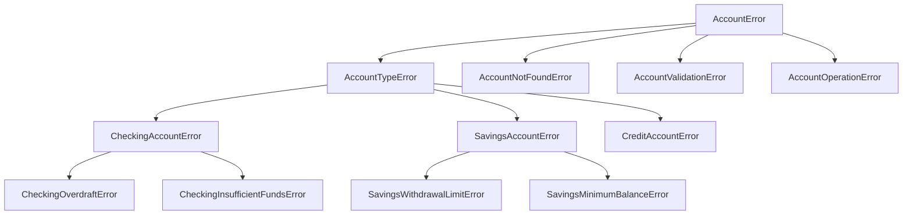

### Error Class Naming Convention

- Base error classes use general names: `AccountError`, `RepositoryError`
- Account type-specific errors include type prefix: `CheckingAccountError`, `SavingsAccountError`
- Specific errors include both type and error type: `CheckingOverdraftError`, `SavingsWithdrawalLimitError`
- All error classes end with `Error` suffix

### Directory Structure

- Follow module structure that mirrors domain model:
  - `src/errors/accounts.py` - Base account errors
  - `src/errors/account_types/banking/checking.py` - Checking-specific errors
  - `src/errors/account_types/banking/savings.py` - Savings-specific errors

### Error Construction Pattern

- Pass meaningful context in error constructors
- Include entity IDs when available (e.g., account_id)
- Use optional field parameters for error details
- Standardize parameter handling in constructors

### Error Usage Pattern

- Raise specific error types, not generic exceptions
- Catch exceptions at service boundaries and translate appropriately  
- Include enough context for effective debugging
- Format error messages consistently for both logs and user display

## Testing Patterns

### Integration-First Approach with Real Objects

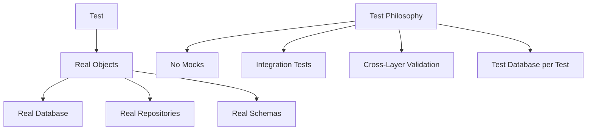

- **No Mocks Policy**: Strictly prohibit using unittest.mock, MagicMock, or any other mocking libraries
- Integration tests for services with real database that resets between tests
- Cross-layer integration to verify actual interactions between components
- Repository tests with real database fixtures
- API tests for endpoint validation with real service and repository implementations
- Error case testing for validation scenarios
- Service tests with real repositories connected to test database

### Test Fixture Pattern

```mermaid
graph TD
    A[Source Code Structure] --> B[Mirror in Test Fixtures]
    B --> C[tests/fixtures/models/account_types/]
    B --> D[Polymorphic Subclasses]
    
    E[SQLAlchemy 2.0 Async] --> F[select API]
    F --> G[No query() method]
    E --> H[await db_session.execute]
```

- **Mirror Structure Pattern**: Test fixture directories mirror source code structure
  - Example: `src/models/account_types/banking/` → `tests/fixtures/models/account_types/banking/`
  - Each account type has dedicated fixture file (e.g., `fixture_checking.py`)
  - Encourages maintainable pattern as model hierarchy grows

- **Modern SQLAlchemy Query Pattern**:
  - Use `select()` function instead of legacy `query()` method
  - Example:

    ```python
    # ✅ Correct: Modern SQLAlchemy 2.0 async pattern
    from sqlalchemy import select
    stmt = select(Model).where(Model.id == some_id)
    result = await db_session.execute(stmt)
    item = result.scalars().first()
    
    # ❌ Incorrect: Legacy pattern that fails with AsyncSession
    items = (await db_session.execute(db_session.query(Model))).scalars().all()
    ```

  - AsyncSession doesn't support the query() method from SQLAlchemy 1.x

### Polymorphic Identity Pattern

```mermaid
graph TD
    A[Base Model Class] --> B[Abstract Methods]
    A --> C[Polymorphic Identity Mapping]
    
    C --> D[Concrete Subclasses]
    D --> E[CheckingAccount]
    D --> F[SavingsAccount]
    D --> G[CreditAccount]
    
    H[Creating Instances] --> I[Always Use Subclass]
    I --> J[CheckingAccount.new()]
    
    K[Testing] --> L[Match Fixture to Production]
    L --> M[Type-Specific Fixtures]
```

- **Polymorphic Type Instantiation**:
  - Always use the proper subclass constructor that matches the intended polymorphic type
  - Example:

    ```python
    # ✅ Correct: Using concrete subclass constructor 
    checking = CheckingAccount(
        name="Primary Checking",
        current_balance=Decimal("1000.00"),
        available_balance=Decimal("1000.00")
    )
    
    # ❌ Incorrect: Setting discriminator on base class
    account = Account(
        name="Primary Checking",
        account_type="checking",  # Will cause SQLAlchemy polymorphic warnings
        current_balance=Decimal("1000.00"),
        available_balance=Decimal("1000.00")
    )
    ```

- **Test Fixtures for Polymorphic Types**:
  - Use specialized fixture functions that return proper subclass instances
  - Mirror the polymorphic hierarchy in your test fixtures

### Test Layer Separation

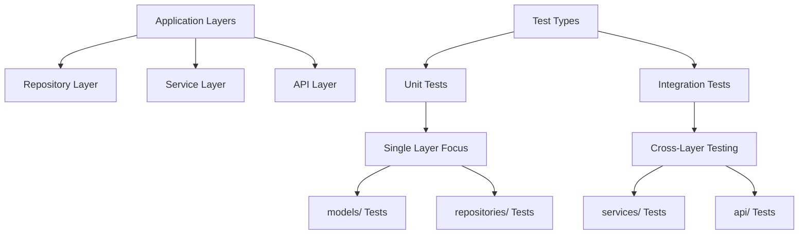

- **Layer Separation in Unit Tests**:
  - Unit tests should not cross application layers
  - Model unit tests should test only model-level behavior (relationships, constraints, etc.)
  - Repository unit tests should focus on data access patterns

- **Service-Dependent Tests**:
  - Tests that need services should be in `tests/integration/services/`
  - Service tests validate business logic and cross-entity operations
  - Integration tests are appropriate for testing cross-layer behavior
  - Type-specific behavior should be tested at the right layer

## Model Registration & Circular Reference Resolution

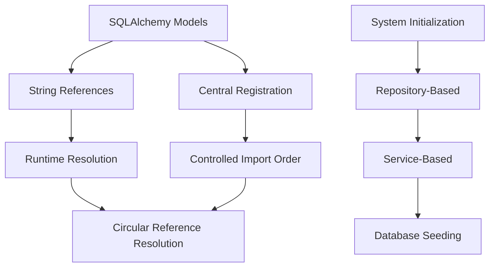

### Model Layer Circular Reference Resolution

The model layer uses two key patterns to handle circular dependencies between model files:

#### String Reference Pattern

- Use string references in relationship definitions: `relationship("ModelName", ...)`
- Defer class resolution until runtime rather than import time
- Allows cross-referencing between models without direct imports
- Example: `bills: Mapped[List["Liability"]] = relationship("Liability", back_populates="category")`

#### Central Registration Pattern

- Import all models in controlled order in `models/__init__.py`
- Define explicit dependency order for model registration
- Create a single import path for database initialization
- Ensures all model references are resolved properly at runtime

### System Initialization Pattern

System initialization follows a layered architectural approach:

#### Repository-Based Data Access

- All database access happens exclusively through repository layer
- Even during initialization, direct DB access is prohibited
- Leverages existing repository methods for data operations
- Maintains architectural consistency throughout codebase

#### System Initialization Service

- Dedicated service layer for system data initialization
- Clear separation between schema creation and data seeding
- Ensures all required system data exists on startup
- Example: `ensure_system_categories()` for default category creation
