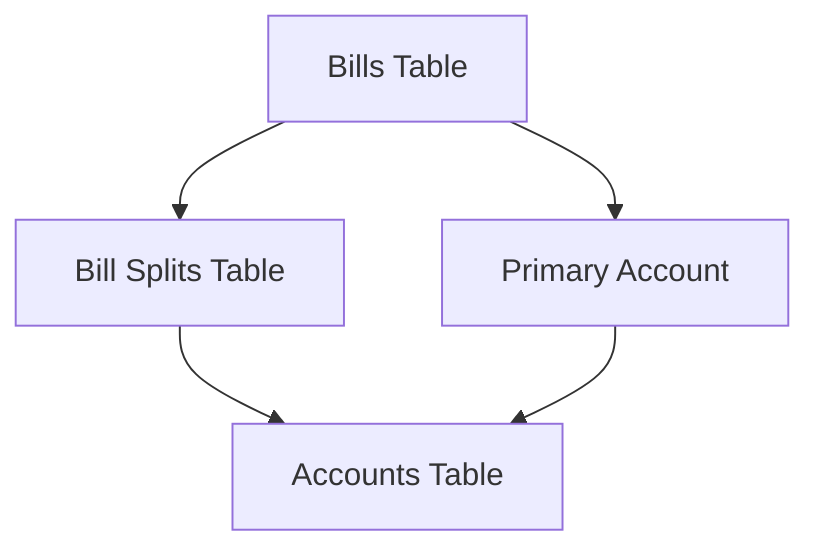
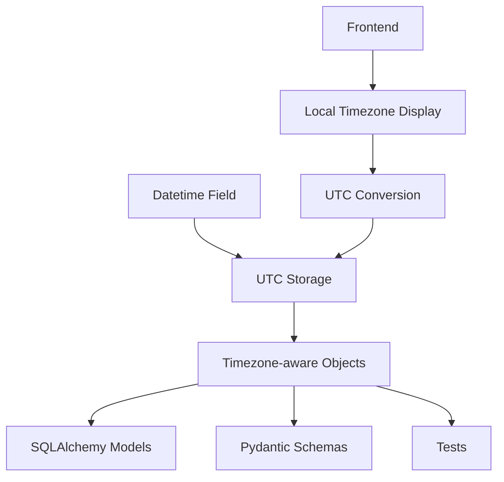
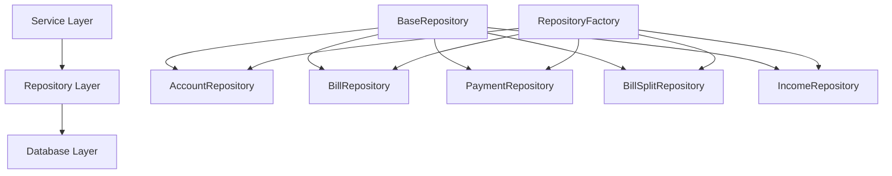
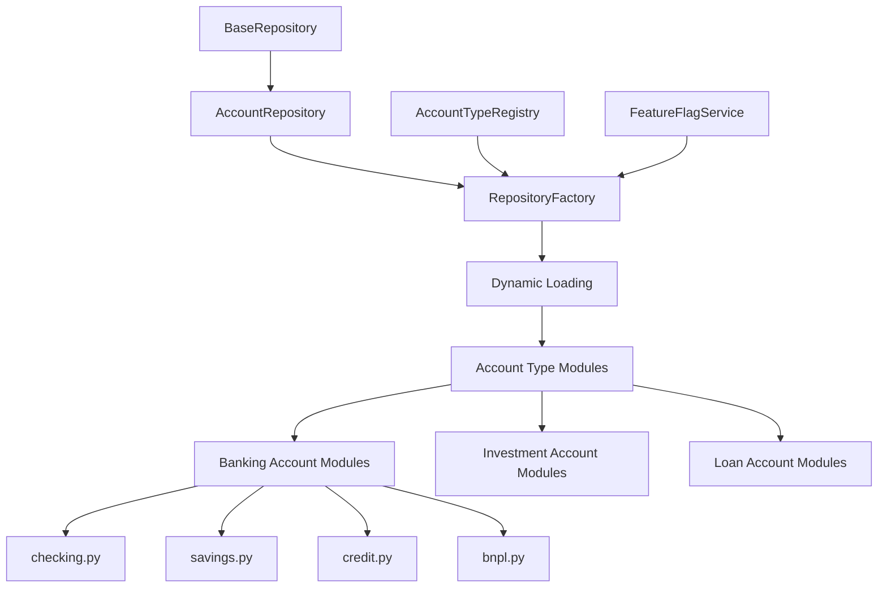
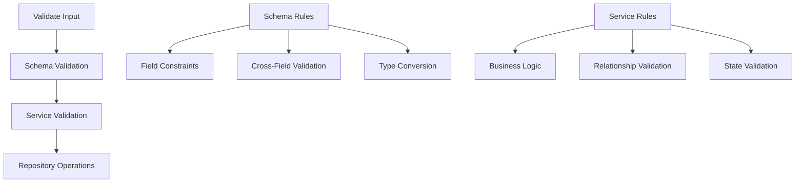
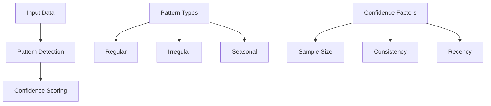
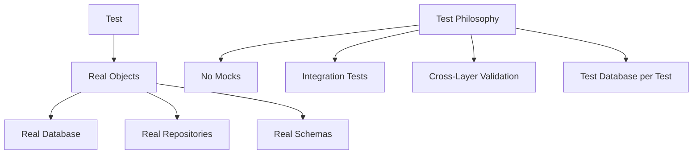
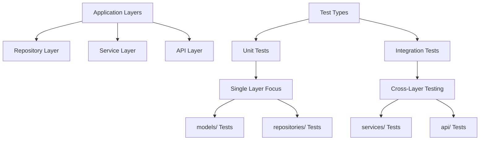
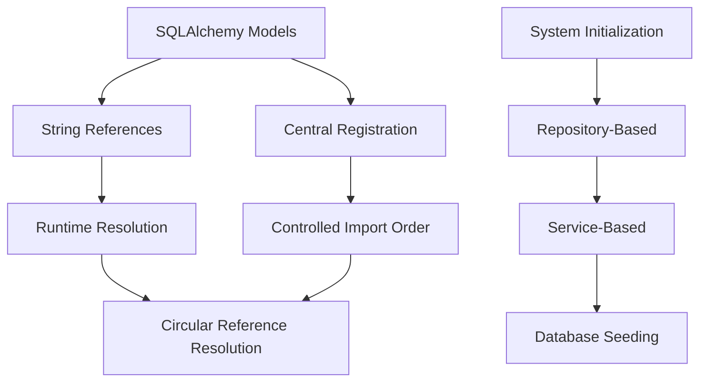

# System Patterns: Debtonator

## Core Patterns

### Dynamic Accounts and Bill Split Management



- **Primary Account Relationship**: Each bill has a primary account (required)
- **Split Relationships**: Bills can be split across multiple accounts
- **Split Amount Logic**: Primary account amount = total bill amount - sum of splits
- **Auto-Split Creation**: Primary account split is created automatically

#### Validation Rules

1. Split amounts must sum to total bill amount
2. All account references must be valid
3. No negative split amounts allowed
4. Each bill-account combination must be unique (enforced by database constraint)

#### Implementation Pattern

1. Bill creation:
   - Assign primary account
   - Create splits for non-primary accounts
   - Calculate and create primary account split automatically
2. Bill update:
   - Validate split integrity
   - Update or create splits as needed
   - Recalculate primary account split amount

### Datetime Standardization



- Store all datetime values in UTC timezone
- Use timezone-aware objects throughout the system
- Convert to local timezone only at presentation layer
- Validate timezone correctness in schemas

## Repository Patterns

### Repository Architecture



- BaseRepository provides generic CRUD operations
- Model-specific repositories extend BaseRepository with specialized methods
- RepositoryFactory manages repository instances for dependency injection
- Each repository focuses on a single model with related operations

### Repository Implementation Pattern

- Generic typing for model and primary key types
- Consistent method signatures across repositories
- Relationship loading with selectinload/joinedload
- Pagination support for large result sets
- Transaction handling for multi-operation consistency

### Repository Module Pattern



The Repository Module Pattern allows for specialized repository functionality to scale to hundreds of account types without creating unwieldy monolithic repositories. Key aspects include:

1. **Module Organization**: Account type-specific repository operations are organized into specialized modules:
   - `src/repositories/account_types/{category}/{type}.py` (e.g., banking/checking.py)
   - Each module contains functions specific to a particular account type
   - All functions take SQLAlchemy session as their first parameter

2. **Dynamic Loading**: The `RepositoryFactory` dynamically:
   - Loads the correct module based on account type
   - Binds specialized functions to the repository instance
   - Handles missing modules gracefully with fallbacks
   - Provides runtime introspection of available operations

3. **Registry Integration**: The `AccountTypeRegistry`:
   - Maps account types to their repository modules
   - Controls which modules should be loaded
   - Integrates with feature flag system for conditional loading

4. **Feature Flag Integration**:
   - Repository modules can be enabled/disabled through feature flags
   - Type-specific operations are only available when features are enabled
   - Graceful degradation when features are disabled

5. **Implementation Example**:

   ```python
   # Repository Factory usage
   repo = RepositoryFactory.create_account_repository(
       session=session,
       account_type="checking",  # Dynamically loads checking.py module
       feature_flag_service=feature_flag_service
   )

   # Base operations from AccountRepository
   accounts = await repo.get_all()
   
   # Type-specific operations from checking.py (dynamically bound)
   with_overdraft = await repo.get_checking_accounts_with_overdraft()
   ```

This pattern provides several benefits:

- **Separation of Concerns**: Each account type has isolated repository code
- **Scalability**: Handles hundreds of account types without code bloat
- **Maintainability**: Type-specific operations live with their respective types
- **DRY Design**: Common operations defined only once in base repository
- **Feature Control**: Feature flags can enable/disable account type modules

## Validation Patterns

### Multi-Layer Validation Approach



- Schema Layer: Field constraints, type validation, basic cross-field validation
- Service Layer: Business rules, complex validation, state-dependent validation
- Repository Layer: Data access without validation logic
- Clear separation of validation responsibilities between layers

### Decimal Precision Strategy

- Two-tier precision model:
  - 4 decimal places for storage in database (Numeric(12, 4))
  - 2 decimal places for display at UI/API boundaries
- MoneyDecimal type for monetary values (2 decimal places)
- PercentageDecimal type for percentage values (4 decimal places)
- Annotated types with Field constraints for validation

## Service Patterns

### Pattern Analysis



- Financial pattern detection for bills, income, and payments
- Confidence scoring based on sample size and consistency
- Pattern types classified as regular, irregular, or seasonal
- History-based analyses for predictions

## Error Handling Patterns

### Layered Error Handling

- Service Layer: Business logic errors with context
- Repository Layer: Data access errors with details
- API Layer: User-friendly error messages with codes
- Clear error hierarchies with consistent structure

## Testing Patterns

### Integration-First Approach with Real Objects



- **No Mocks Policy**: Strictly prohibit using unittest.mock, MagicMock, or any other mocking libraries
- Integration tests for services with real database that resets between tests
- Cross-layer integration to verify actual interactions between components
- Repository tests with real database fixtures
- API tests for endpoint validation with real service and repository implementations
- Error case testing for validation scenarios
- Service tests with real repositories connected to test database

### Test Fixture Pattern

```mermaid
graph TD
    A[Source Code Structure] --> B[Mirror in Test Fixtures]
    B --> C[tests/fixtures/models/account_types/]
    B --> D[Polymorphic Subclasses]
    
    E[SQLAlchemy 2.0 Async] --> F[select API]
    F --> G[No query() method]
    E --> H[await db_session.execute]
```

- **Mirror Structure Pattern**: Test fixture directories mirror source code structure
  - Example: `src/models/account_types/banking/` → `tests/fixtures/models/account_types/banking/`
  - Each account type has dedicated fixture file (e.g., `fixture_checking.py`)
  - Encourages maintainable pattern as model hierarchy grows

- **Modern SQLAlchemy Query Pattern**:
  - Use `select()` function instead of legacy `query()` method
  - Example:

    ```python
    # ✅ Correct: Modern SQLAlchemy 2.0 async pattern
    from sqlalchemy import select
    stmt = select(Model).where(Model.id == some_id)
    result = await db_session.execute(stmt)
    item = result.scalars().first()
    
    # ❌ Incorrect: Legacy pattern that fails with AsyncSession
    items = (await db_session.execute(db_session.query(Model))).scalars().all()
    ```

  - AsyncSession doesn't support the query() method from SQLAlchemy 1.x

### Polymorphic Identity Pattern

```mermaid
graph TD
    A[Base Model Class] --> B[Abstract Methods]
    A --> C[Polymorphic Identity Mapping]
    
    C --> D[Concrete Subclasses]
    D --> E[CheckingAccount]
    D --> F[SavingsAccount]
    D --> G[CreditAccount]
    
    H[Creating Instances] --> I[Always Use Subclass]
    I --> J[CheckingAccount.new()]
    
    K[Testing] --> L[Match Fixture to Production]
    L --> M[Type-Specific Fixtures]
```

- **Polymorphic Type Instantiation**:
  - Always use the proper subclass constructor that matches the intended polymorphic type
  - Example:

    ```python
    # ✅ Correct: Using concrete subclass constructor 
    checking = CheckingAccount(
        name="Primary Checking",
        current_balance=Decimal("1000.00"),
        available_balance=Decimal("1000.00")
    )
    
    # ❌ Incorrect: Setting discriminator on base class
    account = Account(
        name="Primary Checking",
        account_type="checking",  # Will cause SQLAlchemy polymorphic warnings
        current_balance=Decimal("1000.00"),
        available_balance=Decimal("1000.00")
    )
    ```

- **Test Fixtures for Polymorphic Types**:
  - Use specialized fixture functions that return proper subclass instances
  - Mirror the polymorphic hierarchy in your test fixtures
  - Example:

    ```python
    # Proper fixture returning correct subclass
    @pytest_asyncio.fixture
    async def test_checking_account(db_session) -> CheckingAccount:
        """Create a checking account for testing."""
        account = CheckingAccount(
            name="Test Checking",
            current_balance=Decimal("1000.00"),
            available_balance=Decimal("1000.00")
        )
        db_session.add(account)
        await db_session.flush()
        return account
    ```

### Test Layer Separation



- **Layer Separation in Unit Tests**:
  - Unit tests should not cross application layers
  - Model unit tests should test only model-level behavior (relationships, constraints, etc.)
  - Repository unit tests should focus on data access patterns
  - Example:

    ```python
    # ✅ Correct: Model-only unit test
    async def test_account_relationships(db_session):
        """Test relationships between models"""
        # Test with only model-level operations
        account = CheckingAccount(name="Test Account")
        db_session.add(account)
        await db_session.flush()
        
        # Verify relationships using only model-level code
        await db_session.refresh(account, ["transactions"])
        assert isinstance(account.transactions, list)
    
    # ❌ Incorrect: Using service in model test
    async def test_account_with_service(db_session):
        """This crosses layers inappropriately"""
        # Don't use services in model unit tests
        service = AccountService(db_session)
        account = await service.create_account(account_data)
        # ...
    ```

- **Service-Dependent Tests**:
  - Tests that need services should be in `tests/integration/services/`
  - Service tests validate business logic and cross-entity operations
  - Integration tests are appropriate for testing cross-layer behavior
  - Type-specific behavior should be tested at the right layer

## Database Patterns

### Model Relationships

- Clear relationship definitions with back_populates
- Proper cascade behavior for related records
- Efficient joins for relationship loading
- Type-safe relationship references

## Model Registration & Circular Reference Resolution



### Model Layer Circular Reference Resolution

The model layer uses two key patterns to handle circular dependencies between model files:

#### String Reference Pattern

- Use string references in relationship definitions: `relationship("ModelName", ...)`
- Defer class resolution until runtime rather than import time
- Allows cross-referencing between models without direct imports
- Example: `bills: Mapped[List["Liability"]] = relationship("Liability", back_populates="category")`

#### Central Registration Pattern

- Import all models in controlled order in `models/__init__.py`
- Define explicit dependency order for model registration
- Create a single import path for database initialization
- Ensures all model references are resolved properly at runtime

### System Initialization Pattern

System initialization follows a layered architectural approach:

#### Repository-Based Data Access

- All database access happens exclusively through repository layer
- Even during initialization, direct DB access is prohibited
- Leverages existing repository methods for data operations
- Maintains architectural consistency throughout codebase

#### System Initialization Service

- Dedicated service layer for system data initialization
- Clear separation between schema creation and data seeding
- Ensures all required system data exists on startup
- Example: `ensure_system_categories()` for default category creation

#### Database Initialization Flow

1. Schema creation through SQLAlchemy metadata
2. Repository instantiation with database session
3. Service-based initialization of required system data
4. Validation of system requirements before application start

This approach solves circular dependencies while maintaining architectural integrity by:

1. Using string references for model relationships
2. Centralizing model registration in a single location
3. Leveraging repository layer for all data access
4. Separating schema creation from system data initialization
5. Using service layer for business logic, even during initialization

## Frontend Integration Patterns

### API Client

- Consistent error handling across requests
- Response formatting with appropriate precision
- Type-safe request and response handling
- Loading state management
