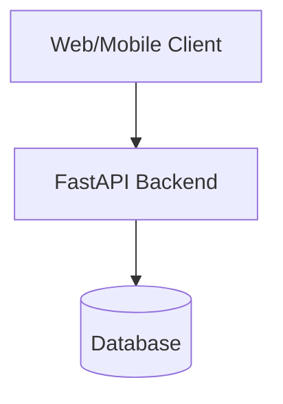
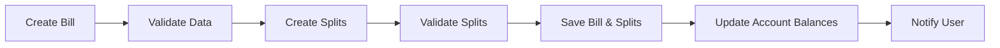
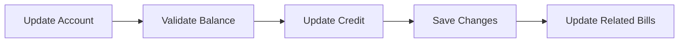
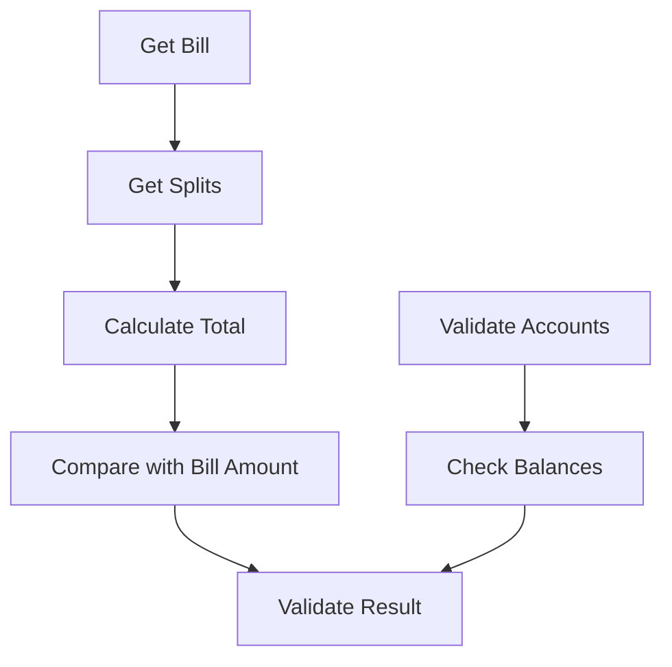

# System Patterns: Debtonator

## Architecture Overview

### Three-Tier Architecture


### Key Components
1. **Frontend Layer**
   - React components
   - State management
   - API integration
   - Real-time calculations
   - Dynamic account management
   - Split payment handling

2. **API Layer**
   - FastAPI endpoints
   - Business logic
   - Data validation
   - Authentication
   - Account management
   - Split payment validation

3. **Data Layer**
   - Database schema
   - Data access patterns
   - Caching strategy
   - Account relationships
   - Bill splits tracking

## Design Patterns

### Repository Pattern
- Abstracts data access
- Enables database switching
- Centralizes data operations

```python
class BillRepository:
    async def get_bills_by_date_range(self, start_date: date, end_date: date) -> List[Bill]:
        pass
    
    async def get_unpaid_bills(self) -> List[Bill]:
        pass

    async def get_bill_splits(self, bill_id: int) -> List[BillSplit]:
        pass
```

### Service Layer Pattern
- Encapsulates business logic
- Manages transactions
- Handles complex calculations

```python
class BillService:
    async def create_bill_with_splits(
        self, bill_data: BillCreate, splits: List[BillSplitCreate]
    ) -> Bill:
        pass
    
    async def validate_split_total(self, bill_id: int) -> bool:
        pass

class AccountService:
    async def update_balance(self, account_id: int, amount: Decimal) -> Account:
        pass
    
    async def calculate_available_credit(self, account_id: int) -> Decimal:
        pass
```

### Factory Pattern
- Creates complex objects
- Manages object lifecycle
- Enables dependency injection

```python
class BillFactory:
    @staticmethod
    def create_recurring_bill(template: BillTemplate) -> Bill:
        pass

    @staticmethod
    def create_split_bill(template: BillTemplate, splits: List[BillSplit]) -> Bill:
        pass
```

## Data Flow Patterns

### Bill Management with Splits


### Account Management


### Bill Split Validation


## State Management

### Frontend State
- Global application state
- Component-level state
- Form state
- API cache state
- Account state management
- Split payment state

### Backend State
- Database transactions
- Session management
- Cache invalidation
- Background tasks
- Account balance tracking
- Split payment validation

## Error Handling

### Frontend Errors
- API error handling
- Form validation errors
- Network error recovery
- State inconsistency handling
- Split payment validation errors
- Account balance errors

### Backend Errors
- Database errors
- Validation errors
- Business rule violations
- External service errors
- Split total mismatch errors
- Account balance constraints

## Security Patterns

### Authentication
- JWT tokens
- Session management
- Role-based access

### Data Protection
- Encryption at rest
- Secure communication
- Input validation
- Output sanitization
- Account data protection
- Balance information security

## Testing Patterns

### Unit Testing
- Business logic
- Data validation
- Calculations
- Component rendering
- Split payment validation
- Account balance calculations

### Integration Testing
- API endpoints
- Database operations
- Service interactions
- User workflows
- Account management flows
- Split payment flows

### End-to-End Testing
- Critical paths
- User scenarios
- Mobile responsiveness
- Performance testing
- Account operations
- Split payment scenarios

## Validation Patterns

### Bill Split Validation
- Total amount matching
- Account availability
- Balance sufficiency
- Split constraints
- Business rules compliance

### Account Validation
- Balance consistency
- Credit limit enforcement
- Transaction validation
- Split payment capacity
- Historical data consistency
