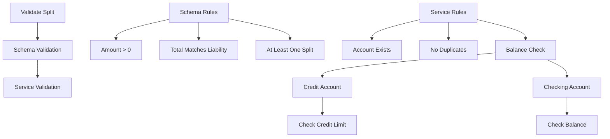

[Previous content remains exactly the same until "## Validation Patterns"]

## Validation Patterns

### Bill Splits Validation


```python
# Schema-level validation
class BillSplitValidation(BaseModel):
    liability_id: int = Field(..., gt=0)
    total_amount: Decimal = Field(..., gt=0)
    splits: List[BillSplitCreate]

    @validator('splits')
    @classmethod
    def validate_splits(cls, v, values):
        if not v:
            raise ValueError("At least one split is required")
        
        total_split = sum(split.amount for split in v)
        if abs(total_split - values['total_amount']) > Decimal('0.01'):
            raise ValueError(
                f"Sum of splits ({total_split}) must equal total amount ({values['total_amount']})"
            )
        return v

# Service-level validation
async def validate_splits(self, validation: BillSplitValidation) -> Tuple[bool, Optional[str]]:
    try:
        # Verify liability exists
        liability = await self.get_liability(validation.liability_id)
        if not liability:
            return False, f"Liability not found"

        # Get all accounts
        accounts = await self.get_accounts(validation.splits)
        
        # Check for duplicate accounts
        if len(set(accounts)) != len(accounts):
            return False, "Duplicate accounts found"
            
        # Validate each account's balance/credit
        for split in validation.splits:
            account = accounts[split.account_id]
            if not await self.validate_account_capacity(account, split.amount):
                return False, f"Insufficient funds in {account.name}"
                
        return True, None
    except Exception as e:
        return False, str(e)
```

### Payment Validation
- Total amount matching
- Account availability
- Balance sufficiency
- Source constraints
- Business rules compliance

### Account Validation
- Balance consistency
- Credit limit enforcement
- Transaction validation
- Payment capacity
- Historical data consistency

[Rest of the file remains exactly the same]
