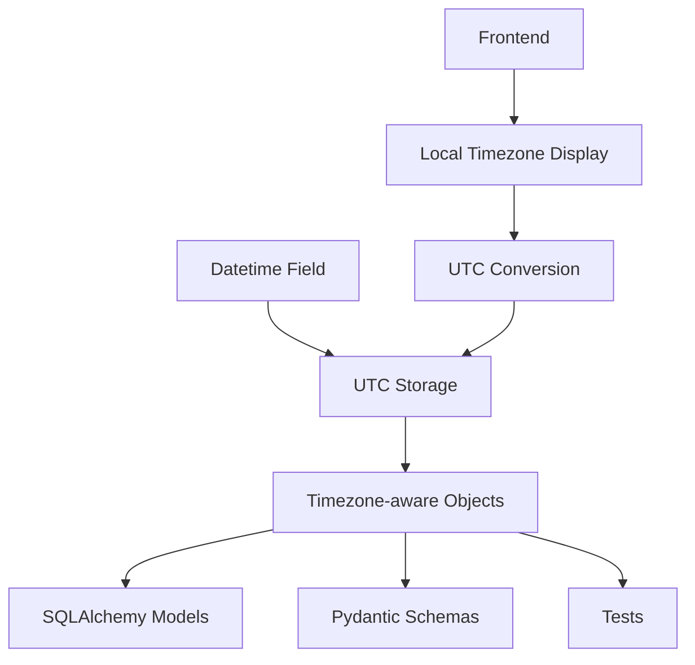
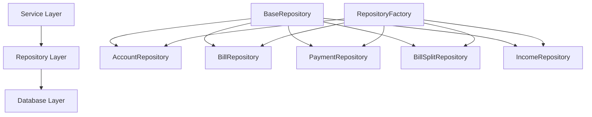
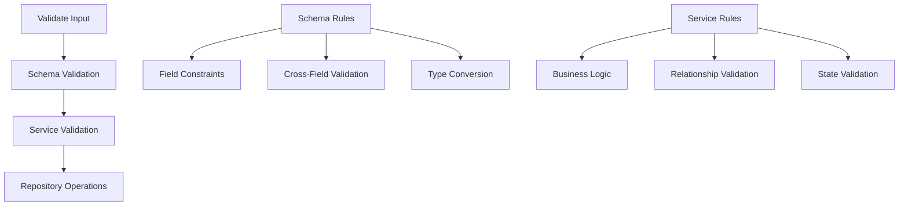
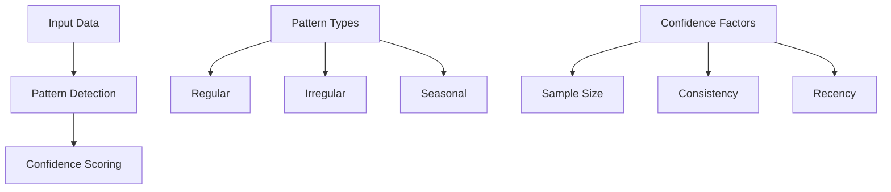

# System Patterns: Debtonator

## Core Patterns

### Datetime Standardization

- Store all datetime values in UTC timezone
- Use timezone-aware objects throughout the system
- Convert to local timezone only at presentation layer
- Validate timezone correctness in schemas

## Repository Patterns

### Repository Architecture

- BaseRepository provides generic CRUD operations
- Model-specific repositories extend BaseRepository with specialized methods
- RepositoryFactory manages repository instances for dependency injection
- Each repository focuses on a single model with related operations

### Repository Implementation Pattern

- Generic typing for model and primary key types
- Consistent method signatures across repositories
- Relationship loading with selectinload/joinedload
- Pagination support for large result sets
- Transaction handling for multi-operation consistency

## Validation Patterns

### Multi-Layer Validation Approach

- Schema Layer: Field constraints, type validation, basic cross-field validation
- Service Layer: Business rules, complex validation, state-dependent validation
- Repository Layer: Data access without validation logic
- Clear separation of validation responsibilities between layers

### Decimal Precision Strategy

- Two-tier precision model:
  - 4 decimal places for storage in database (Numeric(12, 4))
  - 2 decimal places for display at UI/API boundaries
- MoneyDecimal type for monetary values (2 decimal places)
- PercentageDecimal type for percentage values (4 decimal places)
- Annotated types with Field constraints for validation

## Service Patterns

### Pattern Analysis

- Financial pattern detection for bills, income, and payments
- Confidence scoring based on sample size and consistency
- Pattern types classified as regular, irregular, or seasonal
- History-based analyses for predictions

## Error Handling Patterns

### Layered Error Handling

- Service Layer: Business logic errors with context
- Repository Layer: Data access errors with details
- API Layer: User-friendly error messages with codes
- Clear error hierarchies with consistent structure

## Testing Patterns

### Integration-First Approach

- Integration tests for services with real database
- Unit tests for pure business logic and utilities
- Repository tests with test fixtures
- API tests for endpoint validation
- Error case testing for validation scenarios

## Database Patterns

### Model Relationships

- Clear relationship definitions with back_populates
- Proper cascade behavior for related records
- Efficient joins for relationship loading
- Type-safe relationship references

## Frontend Integration Patterns

### API Client

- Consistent error handling across requests
- Response formatting with appropriate precision
- Type-safe request and response handling
- Loading state management
