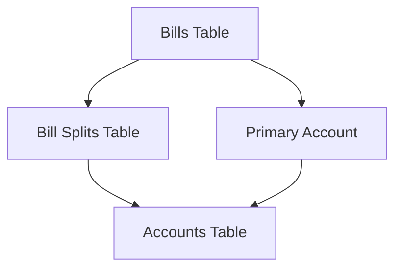
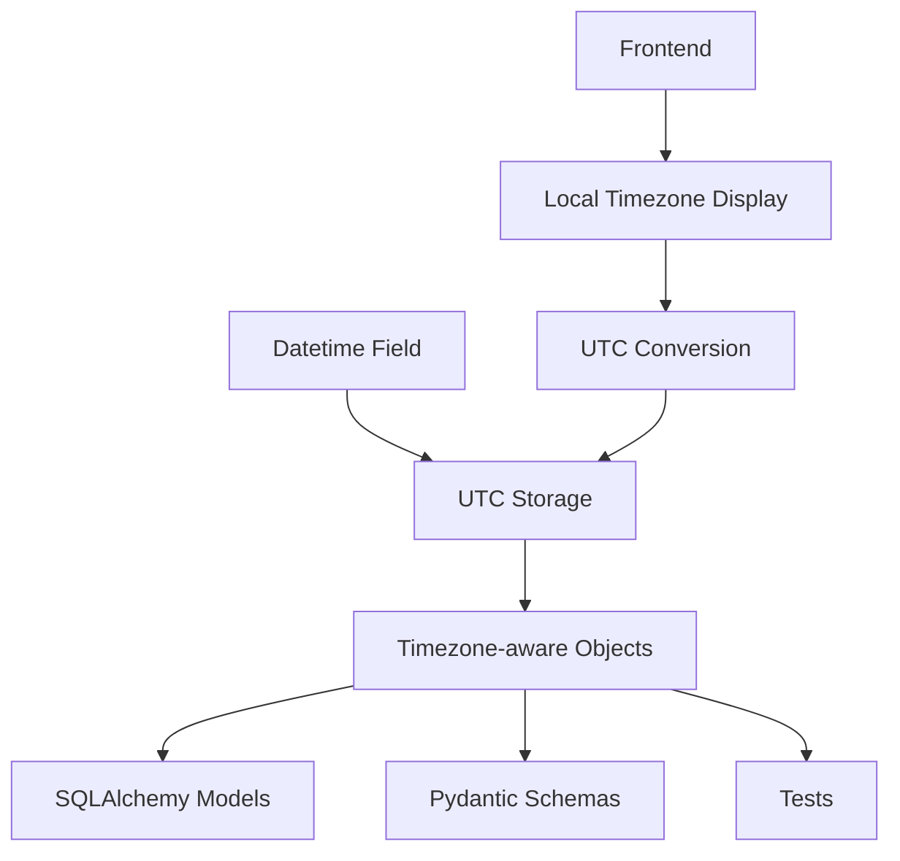
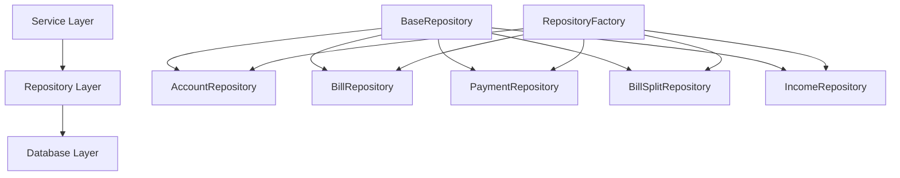
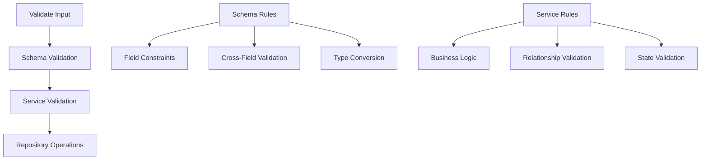
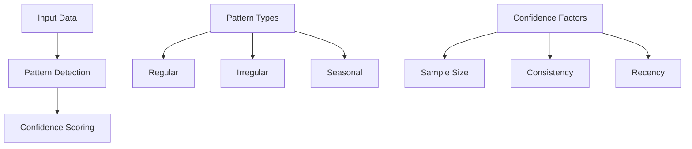
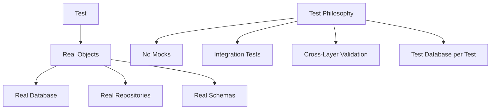
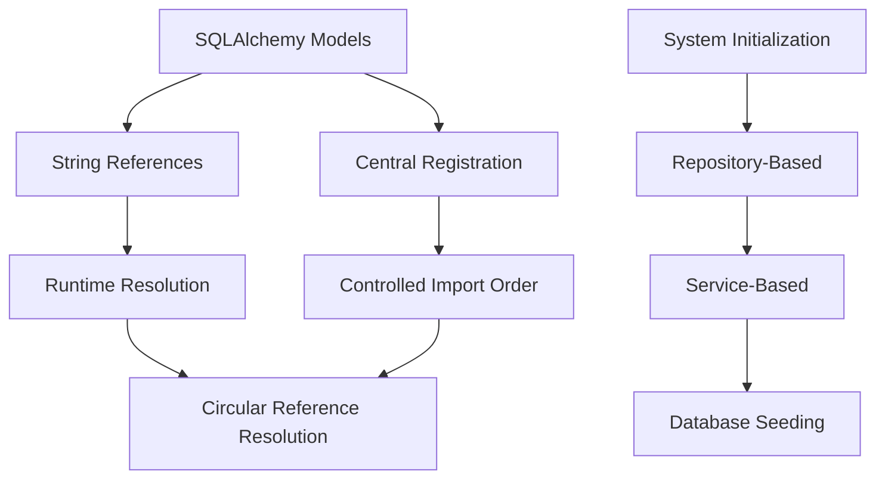

# System Patterns: Debtonator

## Core Patterns

### Dynamic Accounts and Bill Split Management

- **Primary Account Relationship**: Each bill has a primary account (required)
- **Split Relationships**: Bills can be split across multiple accounts
- **Split Amount Logic**: Primary account amount = total bill amount - sum of splits
- **Auto-Split Creation**: Primary account split is created automatically

#### Validation Rules
1. Split amounts must sum to total bill amount
2. All account references must be valid
3. No negative split amounts allowed
4. Each bill-account combination must be unique (enforced by database constraint)

#### Implementation Pattern
1. Bill creation: 
   - Assign primary account
   - Create splits for non-primary accounts
   - Calculate and create primary account split automatically
2. Bill update:
   - Validate split integrity
   - Update or create splits as needed
   - Recalculate primary account split amount

### Datetime Standardization

- Store all datetime values in UTC timezone
- Use timezone-aware objects throughout the system
- Convert to local timezone only at presentation layer
- Validate timezone correctness in schemas

## Repository Patterns

### Repository Architecture

- BaseRepository provides generic CRUD operations
- Model-specific repositories extend BaseRepository with specialized methods
- RepositoryFactory manages repository instances for dependency injection
- Each repository focuses on a single model with related operations

### Repository Implementation Pattern

- Generic typing for model and primary key types
- Consistent method signatures across repositories
- Relationship loading with selectinload/joinedload
- Pagination support for large result sets
- Transaction handling for multi-operation consistency

## Validation Patterns

### Multi-Layer Validation Approach

- Schema Layer: Field constraints, type validation, basic cross-field validation
- Service Layer: Business rules, complex validation, state-dependent validation
- Repository Layer: Data access without validation logic
- Clear separation of validation responsibilities between layers

### Decimal Precision Strategy

- Two-tier precision model:
  - 4 decimal places for storage in database (Numeric(12, 4))
  - 2 decimal places for display at UI/API boundaries
- MoneyDecimal type for monetary values (2 decimal places)
- PercentageDecimal type for percentage values (4 decimal places)
- Annotated types with Field constraints for validation

## Service Patterns

### Pattern Analysis

- Financial pattern detection for bills, income, and payments
- Confidence scoring based on sample size and consistency
- Pattern types classified as regular, irregular, or seasonal
- History-based analyses for predictions

## Error Handling Patterns

### Layered Error Handling

- Service Layer: Business logic errors with context
- Repository Layer: Data access errors with details
- API Layer: User-friendly error messages with codes
- Clear error hierarchies with consistent structure

## Testing Patterns

### Integration-First Approach with Real Objects

- **No Mocks Policy**: Strictly prohibit using unittest.mock, MagicMock, or any other mocking libraries
- Integration tests for services with real database that resets between tests
- Cross-layer integration to verify actual interactions between components
- Repository tests with real database fixtures
- API tests for endpoint validation with real service and repository implementations
- Error case testing for validation scenarios
- Service tests with real repositories connected to test database

## Database Patterns

### Model Relationships

- Clear relationship definitions with back_populates
- Proper cascade behavior for related records
- Efficient joins for relationship loading
- Type-safe relationship references

## Model Registration & Circular Reference Resolution

### Model Layer Circular Reference Resolution

The model layer uses two key patterns to handle circular dependencies between model files:

#### String Reference Pattern
- Use string references in relationship definitions: `relationship("ModelName", ...)`
- Defer class resolution until runtime rather than import time
- Allows cross-referencing between models without direct imports
- Example: `bills: Mapped[List["Liability"]] = relationship("Liability", back_populates="category")`

#### Central Registration Pattern
- Import all models in controlled order in `models/__init__.py`
- Define explicit dependency order for model registration
- Create a single import path for database initialization
- Ensures all model references are resolved properly at runtime

### System Initialization Pattern

System initialization follows a layered architectural approach:

#### Repository-Based Data Access
- All database access happens exclusively through repository layer
- Even during initialization, direct DB access is prohibited
- Leverages existing repository methods for data operations
- Maintains architectural consistency throughout codebase

#### System Initialization Service
- Dedicated service layer for system data initialization
- Clear separation between schema creation and data seeding
- Ensures all required system data exists on startup
- Example: `ensure_system_categories()` for default category creation

#### Database Initialization Flow
1. Schema creation through SQLAlchemy metadata
2. Repository instantiation with database session
3. Service-based initialization of required system data
4. Validation of system requirements before application start

This approach solves circular dependencies while maintaining architectural integrity by:
1. Using string references for model relationships
2. Centralizing model registration in a single location
3. Leveraging repository layer for all data access
4. Separating schema creation from system data initialization
5. Using service layer for business logic, even during initialization

## Frontend Integration Patterns

### API Client

- Consistent error handling across requests
- Response formatting with appropriate precision
- Type-safe request and response handling
- Loading state management
