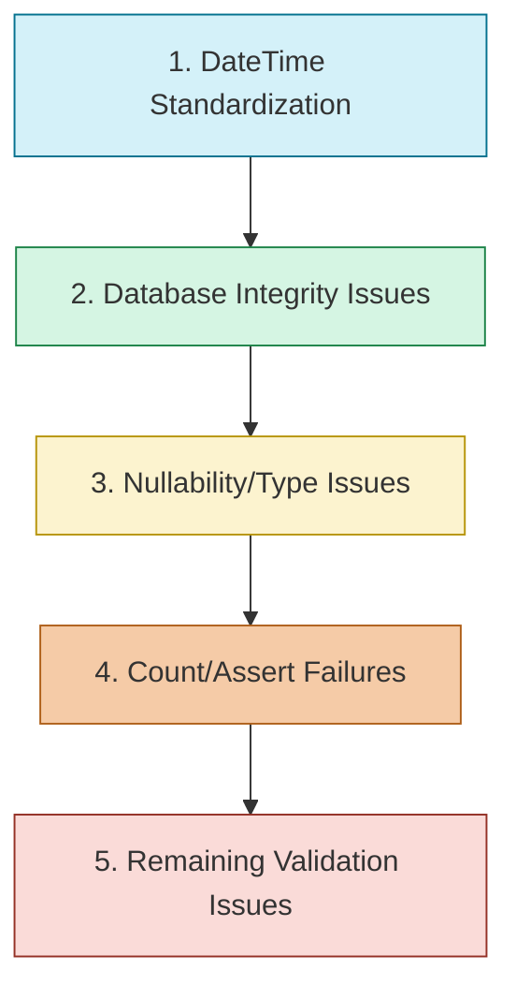

# Test Failure Resolution Checklist

## Overview 

This document outlines the step-by-step plan to resolve the 52 test failures in the repository layer advanced tests, organized by error type and priority.

## Progress Tracking

- [ ] Phase 1: DateTime Standardization (0/14 fixed)
- [ ] Phase 2: Database Integrity Issues (0/8 fixed)
- [ ] Phase 3: Nullability and Type Issues (0/8 fixed)
- [ ] Phase 4: Count/Assert Failures (0/18 fixed)
- [ ] Phase 5: Validation Issues (0/4 fixed)

**Total Progress: 0/52 tests fixed**

## Resolution Sequence

## Phase 1: DateTime Standardization Checklist

### balance_reconciliation_repository_advanced.py

- [ ] Fix test_get_by_date_range: "can't compare offset-naive and offset-aware datetimes"
  - Replace naive datetimes with UTC-aware datetimes using helpers from datetime_utils.py
  - Ensure date range parameters are consistently UTC-aware

- [ ] Fix test_get_most_recent: "can't compare offset-naive and offset-aware datetimes"
  - Replace datetime comparisons with UTC-aware equivalents
  - Verify repository method handles timezone-aware datetime objects correctly

- [ ] Fix test_get_reconciliation_frequency: "assert 15 <= 3.3122106481481484e-08"
  - Update frequency calculation to handle timezone-aware datetimes
  - Review expected vs. actual values in assertion

### bill_split_repository_advanced.py

- [ ] Fix test_get_splits_in_date_range: "can't compare offset-naive and offset-aware datetimes"
  - Ensure all date parameters in queries use consistent UTC timezone
  - Update query parameters to use datetime_utils helpers

- [ ] Fix test_get_recent_split_patterns: "name 'timedelta' is not defined"
  - Add missing import: `from datetime import timedelta`
  - Fix time calculation using proper imports

### liability_repository_advanced.py

- [ ] Fix test_get_bills_due_in_range: "can't compare offset-naive and offset-aware datetimes"
  - Update all due date comparisons to use UTC-aware datetimes
  - Standardize date range queries with UTC awareness

- [ ] Fix test_get_upcoming_payments: "can't compare offset-naive and offset-aware datetimes"
  - Make payment date filters and comparisons UTC-aware
  - Use utc_now() and similar helper functions

- [ ] Fix test_get_overdue_bills: "can't compare offset-naive and offset-aware datetimes"
  - Update overdue bill logic to handle timezone information
  - Fix comparison of due dates with current time

### statement_history_repository_advanced.py

- [ ] Fix test_get_by_date_range: "can't compare offset-naive and offset-aware datetimes"
  - Make date range parameters UTC-aware
  - Review SQL query generation for date range filtering

### account_repository_advanced.py

- [ ] Fix test_update_statement_balance: "can't subtract offset-naive and offset-aware datetimes"
  - Update test to use timezone-aware datetime for statement date
  - Fix date comparison in assertion

### deposit_schedule_repository_advanced.py

- [ ] Fix test_get_upcoming_schedules: "day is out of range for month"
  - Fix date arithmetic to handle month boundary cases
  - Use proper date calculation methods instead of manual addition

### payment_schedule_repository_advanced.py

- [ ] Fix test_get_upcoming_schedules: "day is out of range for month"
  - Fix date calculation to properly handle month boundaries
  - Review schedule date generation logic

### recurring_income_repository_advanced.py

- [ ] Fix test_get_upcoming_deposits: "name 'utc_now' is not defined"
  - Add import: `from tests.helpers.datetime_utils import utc_now`
  - Update code to use utility function

## Phase 2: Database Integrity Issues Checklist

### category_repository_advanced.py

- [ ] Fix test_get_with_bills: "NOT NULL constraint failed: liabilities.primary_account_id"
  - Update test fixture creation to include required primary_account_id
  - Check for proper relationship setup between categories and liabilities

- [ ] Fix test_get_with_relationships: "NOT NULL constraint failed: liabilities.primary_account_id"
  - Fix relationship loading in repository method
  - Ensure test data includes all required fields

- [ ] Fix test_get_category_with_bill_count: "NOT NULL constraint failed: liabilities.primary_account_id"
  - Update test fixture creation to include required fields
  - Fix query that fetches categories with bill counts

- [ ] Fix test_get_categories_with_bill_counts: "NOT NULL constraint failed: liabilities.primary_account_id"
  - Ensure test data setup includes proper account IDs
  - Review relationship mapping in model definitions

- [ ] Fix test_delete_if_unused: "NOT NULL constraint failed: liabilities.primary_account_id"
  - Fix cascade deletion behavior
  - Update test setup to handle constraints

### liability_repository_advanced.py

- [ ] Fix test_get_bills_for_account: "'int' object has no attribute 'primary_account_id'"
  - Fix relationship loading in repository method
  - Ensure account objects are properly instantiated

### recurring_bill_repository_advanced.py

- [ ] Fix test_get_with_relationships: "assert (not True or Category is None)"
  - Update relationship assertion
  - Fix test data setup for bill-category relationships

### income_category_repository_advanced.py

- [ ] Fix test_get_categories_with_income_counts: "assert 1 == 0"
  - Update expected count values or test data setup
  - Fix category-income relationship loading

## Phase 3: Nullability and Type Issues Checklist

### account_repository_advanced.py

- [ ] Fix test_update_balance_credit_account: "unsupported operand type(s) for -: 'NoneType' and 'decimal.Decimal'"
  - Add null check before decimal arithmetic
  - Ensure available_credit is never None for credit accounts

### balance_history_repository_advanced.py

- [ ] Fix test_get_min_max_balance: "assert None is not None"
  - Update repository method to return proper value instead of None
  - Fix query or data setup for min/max balance calculation

- [ ] Fix test_get_average_balance: "assert None == Decimal('1500.00')"
  - Fix average balance calculation to return decimal value
  - Add null-handling for edge cases

### income_category_repository_advanced.py

- [ ] Fix test_get_with_income: "type object 'IncomeCategory' has no attribute 'income_entries'"
  - Update attribute name to match model definition
  - Fix relationship definition between IncomeCategory and Income

- [ ] Fix test_get_active_categories: "type object 'Income' has no attribute 'is_deposited'. Did you mean: 'deposited'?"
  - Update attribute reference from 'is_deposited' to 'deposited'
  - Fix query that filters by deposit status

- [ ] Fix test_get_categories_with_stats: "type object 'Income' has no attribute 'is_deposited'. Did you mean: 'deposited'?"
  - Update attribute reference from 'is_deposited' to 'deposited'
  - Fix stats calculation that uses deposit status

### transaction_history_repository_advanced.py

- [ ] Fix test_get_total_by_type: "Decimal('130.9000') >= Decimal('280.50')"
  - Fix decimal precision handling or expected values
  - Update total calculation by transaction type

### recurring_income_repository_advanced.py

- [ ] Fix additional nullability issues found during implementation

## Phase 4: Count/Assert Failures Checklist

### account_repository_advanced.py

- [ ] Fix test_find_credit_accounts_near_limit: "assert 0 >= 1"
  - Update test data to include accounts near credit limit
  - Fix credit limit calculation logic

### balance_history_repository_advanced.py

- [ ] Fix test_get_by_date_range: "assert 0 >= 1"
  - Add more test data in the specified date range
  - Fix date range query filtering

- [ ] Fix test_get_balance_trend: "assert 0 >= 3"
  - Update trend data calculation
  - Add sufficient test data points for trend analysis

- [ ] Fix test_get_missing_days: "assert 11 == 8"
  - Update expected number of missing days
  - Fix calculation of missing days in date range

- [ ] Fix test_get_available_credit_trend: "assert 0 >= 3"
  - Add test data for credit trend calculation
  - Fix query that calculates available credit over time

### balance_reconciliation_repository_advanced.py

- [ ] Fix test_get_by_date_range: "assert 0 >= 3"
  - Add more reconciliation records in test date range
  - Fix date range filtering in query

### deposit_schedule_repository_advanced.py

- [ ] Fix test_get_by_account: "assert 0 >= 2"
  - Add test data with schedules linked to account
  - Fix query that filters by account ID

- [ ] Fix test_get_by_income: "assert 0 >= 2"
  - Create test schedules linked to income
  - Fix query that filters by income ID

- [ ] Fix test_get_by_date_range: "assert 0 >= 3"
  - Add schedules within test date range
  - Fix date range filtering

- [ ] Fix test_get_pending_schedules: "assert 0 >= 3"
  - Create pending schedule test data
  - Fix query that identifies pending status

- [ ] Fix test_get_processed_schedules: "assert 0 >= 1"
  - Add processed schedule test data
  - Update processed status filtering

- [ ] Fix test_get_schedules_with_relationships: "assert 0 >= 3"
  - Fix relationship loading in query
  - Ensure test data has proper relationships

- [ ] Fix test_find_overdue_schedules: "assert 0 >= 1"
  - Add overdue schedule test data
  - Fix overdue detection logic

- [ ] Fix test_get_recurring_schedules: "assert 0 >= 1"
  - Add recurring schedule test data
  - Update recurrence filtering

- [ ] Fix test_get_total_scheduled_deposits: "assert 0.0 > 0"
  - Fix sum calculation for scheduled deposits
  - Add test data with positive deposit amounts

### payment_schedule_repository_advanced.py

- [ ] Fix test_get_by_date_range: "assert 1 >= 2"
  - Add payment schedules in test date range
  - Fix date range filtering query

### recurring_bill_repository_advanced.py

- [ ] Fix test_get_upcoming_bills: "assert 5 >= 6"
  - Fix expected count or add test data
  - Update upcoming bill detection logic

### statement_history_repository_advanced.py

- [ ] Fix test_get_statements_with_due_dates: "assert 0 > 0"
  - Add statements with due dates in test data
  - Fix query that filters statements by due date

- [ ] Fix test_get_upcoming_statements_with_accounts: "assert 0 > 0"
  - Create upcoming statement test data
  - Fix query that identifies upcoming statements

### transaction_history_repository_advanced.py

- [ ] Fix test_get_by_account: "assert 3 >= 7"
  - Update expected transaction count or adjust test data
  - Fix query that filters transactions by account

- [ ] Fix test_get_by_date_range: "assert 1 >= 3"
  - Add transactions in test date range
  - Fix date range filtering

- [ ] Fix test_get_by_type: "assert 1 >= 3"
  - Add transactions of different types
  - Fix query that filters by transaction type

- [ ] Fix test_get_transaction_count: "assert 1 >= 3"
  - Update expected count or test data
  - Fix counting logic in repository method

## Phase 5: Validation Issues Checklist

### bill_split_repository_advanced.py

- [ ] Fix test_get_split_distribution: "Decimal('100.0000') == Decimal('300.0000')"
  - Fix split amount distribution calculation
  - Update expected distribution values

### cashflow_forecast_repository_advanced.py

- [ ] Fix test_get_forecast_trend: "assert 3 >= 4"
  - Fix trend calculation logic
  - Update expected trend data count

- [ ] Fix test_get_deficit_trend: "assert 3 >= 4"
  - Fix deficit calculation logic
  - Update expected trend point count

- [ ] Fix test_get_required_income_trend: "assert 3 >= 4"
  - Fix income requirement calculation
  - Update expected trend data count

- [ ] Fix test_get_forecast_by_account: "assert 3 >= 4"
  - Fix account-specific forecast data
  - Update expected forecast data points

### income_category_repository_advanced.py

- [ ] Fix test_validation_error_handling: validation string assertion
  - Update validation message check
  - Fix string comparison in assertion

## Implementation Guidelines

### For DateTime Issues

- [ ] Import and use helper functions from datetime_utils.py consistently
- [ ] Replace datetime.now() with utc_now()
- [ ] Replace datetime.utcnow() with utc_now() 
- [ ] Replace datetime(...) with utc_datetime(...)
- [ ] Add missing imports where needed
- [ ] Update comparison logic to handle timezone-aware objects

### For Database Integrity Issues

- [ ] Review model relationships and ensure correct foreign key usage
- [ ] Update fixture creation to include required fields
- [ ] Fix cascade behavior for related entities
- [ ] Verify test data setup aligns with schema constraints

### For Each Fix

- [ ] Identify the specific error in the test
- [ ] Check for related failures that may have the same root cause
- [ ] Implement fix in a focused, minimal way
- [ ] Run the specific test to verify the fix
- [ ] Update this checklist with completion status
- [ ] Check if the fix impacts other tests

## Testing Progress Checklist

- [ ] Phase 1 tests all passing
- [ ] Phase 2 tests all passing
- [ ] Phase 3 tests all passing
- [ ] Phase 4 tests all passing
- [ ] Phase 5 tests all passing
- [ ] All repository tests passing
- [ ] No regressions introduced

## Final Verification

- [ ] All 52 tests passing
- [ ] Documentation updated with any new patterns discovered
- [ ] Commit message prepared with summary of fixes
