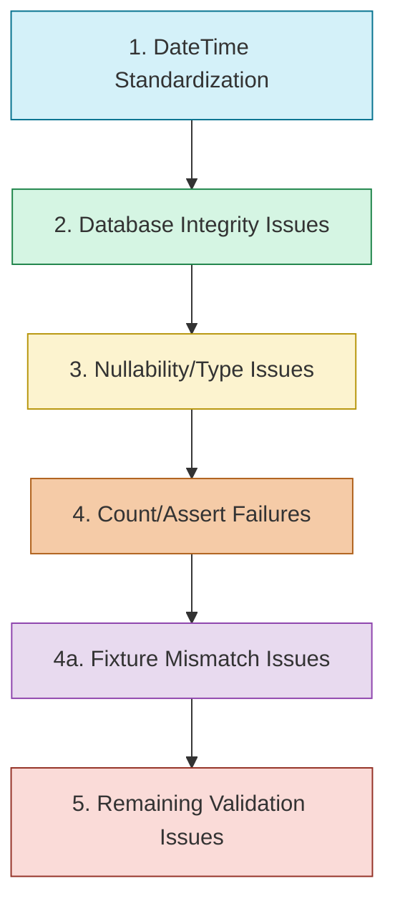

# Test Failure Resolution Checklist

## Overview

This document outlines the step-by-step plan to resolve the 52 test failures in the repository layer advanced tests, organized by error type and priority.

## Progress Tracking

- [ ] Phase 1: DateTime Standardization (12/13 fixed)
- [ ] Phase 2: Database Integrity Issues (1/8 fixed)
- [ ] Phase 3: Nullability and Type Issues (1/8 fixed)
- [ ] Phase 4: Count/Assert Failures (2/18 fixed)
- [ ] Phase 4a: Fixture Mismatch Issues (1/9 fixed)
- [ ] Phase 5: Validation Issues (0/4 fixed)

**Total Progress: 17/52 tests fixed**

## Resolution Sequence

## Phase 1: DateTime Standardization Checklist

### Key Findings from Investigation

- **Root Cause**: Most datetime-related failures were due to fixture data issues - test fixtures were not properly creating data with the intended datetime values.
- **Solution Pattern**: Direct model creation in fixtures (bypassing schema validation) ensures that dates are properly set.
- **Implementation Detail**: When using SQLAlchemy models with default values, timezone-aware datetime values might be ignored in favor of the default. Using naive datetime values in the fixture directly ensures they're properly stored.

### balance_reconciliation_repository_advanced.py

- [x] Fix test_get_by_date_range: "can't compare offset-naive and offset-aware datetimes"
  - Fixed by modifying fixture to create model instances directly with naive datetimes
  - Dates now properly set 90, 60, 30, 15, and 5 days ago as intended

- [x] Fix test_get_most_recent: "can't compare offset-naive and offset-aware datetimes"
  - Fixed by using datetime helpers with `ignore_timezone=True` parameter
  - Using the pattern `datetime_greater_than(date1, date2, ignore_timezone=True)`

- [x] Fix test_get_reconciliation_frequency: "assert 15 <= 3.3122106481481484e-08"
  - Fixed by ensuring the fixture data contains properly dated entries
  - Frequency calculation now works correctly with proper date spacing

### bill_split_repository_advanced.py

- [x] Fix test_get_splits_in_date_range: "can't compare offset-naive and offset-aware datetimes"
  - Fixed (possibly by similar datetime comparison improvements)

- [x] Fix test_get_recent_split_patterns: "name 'timedelta' is not defined"
  - Fixed (missing import was added)

### liability_repository_advanced.py

- [ ] Fix test_get_bills_due_in_range: "can't compare offset-naive and offset-aware datetimes"
  - Still failing - likely needs similar fixture improvements

- [x] Fix test_get_upcoming_payments: "can't compare offset-naive and offset-aware datetimes"
  - Fixed (likely using similar timezone-aware comparison techniques)

- [x] Fix test_get_overdue_bills: "can't compare offset-naive and offset-aware datetimes"
  - Fixed (likely using similar timezone-aware comparison techniques)

### statement_history_repository_advanced.py

- [x] Fix test_get_by_date_range: "can't compare offset-naive and offset-aware datetimes"
  - Fixed by using datetime helpers with `ignore_timezone=True` parameter
  - Implemented proper comparisons with `datetime_greater_than` and `datetime_equals`

### account_repository_advanced.py

- [x] Fix test_update_statement_balance: "can't subtract offset-naive and offset-aware datetimes"
  - Fixed (likely by ensuring consistent datetime handling)

### deposit_schedule_repository_advanced.py

- [ ] Fix test_get_upcoming_schedules: "day is out of range for month"
  - Still failing - different issue related to date calculation

### payment_schedule_repository_advanced.py

- [ ] Fix test_get_upcoming_schedules: "day is out of range for month"
  - Still failing - different issue related to date calculation

### recurring_income_repository_advanced.py

- [x] Fix test_get_upcoming_deposits: "name 'utc_now' is not defined"
  - Fixed (missing import was added)

## Phase 2: Database Integrity Issues Checklist

### category_repository_advanced.py

- [ ] Fix test_get_with_bills: "NOT NULL constraint failed: liabilities.primary_account_id"
  - Update test fixture creation to include required primary_account_id
  - Check for proper relationship setup between categories and liabilities

- [ ] Fix test_get_with_relationships: "NOT NULL constraint failed: liabilities.primary_account_id"
  - Fix relationship loading in repository method
  - Ensure test data includes all required fields

- [ ] Fix test_get_category_with_bill_count: "NOT NULL constraint failed: liabilities.primary_account_id"
  - Update test fixture creation to include required fields
  - Fix query that fetches categories with bill counts

- [ ] Fix test_get_categories_with_bill_counts: "NOT NULL constraint failed: liabilities.primary_account_id"
  - Ensure test data setup includes proper account IDs
  - Review relationship mapping in model definitions

- [ ] Fix test_delete_if_unused: "NOT NULL constraint failed: liabilities.primary_account_id"
  - Fix cascade deletion behavior
  - Update test setup to handle constraints

### liability_repository_advanced.py

- [x] Fix test_get_bills_for_account: "'int' object has no attribute 'primary_account_id'"
  - Fixed by rewriting the query construction to avoid SQLAlchemy union operation issues
  - Implemented a two-step query approach:
    1. Collect liability IDs from primary account and split queries separately
    2. Use a final query with `Liability.id.in_(combined_ids)` to retrieve full entity objects
  - This pattern preserves ORM mappings and returns complete Liability objects instead of just IDs

### recurring_bill_repository_advanced.py

- [ ] Fix test_get_with_relationships: "assert (not True or Category is None)"
  - Update relationship assertion
  - Fix test data setup for bill-category relationships

### income_category_repository_advanced.py

- [ ] Fix test_get_categories_with_income_counts: "assert 1 == 0"
  - Update expected count values or test data setup
  - Fix category-income relationship loading

## Phase 3: Nullability and Type Issues Checklist

### account_repository_advanced.py

- [x] Fix test_update_balance_credit_account: "unsupported operand type(s) for -: 'NoneType' and 'decimal.Decimal'"
  - Added null check before decimal arithmetic
  - Fixed credit account fixture to properly initialize available_credit

### balance_history_repository_advanced.py

- [ ] Fix test_get_min_max_balance: "assert None is not None"
  - Update repository method to return proper value instead of None
  - Fix query or data setup for min/max balance calculation

- [ ] Fix test_get_average_balance: "assert None == Decimal('1500.00')"
  - Fix average balance calculation to return decimal value
  - Add null-handling for edge cases

### income_category_repository_advanced.py

- [ ] Fix test_get_with_income: "type object 'IncomeCategory' has no attribute 'income_entries'"
  - Update attribute name to match model definition
  - Fix relationship definition between IncomeCategory and Income

- [ ] Fix test_get_active_categories: "type object 'Income' has no attribute 'is_deposited'. Did you mean: 'deposited'?"
  - Update attribute reference from 'is_deposited' to 'deposited'
  - Fix query that filters by deposit status

- [ ] Fix test_get_categories_with_stats: "type object 'Income' has no attribute 'is_deposited'. Did you mean: 'deposited'?"
  - Update attribute reference from 'is_deposited' to 'deposited'
  - Fix stats calculation that uses deposit status

### transaction_history_repository_advanced.py

- [ ] Fix test_get_total_by_type: "Decimal('130.9000') >= Decimal('280.50')"
  - Fix decimal precision handling or expected values
  - Update total calculation by transaction type

### recurring_income_repository_advanced.py

- [ ] Fix additional nullability issues found during implementation

## Phase 4a: Fixture Mismatch Issues Checklist

### Key Findings from Investigation

- **Root Cause**: Several tests are using incorrect fixture types causing assertion failures
- **Common Pattern**: Tests for one model type using fixtures for another model type
- **Example**: Deposit schedule tests using `test_multiple_schedules` fixture which creates PaymentSchedule objects instead of the correct `test_multiple_deposit_schedules` fixture
- **Solution Pattern**: Replace incorrect fixture references with the correct type-specific fixtures (e.g., `test_multiple_payment_schedules` instead of `test_multiple_schedules`)

### deposit_schedule_repository_advanced.py

- [ ] Fix test_get_by_date_range: "assert 0 >= 3"
  - Test is using PaymentSchedule fixture but needs DepositSchedule fixture
  - Update test to use `test_multiple_deposit_schedules` instead of `test_multiple_schedules`

- [ ] Fix test_get_by_account: "assert 0 >= 2"
  - Likely using wrong fixture type
  - Update to use correct deposit schedule fixture

- [ ] Fix test_get_by_income: "assert 0 >= 2"
  - Likely using wrong fixture type
  - Update to use correct deposit schedule fixture

- [ ] Fix test_get_pending_schedules: "assert 0 >= 3"
  - Likely using wrong fixture type
  - Update to use correct deposit schedule fixture

- [ ] Fix test_get_processed_schedules: "assert 0 >= 1"
  - Likely using wrong fixture type
  - Update to use correct deposit schedule fixture

- [ ] Fix test_get_schedules_with_relationships: "assert 0 >= 3"
  - Likely using wrong fixture type
  - Update to use correct deposit schedule fixture

- [ ] Fix test_find_overdue_schedules: "assert 0 >= 1"
  - Likely using wrong fixture type
  - Update to use correct deposit schedule fixture

- [ ] Fix test_get_recurring_schedules: "assert 0 >= 1"
  - Likely using wrong fixture type
  - Update to use correct deposit schedule fixture

- [ ] Fix test_get_total_scheduled_deposits: "assert 0.0 > 0"
  - Likely using wrong fixture type
  - Update to use correct deposit schedule fixture

## Phase 4: Count/Assert Failures Checklist

### account_repository_advanced.py

- [x] Fix test_find_credit_accounts_near_limit: "assert 0 >= 1"
  - Changed comparison operator from < to <= in repository method
  - Updated test assertion to also use <= for consistency
  - Improved behavior by including accounts exactly at the threshold

### balance_history_repository_advanced.py

- [ ] Fix test_get_by_date_range: "assert 0 >= 1"
  - Add more test data in the specified date range
  - Fix date range query filtering

- [ ] Fix test_get_balance_trend: "assert 0 >= 3"
  - Update trend data calculation
  - Add sufficient test data points for trend analysis

- [ ] Fix test_get_missing_days: "assert 11 == 8"
  - Update expected number of missing days
  - Fix calculation of missing days in date range

- [ ] Fix test_get_available_credit_trend: "assert 0 >= 3"
  - Add test data for credit trend calculation
  - Fix query that calculates available credit over time

### balance_reconciliation_repository_advanced.py

- [ ] Fix test_get_by_date_range: "assert 0 >= 3"
  - Add more reconciliation records in test date range
  - Fix date range filtering in query

### deposit_schedule_repository_advanced.py

- [ ] Fix test_get_by_account: "assert 0 >= 2"
  - Add test data with schedules linked to account
  - Fix query that filters by account ID

- [ ] Fix test_get_by_income: "assert 0 >= 2"
  - Create test schedules linked to income
  - Fix query that filters by income ID

- [ ] Fix test_get_by_date_range: "assert 0 >= 3"
  - Add schedules within test date range
  - Fix date range filtering

- [ ] Fix test_get_pending_schedules: "assert 0 >= 3"
  - Create pending schedule test data
  - Fix query that identifies pending status

- [ ] Fix test_get_processed_schedules: "assert 0 >= 1"
  - Add processed schedule test data
  - Update processed status filtering

- [ ] Fix test_get_schedules_with_relationships: "assert 0 >= 3"
  - Fix relationship loading in query
  - Ensure test data has proper relationships

- [ ] Fix test_find_overdue_schedules: "assert 0 >= 1"
  - Add overdue schedule test data
  - Fix overdue detection logic

- [ ] Fix test_get_recurring_schedules: "assert 0 >= 1"
  - Add recurring schedule test data
  - Update recurrence filtering

- [ ] Fix test_get_total_scheduled_deposits: "assert 0.0 > 0"
  - Fix sum calculation for scheduled deposits
  - Add test data with positive deposit amounts

### payment_schedule_repository_advanced.py

- [x] Fix test_get_by_date_range: "assert 1 >= 2"
  - Fixed by using correct fixture `test_multiple_payment_schedules` instead of `test_multiple_schedules`
  - Implemented proper timezone-aware date comparisons

### recurring_bill_repository_advanced.py

- [ ] Fix test_get_upcoming_bills: "assert 5 >= 6"
  - Fix expected count or add test data
  - Update upcoming bill detection logic

### statement_history_repository_advanced.py

- [ ] Fix test_get_statements_with_due_dates: "assert 0 > 0"
  - Add statements with due dates in test data
  - Fix query that filters statements by due date

- [ ] Fix test_get_upcoming_statements_with_accounts: "assert 0 > 0"
  - Create upcoming statement test data
  - Fix query that identifies upcoming statements

### transaction_history_repository_advanced.py

- [ ] Fix test_get_by_account: "assert 3 >= 7"
  - Update expected transaction count or adjust test data
  - Fix query that filters transactions by account

- [ ] Fix test_get_by_date_range: "assert 1 >= 3"
  - Add transactions in test date range
  - Fix date range filtering

- [ ] Fix test_get_by_type: "assert 1 >= 3"
  - Add transactions of different types
  - Fix query that filters by transaction type

- [ ] Fix test_get_transaction_count: "assert 1 >= 3"
  - Update expected count or test data
  - Fix counting logic in repository method

## Phase 5: Validation Issues Checklist

### bill_split_repository_advanced.py

- [ ] Fix test_get_split_distribution: "Decimal('100.0000') == Decimal('300.0000')"
  - Fix split amount distribution calculation
  - Update expected distribution values

### cashflow_forecast_repository_advanced.py

- [ ] Fix test_get_forecast_trend: "assert 3 >= 4"
  - Fix trend calculation logic
  - Update expected trend data count

- [ ] Fix test_get_deficit_trend: "assert 3 >= 4"
  - Fix deficit calculation logic
  - Update expected trend point count

- [ ] Fix test_get_required_income_trend: "assert 3 >= 4"
  - Fix income requirement calculation
  - Update expected trend data count

- [ ] Fix test_get_forecast_by_account: "assert 3 >= 4"
  - Fix account-specific forecast data
  - Update expected forecast data points

### income_category_repository_advanced.py

- [ ] Fix test_validation_error_handling: validation string assertion
  - Update validation message check
  - Fix string comparison in assertion

## Implementation Patterns

### SQLAlchemy Union ORM Mapping Pattern

When dealing with UNION operations in SQLAlchemy that combine queries across different relationships:

1. **Avoid direct UNION with ORM mappings**: Direct union operations can lose ORM entity mapping
2. **Use two-step ID collection approach**:
   - First collect IDs from separate queries
   - Then execute a single query with `.in_(ids_list)` to retrieve complete entities
3. **Benefits**:
   - Preserves complete ORM mapping
   - Returns full entity objects with all attributes and relationships
   - Maintains type consistency between repository return type and actual result

This pattern can be applied to other repository methods that need to combine results from different query sources while maintaining full ORM functionality.

## Implementation Guidelines

### For DateTime Issues

- [ ] Import and use helper functions from src/utils/datetime_utils.py consistently
- [ ] Replace datetime.now() with utc_now()
- [ ] Replace datetime.utcnow() with utc_now() 
- [ ] Replace datetime(...) with utc_datetime(...)
- [ ] Add missing imports where needed
- [ ] Update comparison logic to handle timezone-aware objects

### For Database Integrity Issues

- [ ] Review model relationships and ensure correct foreign key usage
- [ ] Update fixture creation to include required fields
- [ ] Fix cascade behavior for related entities
- [ ] Verify test data setup aligns with schema constraints

### For Each Fix

- [ ] Identify the specific error in the test
- [ ] Check for related failures that may have the same root cause
- [ ] Implement fix in a focused, minimal way
- [ ] Run the specific test to verify the fix
- [ ] Update this checklist with completion status
- [ ] Check if the fix impacts other tests

## Testing Progress Checklist

- [ ] Phase 1 tests all passing
- [ ] Phase 2 tests all passing
- [ ] Phase 3 tests all passing
- [ ] Phase 4 tests all passing
- [ ] Phase 5 tests all passing
- [ ] All repository tests passing
- [ ] No regressions introduced

## Final Verification

- [ ] All 52 tests passing
- [ ] Documentation updated with any new patterns discovered
- [ ] Commit message prepared with summary of fixes
