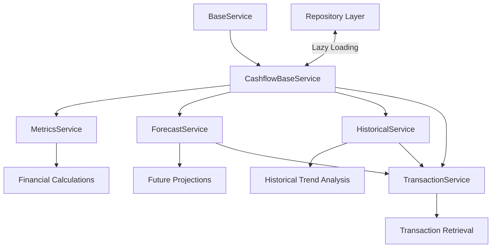

# Cashflow Services

## Purpose

The cashflow services provide comprehensive financial analysis, forecasting, and transaction management capabilities for the Debtonator platform. These services handle complex cashflow calculations, historical trend analysis, and metrics generation to help users understand and improve their financial situation.

## Related Documentation

- [Services Layer README](/code/debtonator/src/services/README.md)
- [ADR-011: Datetime Standardization](/code/debtonator/docs/adr/backend/011-datetime-standardization.md)
- [ADR-014: Repository Layer for CRUD Operations](/code/debtonator/docs/adr/backend/014-repository-layer-for-crud-operations.md)
- [UTC Datetime Compliance Guide](/code/debtonator/docs/guides/utc_datetime_compliance.md)
- [Cashflow Repositories](/code/debtonator/src/repositories/cashflow)
- [System Patterns: Cashflow Analysis](/code/debtonator/docs/system_patterns.md)

## Architecture

The cashflow services follow a specialized service pattern:



### Key Components

1. **CashflowBaseService**: Base class for all cashflow services with shared functionality
2. **MetricsService**: Financial metrics calculations and analysis
3. **ForecastService**: Future financial projections and scenario analysis
4. **HistoricalService**: Historical transaction analysis and pattern detection
5. **TransactionService**: Transaction data retrieval and management

## Implementation Patterns

### Repository Access Pattern

Cashflow services use `BaseService._get_repository()` for repository access:

```python
# Repository access through async property pattern
@property
async def metrics_repository(self) -> CashflowMetricsRepository:
    """Get the cashflow metrics repository instance."""
    return await self._get_repository(CashflowMetricsRepository)
```

### Datetime Handling Pattern

All services follow ADR-011 for datetime standardization:

1. **Business Logic**: Uses timezone-aware UTC datetimes
   - `utc_now()`: For current datetime with UTC timezone
   - `ensure_utc()`: To convert input datetimes to UTC
   - `days_from_now()`, `days_ago()`: For relative date calculations

2. **Database Operations**: Uses naive datetimes (semantically UTC)
   - `naive_start_of_day()`, `naive_end_of_day()`: For inclusive date ranges
   - Repository methods receive naive datetimes for database queries

Example from CashflowMetricsRepository:

```python
async def utc_now(self):
    """Get current UTC datetime."""
    return utc_now()

async def days_ago(self, days: int):
    """Get datetime for specified number of days ago."""
    return days_ago(days)
```

### Service Composition Pattern

Cashflow services use composition for complex operations:

```python
def __init__(self, db):
    super().__init__(db)
    self._transaction_service = TransactionService(db)
```

## Key Responsibilities

### CashflowBaseService

- Provides shared functionality for all cashflow services
- Manages repository access and lazy loading
- Handles warning thresholds and holiday definitions
- Provides timezone standardization

### MetricsService

- Calculates financial metrics for analysis
- Computes minimum required funds
- Calculates daily and yearly deficit amounts
- Determines required income based on financial situation
- Converts financial metrics to hourly rate equivalents

### ForecastService

- Generates account-specific forecasts
- Creates custom forecasts based on parameters
- Calculates confidence scores for financial projections
- Identifies significant dates and potential issues
- Provides comprehensive forecast metrics

### HistoricalService

- Analyzes historical transaction patterns
- Identifies seasonal trends and patterns
- Calculates metrics based on historical data
- Finds significant events and anomalies
- Provides period-based analysis (monthly, quarterly)

### TransactionService

- Retrieves historical transactions
- Gets day-specific transactions
- Projects future transactions based on patterns
- Handles recurring transactions
- Works with income, bills, and payment sources

## Testing Strategy

1. **Integration Testing**: Test services with real repositories
2. **No Mocks**: Use real database connections with test data
3. **Comprehensive Test Cases**: Cover all key calculation scenarios
4. **Date Boundary Testing**: Test date ranges and timezone handling
5. **Error Handling**: Test invalid inputs and error conditions

## Known Considerations

### ADR-014 Repository Compliance Status

All cashflow services fully comply with ADR-014 Repository Layer patterns:

- ✅ All services inherit from BaseService
- ✅ All data access happens through repository methods
- ✅ No direct database queries in service code
- ✅ Proper transaction management across operations
- ✅ Repository access through _get_repository method

### ADR-011 Datetime Compliance Status

All cashflow services fully comply with ADR-011 Datetime Standardization:

- ✅ All date manipulations use datetime_utils.py functions
- ✅ Business logic uses timezone-aware UTC datetimes
- ✅ Database operations use naive datetimes
- ✅ Inclusive date ranges handled correctly
- ✅ Proper timezone handling for all operations

### Performance Considerations

- Some forecast calculations can be computationally expensive
- Heavy database queries should implement pagination
- Consider caching for frequently accessed metrics
- Watch for N+1 query issues with transaction retrieval
- Monitor date range size to prevent excessive memory usage
