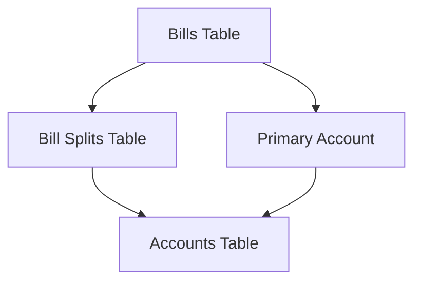

# Bill Splits Tests

## Purpose

This directory contains tests specifically focused on Debtonator's bill split functionality. Bill splits represent the distribution of bill amounts across multiple accounts, an essential feature for shared financial responsibility.

## Related Documentation

- [Parent: Repository Tests](/code/debtonator/tests/integration/repositories/README.md)
- [Advanced Bill Splits Tests](/code/debtonator/tests/integration/repositories/advanced/bill_splits/README.md)
- [System Patterns: Dynamic Accounts and Bill Split Management](/code/debtonator/docs/system_patterns.md#dynamic-accounts-and-bill-split-management)

## Architecture

Bill splits are a core component of Debtonator's financial management system:



Key architectural principles:

1. Each bill has a primary account (required)
2. Bills can be split across multiple accounts
3. Primary account split is created automatically
4. Split amounts must sum to total bill amount

## Implementation Patterns

### Consistent Terminology Pattern

The system standardizes on "liability_id" terminology in bill split operations:

```python
# ✅ Correct: Using liability_id consistent with schema
split_schema = create_bill_split_schema(
    liability_id=bill.id,
    account_id=account.id,
    amount=Decimal("50.00")
)

# ❌ Incorrect: Using bill_id instead of liability_id
split_schema = create_bill_split_schema(
    bill_id=bill.id,  # Wrong parameter name
    account_id=account.id,
    amount=Decimal("50.00")
)
```

### Bill Split Operations Pattern

Bill splits use specialized repository methods with transaction support:

```python
# Creating bill splits (handles automatic primary account split)
await bill_split_repository.create_bill_splits(
    liability_id=bill.id,
    splits=[split_schema.model_dump()]
)

# Updating bill splits (within transaction boundary)
await bill_split_repository.update_bill_splits(
    liability_id=bill.id,
    splits=[updated_split_schema.model_dump()]
)
```

## Key Responsibilities

- Validate proper bill split creation and updates
- Ensure transaction integrity for split operations
- Verify validation rules for split amounts
- Test automatic primary account split generation
- Validate error handling for invalid splits

## Testing Strategy

- Test the complete bill split workflow
- Verify transaction boundaries for split operations
- Test validation for split amount totals
- Test error handling for invalid account references
- Ensure proper terminology usage throughout tests

## Known Considerations

- Bill splits must use "liability_id" parameter, not "bill_id"
- All accounts referenced in splits must exist
- No negative split amounts are allowed
- Total of splits must equal bill amount
- Primary account split is generated automatically
- Split repository operations use transaction boundaries
- Errors during split operations should trigger rollback
